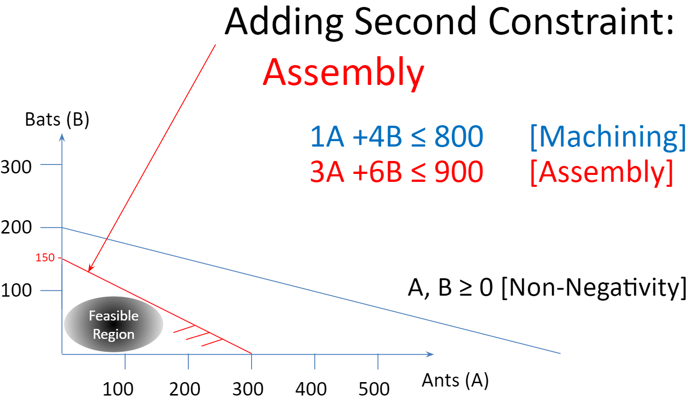
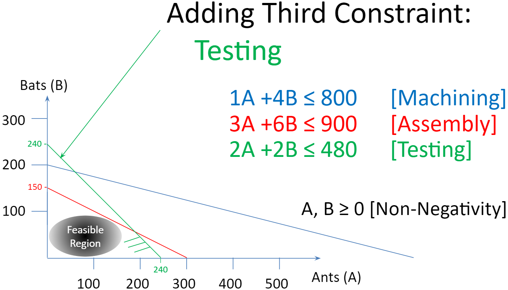
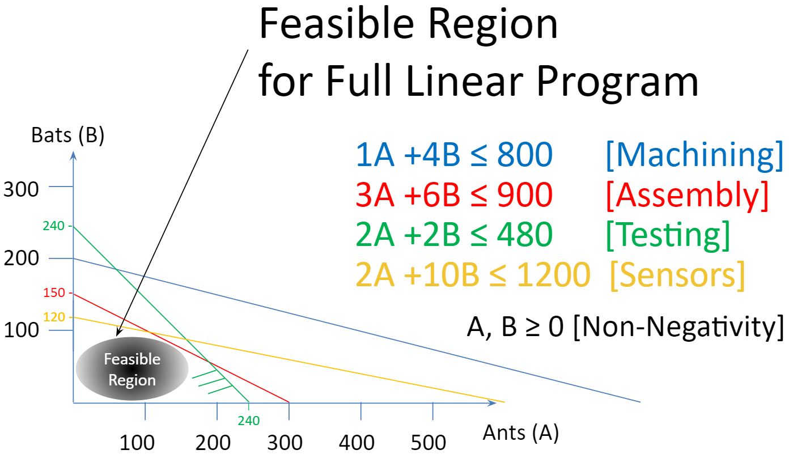
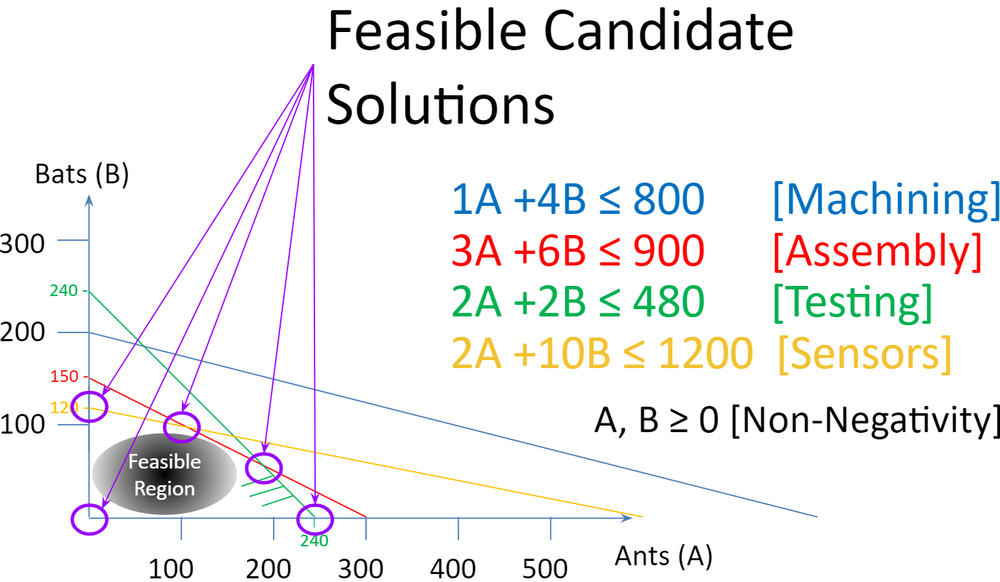

# Introduction to Linear Programming

```{r, eval=FALSE, include=FALSE}
library(bookdown); library(rmarkdown); rmarkdown::render("02-A_First_LP.Rmd", "pdf_book")
```

```{r ch2setup, include=FALSE}
library(knitr)
library(kableExtra)
knitr::opts_chunk$set(echo = TRUE)
knitr::opts_chunk$set(tidy = FALSE)
knitr::opts_chunk$set(cache = FALSE)
knitr::opts_chunk$set(width = 30)
```

## What is Linear Programming

Linear programming is a tool for optimization. It is a widely used tool for planning, scheduling, resource allocation and many other applications.

## Two Variable Base Case

We will use a recurring example throughout the next couple of chapters of being a small specialty drone manufacturer making animal inspired exploring drones. These drones can be used in search and rescue operations or other functions where a wheeled vehicle may not suffice. Each of the products is named after an animal that describes its general design and function. The first two types of drones are named the Ant and the Bat. The Ant is a small but precise drone while the Bat is a flying drone.

The goal is to make the most profitable mix of drones.

Each drone requires time in machining, assembly, and testing and sensors. For example, an Ant requires one hour of machining time, three hours of assembly, and two hours of testing. It uses two sensors and the net profit is \$10. The characteristics of Bats are similar but different and shown in the following table.

| Characteristic | Ants | Bats | Available |
|---------------:|:----:|:----:|:---------:|
|         Profit | \$7  | \$12 |           |
|      Machining |  1   |  4   |    800    |
|       Assembly |  3   |  6   |    900    |
|        Testing |  2   |  2   |    480    |
|        Sensors |  2   |  10  |   1200    |

: Two Variable Base Case.

A simple LP now is to find the production plan of products that results in the most profit. In order to do so, we need to define certain key items:

-   the goal(s)
-   the decisions
-   the limitations

Let's start with the goal(s). In this case, the production manager is simply trying to make as much profit as possible. While cost cutting is also a goal for many organizations, in this case and many applications profit maximization is appropriate. Maximizing profit is then reflected as the *objective* of the model. \index{Objective function}\

People new to linear programming will often think of the decisions as the amount of each resource to use. Instead, the decisions in this case would be how much to make of each particular product. This drives the resource usage and the resource usage is a byproduct of these decisions. These decisions can take on a range of values and are therefore called *decision variables*. \index{Decision variables}

The decision variables are then combined in some way to reflect the performance with respect to the organization's objective. The equation combining the decision variables to reflect this is then the *objective function*. For now we will assume that there is a single objective function but we will allow for multiple objectives in Chapter 8. \index{Objective function}

Lastly, what is limiting the organization from even better performance? There are typically many limits such as the number of customers, personnel, supplier capacity, etc. In this case, we focus on a set of resource limits based on staffing in different centers and the supply of sensors. Since these limitations constrain the possible values of decision variables, they are called *constraints.* \index{Constraints}

Every optimization model can be thought of as a collection of:

-   an objective function (goal)
-   decision variable(s) (decisions)
-   constraint(s) (limitations)

Let's put things together in the context of this application. In the base case, our objective function is to Maximize Profit. We can't express it though until we define our decision variables. It is good practice to very clearly and precisely define decision variables. While this case is very straightforward, the definition of variables can get much more complicated as we move into richer and larger models.

Let's define the variables:

-   Ants = \# of Ant drones to make
-   Bats = \# of Bat drones to make

Our objective function and constraints can now be written as the optimization model shown in the following formulation.

$$
 \begin{split}
 \begin{aligned}
    \text{Max  }  & 7\cdot Ants +12 \cdot Bats &\text{[Profit]}\\
    \text{s.t.: } & 1\cdot Ants + 4 \cdot Bats \leq 800 &\text{[Machining]}\\
                  & 3\cdot Ants + 6 \cdot Bats \leq 900 &\text{[Assembly]}\\
                  & 2\cdot Ants + 2 \cdot Bats \leq 480 &\text{[Testing]}\\
                  & 2\cdot Ants + 10 \cdot Bats \leq 1200 &\text{[Sensors]}\\
                  & Ants, \; Bats \geq 0  &\text{[Non-negativity]}\\
  \end{aligned}
  \end{split}
$$

Note that since the objective function and each constraint is a simple linear function of the decision variables, this is what we call a *linear* programming model \index{Linear programming} \index{LP|see{Linear programming}} or LP for short. It would not be linear if any nonlinear function is made of the decision variables. For example, squaring a decision variable, using conditional logic based on the variable value, multiplying two variables, or dividing a variable by a function of a variable. These and other issues would then require using nonlinear programming or NLP. NLP is also widely used but has limitations. \index{Nonlinear programming} \index{NLP|see{Nonlinear programming}}

**Linear programming**: (LP, also called linear optimization) is a method to achieve the best outcome (such as maximum profit or lowest cost) in a mathematical model whose requirements are represented by linear relationships.

It is impressive the number of situations that can be modeled well using linear programming. Keeping to the world of linear programming in general allows for finding the very best solution to very big problems in a short amount of time. For example, it is common for practitioners to be analyzing real-world problems with hundreds of thousands of decision variables and constraints.

## Graphically Solving a Linear Program

Given that the linear program has two variables, it can be represented in two dimensions making it straightforward to draw and visualize. Before we analyze it using the `R` we will walk through a graphical representation.

We do this by iteratively adding each constraint and trimming the feasible region. The line can be drawn by looking at the constraint from two perspectives. First as if only Ants are produced and second as if only Bats are produced. This gives specific point on the horizontal and vertical axes respectively which are simply connected.\

```{r Fig-First-Constraint, eval=TRUE, echo=FALSE, out.width="55%", fig.align='center', fig.cap="Drawing a First Constraint."}
library(knitr) 
knitr::include_graphics("images/Fig02-01-First-Constraint.PNG")
```

The constraints are differentiated by color and the diagonal lines of the same color drawn off the constraint are a hatching line indicating the direction of the inequality constraint. In this case, each of the constraints are less than or equal to constraints and are indicating that this constraint includes the line and the region under the line. If it had been a greater than or equal to constraint, the hatching would have been rising above the constraint line. If it had been an exact equality constraint rather than inequality constraint, it would have been just the line with no hatching above or below.

In each figure, we illustrate the feasible region as a grayed oval but it is the whole region.\

```{r Fig-Second-Constraint, echo=FALSE,  out.width="55%",  fig.align='center',fig.cap="Adding the Assembly Constraint."}

```

The assembly constraint is drawn as a red line connecting a production plan of just 300 Ants on the horizontal axis to just 150 Bats on the vertical axis.

```{r Fig-Third-Constraint, echo=FALSE, out.width="55%", fig.align='center', fig.cap="Adding the Testing Constraint." }

```

Since both products require two hours of testing and there are 480 hours available, the Green Testing constraint connects producing just 240 Ants and just 240 Bats.

```{r Fig-Fourth-Constraint, echo=FALSE, out.width="55%", fig.align='center', fig.cap="Adding the Sensors Constraint."}
knitr::include_graphics("images/Fig02-04-Fourth-Constraint.PNG")
```

We now draw our fourth and final constraint - Sensors. This constraint is done in yellow so it may be more difficult to see but it goes from an Ants only production plan of 600 units to a bats only production plan of 120.

This now results in a feasible region that satisfies all of the constraints simultaneously. Every point in this region is feasible or possible in that it does not violate any of the constraints. There is an infinite number of possible points in this feasible region.

```{r Fig-Feasible-Region, echo=FALSE, fig.align='center', out.width="55%", fig.cap="Feasible Region for Drone Manufacturing."}

```

Given that we are doing linear programming and we are trying to maximize or minimize a certain objective function, the optimal solution will be at a corner point or more formally, a vertex. In our example, we can narrow our attention from the full feasible region to just the five vertices or candidate solutions.

```{r Fig-Candidate-Solutions, echo=FALSE,  fig.align='center', out.width="55%", fig.cap="Candidate Solutions."}

```

Lastly, we can pick from among these possible solutions by drawing parallel, equal profit lines radiating out from the origin to find the last line that still touches the feasible region. The figure to the right shows one line with a profit of $\$ 1400$. A second line is drawn that last touches the feasible region at $\$ 1980$.

```{r Fig-Iso-Profit, echo=FALSE,  fig.align='center', out.width="55%", fig.cap="Parallel Equal Profit Lines."}
knitr::include_graphics("images/Fig02-07-Iso-Profit.PNG")
```

Graphically, we could read the number of Ants and number of Bats to produce. Accuracy would be limited to the drawing skills and tools used.

Rather than relying on this graphical approach for determining the coordinates of each point drawn, each point in a two dimensional space is defined by the intersection of two lines. In this case, the optimal solution (and all of the other candidate solutions too) can be defined by the intersection of two constraint lines, rewritten as exact equalities. These can be solved as a system of equations with two equations and two unknowns. The optimal solution here is defined by the intersection of the Assembly (Red) and the Testing (Green) constraints. Just solve $3A+6B=900$ and $2A+2B=480$ for $A$ and $B$.

```{r Fig-Optimal-Solution, echo=FALSE,  fig.align='center', out.width="55%", fig.cap="Optimal Solution."}
knitr::include_graphics("images/Fig02-08-Optimal-Solution.PNG")
```

This approach of graphical solving is helpful for understanding how optimization works but does not scale up to larger dimensions. For example, a three variable model corresponds to three dimensions and can therefore be drawn using various drawing programs but is harder to visualize on a printed page or computer screen.

Alas, real optimization problems typically have far more than three variables - perhaps tens of thousands or hundreds of thousands of variables. In general, we need to use computer tools for solving larger problems. In our case, we will adopt `R` and `ompr` but there are a wide range of similar tools available.

## Implementing and Solving with `ompr`

### Preparing to Implement the Linear Program

Our first formulation named the variables individually and directly entered the data in the formulation. We refer to this as an explicit formulation. \index{Linear programming!Explicit formulation} we will implement our first R LP model using explicit variables and data consistent with the first formulation.

First, let us load the required packages using the `library` command and then we will move on to the actual implementation.

```{r warning = FALSE, message = FALSE}
library (kableExtra, quietly = TRUE) 
library (ROI, quietly = TRUE) # R Optimization Interface
library (ROI.plugin.glpk, quietly = TRUE) # Plugin for solving
library (ompr, quietly = TRUE) # Core ompr package
library (ompr.roi, quietly = TRUE) # Glue for ompr to use ROI
```

The `quietly=TRUE` option will not display standard messages returned when loading libraries.

This code chunk uses the `library` command to load a series of useful packages.[^02-a_first_lp-1] The first line, `library (kableExtra)`, enhances `knitr's` built-in `kable` function to generate better formatted tables. For more details, see Appendix C. The following lines similarly load packages providing the optimization functions that we will be relying on frequently. The `ROI` package is the R Optimization Interface \index{ROI package} for for connecting various optimization solvers to R. The `ROI.plugin.glpk` provides a connection between the the `glpk`solver and R through ROI. While this would be sufficient, we are going to make use of the `ompr` package by Dirk Schumacher to provide algebraic representations for linear programs. The `ompr` package also requires a connector to ROI, aptly named `ompr.roi`.\

[^02-a_first_lp-1]: As noted earlier, if these packages are not preinstalled, you may need to install them using the install.packages function or from the Packages tab in RStudio.

Now we move on to implement and solve the linear program. Let's go through it step by step.\

```{r base_case_no_pipes_step_1}
model0  <- MIPModel()     # Initialize an empty model
```

The first line initializes an empty model using the `MIPModel` \index{ompr!MIPModel} \\index{MIPModel\|see{ompr!MIPModel} command and stores it in `model0`. We could pick any valid R object name in place of `model0` but we are using this to indicate that it is our initial model. The term MIP used in the function call is an acronym for Mixed Integer Program. \index{Mixed integer programming} \index{MIP|see{Mixed integer programming}}This is a more general case of LP and will be discussed in greater detail later. We can see that the model is empty by simply displaying the summary of `model0`.

```{r display_empty_model}
model0
```

The summary states that there are no constraints or variables. Next we will add variables.

```{r base_case_no_pipes_step_2}
model0a <- add_variable(model0, Ants, 
          type = "continuous", lb = 0) 
model0b <- add_variable(model0a, Bats, 
          type = "continuous",lb = 0)
```

The first line takes `model0` and adds the `Ants` variable to it, creating an enhanced `model0a`. Note that the continuation of the first line specifies the type of variable and whether it has a bound. The `Ants` variable is continuous (as compared to integer or binary which we will get to in chapter 6), and non-negative. The variable is made non-negative by setting a zero lowerbound (`lb=0`). The lowerbound can be set to other values such as a minimum production level of ten. Also upperbounds for variables can be set using `ub` as a parameter. \index{ompr!add\_variable} \index{add\_variable|see{ompr!add\_variable}}

The *Bats* variable is added in the same way to `model0a` creating `model0b`. Let's check the new model.[^02-a_first_lp-2]

[^02-a_first_lp-2]: We are creating a series of models here as we keep adding one element at a time and appending a letter to `model0` to differentiate them. The result is that we will have many incrementally enhanced versions of `model0`. Other than for demonstration purposes in our first model, there is no need to incrementally save each version of the file. We could replace each of the assignments with just resaving it to `model0`.

```{r Model_Summary_with_Bats}
model0b
```

Next, we can add the objective function. We set the objective function as well as declaring it to be a *max* rather than a *min* function. \index{ompr!set\_objective} \index{set\_objective|see{ompr!set\_objective}}

```{r base_case_no_pipes_step_3}
model0c<-set_objective(model0b,7*Ants+12*Bats,"max")
```

Now we move on to adding constraints.\

```{r base_case_no_pipes_step_4}
model0d<-add_constraint(model0c, 1*Ants+ 4*Bats<= 800) # machining
model0e<-add_constraint(model0d, 3*Ants+ 6*Bats<= 900) # assembly
model0f<-add_constraint(model0e, 2*Ants+ 2*Bats<= 480) # testing
model0g<-add_constraint(model0f, 2*Ants+12*Bats<=1200) # sensors
```

Notice that we do not need to include non-negativity constraints since they were in the earlier definition of the variables as lower bounds of zero. Let's take a look at the summary of the model after all of the constraints have been added. \index{ompr!add\_constraint} \index{add\_constraint|see{ompr!add\_constraint}}

```{r Model_Summary_with_All_Constraints}
model0g
```

Our model has the three core elements of an optimization model: variables, constraints, and an objective function. Let's go ahead and solve `model0g`. The LP can be solved using different LP engines - we'll use `glpk` for now. The results of the solved model will be assigned to `result0`. `glpk` is the R package name for the "GNU Linear Programming Kit" which is intended for solving large-scale linear programming (LP), mixed integer programming (MIP), and other related problems.\

```{r base_case_no_pipes_step_5}
result0 <- solve_model(model0g, with_ROI(solver = "glpk"))
```

We built up the model line by line incrementally taking the previous model, adding a new element, and storing it in a new model. Note that we could keep placing them into the original model if we had wished such as the following. In this case, we take the previous command's output, `model0`, add an element to it, and then store it back in the same object, `model0`. We keep doing it for each element until we are done. This is equivalent to assigning the value of *2* to *a*. We then multiply *a* by *3* and assign the result again to *a*.\
\

```{r base_case_no_pipes_single_model}
model0 <- MIPModel()     # Initialize an empty model
model0 <- add_variable(model0, Ants, type = "continuous", lb = 0) 
model0 <- add_variable(model0, Bats, type = "continuous", lb = 0)
model0 <- set_objective(model0, 7*Ants + 12*Bats, "max")
model0 <- add_constraint(model0, 1*Ants + 4*Bats <= 800)   # machining
model0 <- add_constraint(model0, 3*Ants + 6*Bats <= 900)   # assembly
model0 <- add_constraint(model0, 2*Ants + 2*Bats <= 480)   # testing
model0 <- add_constraint(model0, 2*Ants + 10*Bats <= 1200) # sensors

result0 <- solve_model(model0, with_ROI(solver = "glpk"))

result0$solution
```

Let's use the `kable` function to display the results nicely.

res0 \<- cbind(objective_value (result0),

get_solution(result0, Ants),

get_solution(result0, Bats))

```{r}
res0 <- cbind(objective_value (result0),
           get_solution(result0, Ants),
           get_solution(result0, Bats))
colnames(res0)<-list("Profit","Ants","Bats")
rownames(res0)<-list("Solution")
```

Notice that we used two ways to get solution of decision variables from `ompr`. In the first case, we can get all the all the decision variable values as a component of our result object,`result0`. When `ompr` solves a problem, it creates an object with a number of components. After solving a model successfully in the console and saving the result to an object, you can see all the components by typing the object name and a dollar sign \$. For example, using the command `Run All Code Chunks Above` and then typing `result0$` will show the following options.

-   `model`: Saves the model that was solved into the result object.
-   `objective_value`: Gives the optimal objective function value found.
-   `status`: States whether the problem is optimal or not optimal.
-   `solution`: An alphabetical listing of variables and their values in the optimal solution.\
-   `solution_column_duals`: Used in sensitivity analysis, (Chapter 4)
-   `solution_row_duals`: Also used in sensitivity analysis, (Chapter 4)

Using this way of examining the solution, (`result0$solution`) is particularly straightforward in an explicit model like this and where variables are conveniently alphabetized. Another approach is extract each variable's solution separately using the `get_solution` function from `ompr`. \index{Linear programming!Explicit formulation}

```{r Base-2Var-Solution}
kbl(res0, booktabs=T,
    caption="Base Case Two Variable Solution") |>
  kableExtra::kable_styling(latex_options = "hold_position")
```

It might be helpful to see what the model looks like before examining the results.\

```{r summarize_model}
model0
```

Furthermore, we can use the `extract_constraints` command to see what the actual constraints look like in the model.

```{r extract_constraints}
extract_constraints(model0)
```

This should look familiar. Let's see if we can arrange to make it look more similar to what we had given the model. Note that the term `RHS` represents the right hand side of the constraint. \index{Right hand side} \index{RHS|see{Right hand side}}

```{r construct-constraints-for-display}
constr0<-extract_constraints(model0)    
# Extract the constraints from model
constr00<- cbind(as.matrix(constr0$matrix), # Get matrix of data
                 as.matrix(constr0$sense),  # Get inequalities 
                 as.matrix(constr0$rhs))    # Get right hand sides
rownames(constr00) <-c ('Machining','Assembly','Testing','Sensors')
kableExtra::kbl(constr00, booktabs=T, align='cccc',
    caption="Elements of the Constraints", 
    col.names = c('Ants', 'Bats','Relationship','RHS'))|>
  kableExtra::kable_styling(latex_options = "hold_position")
```

In the first version of the LP model implementation, we created many different versions of the model along the way while we kept adding elements to create a new model. This uses extra memory and may be a little slower. The second implementation keeps reusing the same model object until the very end when solving is done and it places the results into an object. This may be more memory efficient and carries along some extra notation.

### Implementing the Base Case with Piping

In each step, we are simply taking the output of the previous step and feeding it in as the first term of the following step. It is almost like the output is a bucket that is then passed as a bucket into the next step. Rather than carrying a bucket from one step into the next one, a plumber might suggest a pipe connecting one step to the next. This is done so often that we refer to it as piping and a pipe operator. The **pipe symbol**, represented by `|>` will let us do this more compactly and efficiently. It takes a little getting used to but is a better way to build the model. \index{Piping} Also, note that the piping operator requires `R` version 4.1.0. or higher.

Here is the equivalent process for building the base case implementation using a piping operator without all the intermediate partial models being built. Notice how it is a lot more concise. We will typically use this approach for model building but both approaches are functionally equivalent.

```{r base_case}
result0 <- MIPModel()                             |>
  add_variable(Ants, type = "continuous", lb = 0) |>
  add_variable(Bats, type = "continuous", lb = 0) |>
 
  set_objective(7*Ants + 12*Bats, "max")          |>
  
  add_constraint(1*Ants + 4*Bats<= 800)           |> # machining
  add_constraint(3*Ants + 6*Bats<= 900)           |> # assembly
  add_constraint(2*Ants + 2*Bats<= 480)           |> # testing
  add_constraint(2*Ants + 10*Bats<= 1200)         |> # sensors
  solve_model(with_ROI(solver = "glpk"))
  
```

Piping can make your code more readable by:

-   structuring sequences of data operations left-to-right (as opposed to from the inside and out),
-   avoiding nested function calls,
-   minimizing the need for local variables and function definitions, and
-   making it easy to add steps anywhere in the sequence of operations. \index{Piping}

Piping's major drawback is that it treats all of the piped code as one line of code and it can therefore make debugging much harder. The first line creates the basic model. The `|>` serves as a pipe symbol at the end of each line. It basically means take product of the previous command and feed it in as the first argument of the following command. While it may shorten each line of code and may be faster, there is drawback in that the the piped commands are treated as one very long line of code making it harder to find where an error occurs.

Let's check to see the status of the solver. Did it find the optimal solution? We do this by extracting the solver status from the result object.

```{r base_status_2var}
print(solver_status(result0))
```

Furthermore, we can do the same thing to extract the objective function value.

```{r base_objecfunc_2var}
print(objective_value(result0))
```

The command `objective_value(result0)` extracts the numerical result of the objective function (i.e. maximum possible profit) but it does not tell us what decisions give us this profit.\index{ompr!objective\_value} \index{objective\_value|see{ompr!objective\_value}}

Since the LP solver found an optimal solution, let's now extract the solution values of the decision variables that give us this profit.

```{r base_solution_2var}
print(get_solution(result0, Ants))
print(get_solution(result0, Bats))
```

In summary, our optimal production plan is to make a mix of Ant and Bat drones. More specifically, we should produce `r ompr::get_solution(result0, Ants)` Ants and `r ompr::get_solution(result0, Bats)` Bats to generate a total profit of `r ompr::objective_value(result0)`. Given the situation, this is the optimal or most profitable possible production plan.

## Adding a Third Product (Variable)

As always, it is important to start with formulating the model before moving into implementation. While this problem is small and straightforward, it is an important habit to develop as we build towards more complex models in later chapters.

### Three Variable Base Case Formulation

We will now extend the previous model to account for a third product, the Cat drone. The goal is still to find the most profitable production plan. See the table to the right with a summary of the new situation.

|           | Ant | Bat  | Cat | Available |
|----------:|:---:|:----:|:---:|:---------:|
|    Profit | \$7 | \$12 | \$5 |           |
| Machining |  1  |  4   |  2  |    800    |
|  Assembly |  3  |  6   |  2  |    900    |
|   Testing |  2  |  2   |  1  |    480    |
|   Sensors |  2  |  10  |  2  |   1200    |

: Three Variable Base Case

A simple LP now is to find the production plan or amount of each of the products that results in the most profit. This will require a new decision variable, Cats, to be added to the model.

Let's extend our previous model. Just to reinforce the point, it is an important habit to very clearly define the decision variables.

-   Ants = \# of Ants to Make
-   Bats = \# of Bats to Make
-   Cats = \# of Cats to Make

Our objective function and constraints can now be written as an optimization model.

$$
 \begin{split}
 \begin{aligned}
    \text{Max   } & 7\cdot Ants +12 \cdot Bats +5\cdot Cats \\
    \text{s.t.: } & 1\cdot Ants + 4\cdot Bats +2\cdot Cats \leq 800 \\
                 & 3\cdot Ants + 6\cdot Bats +2\cdot Cats \leq 900 \\
                 & 2\cdot Ants + 2\cdot Bats +1\cdot Cats \leq 480 \\
                 & 2\cdot Ants + 10\cdot Bats +2\cdot Cats \leq 1200 \\
                 & Ants, \; Bats, \; Cats \geq 0  
  \end{aligned}
  \end{split}
$$

### Three Variable Base Case Implementation

Let's now implement the three variable case.

We have already loaded the required packages so it is not necessary to reload them and we can proceed directly into setting up the model.

```{r base_case_3var}
model1 <- MIPModel()                              |>
  add_variable(Ants, type = "continuous", lb = 0) |>
  add_variable(Bats, type = "continuous", lb = 0) |>
  add_variable(Cats, type = "continuous", lb = 0) |>
  
  set_objective(7*Ants + 12*Bats + 5*Cats,"max")  |>
  
  add_constraint(1*Ants + 4*Bats + 2*Cats<=800)   |>  # machining
  add_constraint(3*Ants + 6*Bats + 2*Cats<=900)   |>  # assembly
  add_constraint(2*Ants + 2*Bats + 1*Cats<=480)   |>  # testing
  add_constraint(2*Ants + 10*Bats + 2*Cats<=1200)     # sensors

result1 <-  solve_model(model1, with_ROI(solver="glpk"))
```

### Three Variable Case Results and Interpretation

Let's check to see the status of the solver and the results.\

```{r base_status_3var}
print(solver_status(result1))
result1$objective_value
result1$solution
```

Adding a decision variable, in this case, *Cats* enables new possibilities so it could increase profit.

## Linear Programming Special Cases

There are several special cases where a linear program does not give the simple unique solution that we might expect. These are:

-   No feasible solution
-   Multiple optima
-   Redundant constraint
-   Unbounded solution

Now, let's look at how we would modify the earlier formulation to come up with each of these situations.

### Case 1: No Feasible Solution

Let's assume that the sales manager comes in and says that we have a contractual requirement to deliver 400 Ants to customers. This results in the following LP. \index{Infeasible} \index{No feasible solution|see{Infeasible}} [^02-a_first_lp-3]

[^02-a_first_lp-3]: It can be helpful to highlight a part of a LaTeX formulation. In this case, we can use `\textcolor{red}{` before the part that we want to turn red and use a closing `}`. You can also review the RMD file to see how it it done.

$$
 \begin{split}
 \begin{aligned}
    \text{Max   } & 7\cdot Ants +12 \cdot Bats +5\cdot Cats \\
    \text{s.t.: } & 1\cdot Ants + 4 \cdot Bats  +2\cdot Cats \leq 800 \\
                  & 3\cdot Ants + 6 \cdot Bats  +2\cdot Cats \leq 900 \\
                  & 2\cdot Ants + 2 \cdot Bats  +4\cdot Cats \leq 480 \\
                  & 2\cdot Ants + 10 \cdot Bats  +1\cdot Cats \leq 1200 \\
                  & \textcolor{red}{Ants \geq 400} \\
                  & Ants, \;Bats, \; Cats \geq 0  
\end{aligned}
\end{split}
$$

Now let's extend our formulation with this change.In this case, we are going to simply add the new constraint to `model1` and create a new model, `model1infeas` to solve.

```{r infeasible_case}
model1infeas <- 
  add_constraint(model1, Ants >= 400) #THIS IS THE NEW CHANGE

result1infeas <- solve_model(model1infeas, 
                           with_ROI(solver = "glpk"))
```

Note that the constraint on the minimum number of Ants could also be implemented by changing the lower bound on the `Ants` variable to be 400 instead of zero.

```{r Infeasible_Results}
print(solver_status(result1infeas))
result1infeas$solution
```

Notice that since the solver status was infeasible, the values for the decision variables are not feasible and therefore cannot be considered a reliable (or possible) production plan. This highlights why the solver's status should always be confirmed to be "Optimal" before results are discussed. \index{Infeasible}\

### Case 2: Multiple Optima

When a linear program is solved to optimality, it is an assurance that there is no better solution that can be found in terms of an objective function value. It is not a guarantee of being the only way of finding that good of a solution though. The case of different decision variable values resulting in the same, optimal objective function value is referred to as multiple optimal solutions. \index{Multiple optima}\

There are a couple of ways of creating situations for multiple optima. One situation is to have a decision variable be identical or a linear multiple of another variable. In this case, each Cat now consumes exactly double the resources as an Ant and generates double the profit of an Ant. The new LP is shown in the following formulation.

$$
 \begin{split}
 \begin{aligned}
    \text{Max  }  & 7\cdot Ants +12 \cdot Bats +\textcolor{red}{14}\cdot Cats \\
    \text{s.t.: } & 1\cdot Ants + 4 \cdot Bats  +\textcolor{red}{2}\cdot Cats \leq 800 \\
                  & 3\cdot Ants + 6 \cdot Bats  +\textcolor{red}{6}\cdot Cats \leq 900 \\
                  & 2\cdot Ants + 2 \cdot Bats  +\textcolor{red}{4}\cdot Cats \leq 480 \\
                  & 2\cdot Ants + 10 \cdot Bats  +\textcolor{red}{4}\cdot Cats \leq 1200 \\
                  & Ants, \; Bats, \; Cats \geq 0  
\end{aligned}
\end{split}
$$

The implementation can be simplified again since we are only changing the objective function, let's change the objective function in `model1` and save it to `model2a`.

```{r Modify_Model_to_Have_Multiple_Optima}
model2a <- MIPModel()                             |>
  add_variable(Ants, type = "continuous", lb = 0) |>
  add_variable(Bats, type = "continuous", lb = 0) |>
  add_variable(Cats, type = "continuous", lb = 0) |>
  
  set_objective(7*Ants + 12*Bats + 14*Cats,"max") |>
  
  add_constraint(1*Ants + 4*Bats + 2*Cats<=800)   |> # machining
  add_constraint(3*Ants + 6*Bats + 6*Cats<=900)   |> # assembly
  add_constraint(2*Ants + 2*Bats + 4*Cats<=480)   |> # testing
  add_constraint(2*Ants + 10*Bats + 4*Cats<=1200)    # sensors

result2a <-  solve_model(model2a, with_ROI(solver="glpk"))

```

```{r Forcing_Mult_Optima_to_Make_Only_Ants, echo=FALSE, include=FALSE}
# This is being done to force a particular solution in the
#    case of multiple optima since a solver might arrive
#    at different multiple optimal solutions each time it
#    is run.
# It is hidden since it may be confusing for the reader.
result2a <- model2a |> 
  add_constraint( Ants==180) |>
  solve_model(with_ROI(solver="glpk"))
```

```{r Show_First_Solution_from_Multiple_Optima}
print(solver_status(result2a))
res2a <- cbind(objective_value (result2a),
           get_solution(result2a, Ants),
           get_solution(result2a, Bats),
           get_solution(result2a, Cats))
colnames(res2a)<-list("Profit","Ants","Bats","Cats")
rownames(res2a)<-list("Solution 2a")
```

```{r First-Solution-Multiple-Optima}
kbl(res2a, booktabs=T, 
    caption="First Solution of Multiple Optima Case") |>
  kableExtra::kable_styling(latex_options = "hold_position")
```

Okay. When I ran it, all the production was focused on a mix of Ants and Bats but as discussed earlier, I think that there is an alternate solution producing Cats with the same total profit. The LP engine won't necessarily tell you that there is an alternate optimal solution. Let's see if we can "trick" the LP to show an alternate solution by preventing the production of any Ants by adding a constraint, $Ants=0$ to `model2a` and naming this `model2b` and the solved object or solution as `result2b`. Notice that in a constraint, an equality constraint uses `==` rather than just `=`.

```{r Show-Second-Solution-from-Multiple-Optima}
model2b <- add_constraint(model2a, Ants == 0) 
            # FORCING LP TO FIND A DIFFERENT SOLUTION
result2b <- solve_model(model2b, with_ROI(solver = "glpk"))
print(solver_status(result2b))
res2b <- cbind(objective_value(result2b),
               get_solution(result2b, Ants),
               get_solution(result2b, Bats),
               get_solution(result2b, Cats))
colnames(res2b)<-list("Profit","Ants","Bats","Cats")
rownames(res2b)<-list("Solution 2b")
kbl (res2b, booktabs=T,
     caption="An Alternate Optimal Solution") |>
  kableExtra::kable_styling(latex_options = "hold_position")
```

Again, a product mix is made but now instead of Ants and Bats, the mix is made up of Bats and Cats with exactly the same level of profit. This is an instance of multiple optima. Let's try one more situation by adding a constraint forcing the number of Ants to be 60 and solving.

```{r Find_a_Third_Solution_from_Multiple_Optima}
model2c <- add_constraint(model2a, Ants == 60) 
            # FORCING LP TO FIND A DIFFERENT SOLUTION
result2c <- solve_model(model2c, with_ROI(solver = "glpk"))
print(solver_status(result2c))
res2c <- cbind(objective_value(result2c),
               get_solution(result2c, Ants),
               get_solution(result2c, Bats),
               get_solution(result2c, Cats))
```

Let's summarize these results more clearly by displaying them in a single table.

```{r Summarize-Results-of-Multiple-Optima, echo=FALSE}
colnames(res2c)<-list("Profit","Ants","Bats","Cats")
rownames(res2c)<-list("Solution 2c")
res2z <- rbind(res2a, res2b, res2c)
kbl(res2z, booktabs=T,
    caption="Examples of Alternate Optimal Solutions")       |>
  kableExtra::kable_styling(latex_options = "hold_position") |>
  footnote ("Note that all solutions generate the same profit.")
```

Each of three solutions have exactly the same profit but different production plans to generate this profit. Furthermore while we are listing three, there are actually many more solutions. You can force the system to find other solutions by setting the number of *Ants* to a number between 0 and 180 or *Cats* between 0 and 90. The number of solutions is infinite if we explore fractional solutions. More generally, when there are two alternate optimal solutions in a linear program with continuous variables, there is actually an infinite number of other optimal solutions between them.

While our first optimization found a solution focused more on Ants and our second found a solution that emphasized *Cats*, this is dependent upon the particular solver's algorithmic implementation. The user can consider this to be relatively arbitrary as there is no difference between them based on the objective function.

Which solution is the best? Within the limits of this problem, we can't distinguish between them and they are equally good. If an application area expert or the end decision maker prefers one solution over the other-refinements in costs or profits could be included directly or additional constraints could be added. Sometimes considering these two otherwise equal solutions will elicit a response such as, "With all other things being equal, we prefer this alternative because of future market positioning." This could represent an additional or secondary goal which is addressed using goal programming as discussed in Chapter 8.

### Case 3: Redundant Constraint

For the redundant constraint, a new constraint for painting is created. Let's assume each item is painted and requires one liter of paint. We have 500 liters. The corresponding constraint is then added to the model. \index{Redundant constraint}

$$
 \begin{split}
 \begin{aligned}
    \text{Max   } & 7\cdot Ants +12 \cdot Bats +5\cdot Cats \\
    \text{s.t.: } & 1\cdot Ants + 4 \cdot Bats  +2\cdot Cats \leq 800 \\
                  & 3\cdot Ants + 6 \cdot Bats  +2\cdot Cats \leq 900 \\
                  & 2\cdot Ants + 2 \cdot Bats  +1\cdot Cats \leq 480 \\
                  & 2\cdot Ants + 10 \cdot Bats  +2\cdot Cats \leq 1200 \\
                  & \textcolor{red}{Ants +  Bats  + Cats \leq 500} \\
                  &  Ants, \; Bats, \; Cats \geq 0 \\
 \end{aligned}
 \end{split}
$$

Now we can implement the model. Rather than building the model from scratch, let's just add this one constraint to a previously built model.

```{r Redundant_Constraint_Model}
model1redund <- add_constraint(model1, Ants + Bats + Cats <= 500)  
          # THIS IS THE NEW CHANGE
```

```{r Solve_with_Redundant_Constraint}
result3 <- solve_model(model1redund, with_ROI(solver = "glpk"))
print(solver_status(result3))
result3$solution
```

This constraint was *redundant* because the other constraints would keep us from ever having 500 drones or therefore ever needing 500 liters of paint. In other words, there is no way that this constraint could ever be binding at any solution regardless of what the objective function is. More precisely, elimination of a redundant constraint does not change the size of the feasible region at all.

Note that not all non-binding constraints at an optimal solution are redundant. Deleting a non-binding constraint and resolving won't change the optimal objective function value. On the other hand, for a different objective function, that non-binding constraint might become binding and therefore different solutions would be found if it were deleted. \index{Non-binding constraint}

**Challenge 1:** Can you use a calculator to simply estimate the maximum number of Ants that could be made? Bats? Cats?\
**Challenge 2:** How would you modify the formulation to find the most total drones that could be produced irrespective of profit?\

### Case 4: Unbounded Solution

As with other cases, there are multiple ways of triggering this condition. For the unbounded solution, instead of at *most* a certain amount of resources can be used, the constraints are changed to at *least* that amount of each resource must be used. This doesn't make a lot of sense in the setting of this application. Perhaps a cynic would say that in a cost-plus business arrangement or a situation where the factory manager has a limited purview and doesn't see issues such as downstream demand limits and cost impacts, it results in this kind of myopic perspective. More commonly, an unbounded solution might be a sign that the analyst had simply reversed one or more inequalities or the form of the objective (max vs. min). \index{Unbounded solution}

$$
 \begin{split}
 \begin{aligned}
    \text{Max   } & 7\cdot Ants +12 \cdot Bats +5 \cdot Cats \\
    \text{s.t.: } & \\
                  & 1\cdot Ants + 4 \cdot Bats + 2\cdot Cats \textcolor{red}{\geq} 900 \\
                  & 3\cdot Ants + 6 \cdot Bats + 2\cdot Cats \textcolor{red}{\geq} 800 \\
                  & 2\cdot Ants + 2 \cdot Bats + 1\cdot Cats \textcolor{red}{\geq} 480 \\
                  & 2\cdot Ants + 10 \cdot Bats + 2\cdot Cats \textcolor{red}{\geq} 1200 \\
                  & Ants, \; Bats, \; Cats \geq 0  
  \end{aligned}
  \end{split}
$$

Let's make this change to the model and the implementation by simply changing each $\leq$ to a $\geq$ for each constraint.

```{r Unbounded_Model}
result4 <- MIPModel()                            |>
 add_variable(Ants, type = "continuous", lb = 0) |>
 add_variable(Bats, type = "continuous", lb = 0) |>
 add_variable(Cats, type = "continuous", lb = 0) |>
  
 set_objective(7*Ants + 12*Bats + 5*Cats,"max")  |>
  
 add_constraint(1*Ants + 4*Bats + 2*Cats>= 800)  |> # machining
 add_constraint(3*Ants + 6*Bats + 2*Cats>= 900)  |> # assembly
 add_constraint(2*Ants + 2*Bats + 1*Cats>= 480)  |> # testing
 add_constraint(2*Ants + 10*Bats + 2*Cats>= 1200)|> # sensors
 solve_model(with_ROI(solver = "glpk"))
```

Now let's see what is reported from trying to solve this model.

```{r Unbounded_Results}
print(solver_status(result4))
result4$solution
```

The solver status reports that the problem is *infeasible* rather than *unbounded* but by inspection, the solution is feasible in that it satisfies all of the constraints of $\geq$ and therefore the LP is feasible.

**Infeasible vs Unbounded**. This is a known issue in `ompr` as of 0.8.1 and reported on github. It is caused by not being able to distinguish between the different status conditions for situations other than being solved to guaranteed optimality. This is caused by the variety of status codes used by different LP solvers (`glpk`, `symphony`, and others) passing a numerical status code to `ROI`. Each solver has defined their status codes in different ways.) The result is that you should read the `ompr` status of "infeasible" to indicate that is not assured of being an optimal solution. \index{ompr!Misreporting of status} The misinterpretation of solver status is an outcome of the independent toolchain from the solver (`glpk` to `ROI` to `ompr`.)

This is another good reminder that it is important to always check the status of the solver.

## Abstracting the Production Planning Model

We have explicitly created two variable model and a three variable model by naming each variable independently. This process doesn't scale well for companies with dozens, hundreds, or thousands of different products. Simply writing out the full linear program gets very tedious, hard to read, and even maintain. An application for a company with a thousand products and a thousand resources would have a million terms. Assume that variables are on average seven letters long, each resource consumed is a single digit whole number and a plus symbol is used to add terms together and no spaces. This means that there will be $(7+1)\cdot 1000+999=8999$ characters in each line before the inequality. Just say each constraint has 9000 characters. If a line has 60 characters, this would mean 150 lines or around two pages for each resource (constraint.) The 1000 resources would correspond to about 2000 pages, along with an objective function, and non-negativity constraints. All in all, this single model would make for some rather dry reading.

In practice, people don't write out the full LP explicitly for large models. This includes journals, no journal's page limit would be able to accommodate the above explicit linear program even if readers had the patience to wade through the model. \index{Linear programming!Explicit formulation}

Rather than writing out models explicitly, instead we should express them algebraically. The products are numbered instead of given names: Ants, Bats, and Cats become products 1, 2, and 3 respectively.

We could adopt a variety of naming or notation conventions of the variables:

-   Ants, Bats, Cats
-   Product1, Product2, Product3
-   X1, X2, X3
-   `X[1], X[2], X[3]`
-   $X_1, X_2, X_3$
-   $X_i, \; i=1,\ldots,3$

Each of these conventions can have its place.

The notation with brackets, `X[1]` is consistent R notation and that of many other computer languages. This allows us to simply use a vector of X where we can use each element of the vector for each of the products to use. This connects in very well with the data structures available to us in R (and other languages.) It would also allow us to handle any number of products. If we had a thousand products, the thousandth product is simply `X[1000]`.

Subscripting makes for a more succinct and compact way of expressing the same concept.

Similarly, the resources: Machining, Assembly, Testing, and Sensors resources are numbered as 1, 2, 3, and 4 respectively. Note that we do not need to separate the resources by units, the first three are in units of hours while the last is a count of sensors.

Here we are talking about abstracting the model in terms of variable names and notation. In the next chapter we will continue with generalizing the model's number of products and resources.

## Methods of Solving Linear Programs

In this book, we will focus on solving linear programs using the Simplex method. \index{Simplex method} While we don't cover the algorithm of the Simplex method, it is well implemented in a variety of robust packages that we can readily use for modeling purposes. Conceptually, the Simplex method can be thought of as traversing the edges of a multidimensional space. In general, it is usually a very quick and efficient process for even very large problems. There are alternatives to solving optimization problems.

First, Karmarkar developed an approach called Interior Points Algorithm that \index{Interior points algorithm} instead of following the edges, instead cuts through the middle of the multidimensional region. On certain problems, this can be significantly faster. Often a standard linear programming solver will include an option to use an interior points approach.

Another very important way of solving optimization problems is using heuristic methods. \index{Heuristic methods} These approaches cover a range of techniques but in general, unlike the Simplex and Interior Points method approaches do not guarantee optimality. These include evolutionary or genetic algorithms, simulated annealing, and gradient search (hill climbing). These approaches can be particularly helpful on nonlinear problems or complex integer programming problems.

Changing the method of solving an optimization problem can often be done at the implementation stage after the model is formulated. The approach of formulating the model will often stay the same regardless of the approach used for solving.

## Exercises

::: {.exercise name="Adding a Dog Drone"}
Your company has extended production to allow for producing the dog drone and is now including a finishing department that primes and paints the drones.

a.  Use R Markdown to create your own description of the model.
b.  Extend the R Markdown to show your LP Model. Be sure to define models.
c.  Solve the model in R.
d.  Interpret and discuss the model in R Markdown.
e.  Discuss how one parameter would need to change in order to result in a different production plan. Demonstrate how this affects the results.

| Characteristic | Ants | Bats | Cats | Dogs | Available |
|---------------:|:----:|:----:|:----:|:----:|:---------:|
|         Profit | \$7  | \$12 | \$5  | \$24 |           |
|      Machining |  1   |  4   |  2   |  2   |    800    |
|       Assembly |  3   |  6   |  2   |  2   |    900    |
|        Testing |  2   |  2   |  1   |  2   |    480    |
|        Sensors |  2   |  10  |  2   |  4   |   1200    |
|       Painting |  2   |  7   |  2   |  6   |    500    |

: Data for Dog Drone Exercise

**Hint:** Knit your RMarkdown as a PDF. Also, don't be bothered by fractional values for a possible production plan at this time. It is only a high level production plan so if a drone is only partially finished, assume that work on them will continue in the next planning period. We will deal with eliminating fractional variable values much more formally in Chapter 6 but for now, consider the expression "close enough for government work" to apply.
:::

::: {.exercise name="Eliminating Painting of Bat and Dog Drones"}
Exercise 2.1b (Eliminating Painting Cost) Your company has changed production plans for producing the cat and dog drone models so that they no longer require painting. However a market analysis predicts a decrease in profitability to \$18 for each dog drone,

| Characteristic | Ants | Bats | Cats | Dogs | Available |
|---------------:|:----:|:----:|:----:|:----:|:---------:|
|         Profit | \$7  | \$10 | \$5  | \$18 |           |
|    Fabrication |  1   |  3   |  2   |  2   |    800    |
|       Assembly |  3   |  4   |  2   |  2   |    900    |
|      Machining |  2   |  3   |  1   |  2   |    480    |
|        Sensors |  3   |  5   |  2   |  4   |   1200    |
|       Painting |  2   |  0   |  2   |  0   |    500    |

: Characteristics with Painting Changes.

a.  Use R Markdown to create your own description of the model.
b.  Extend the R Markdown to show your LP Model.
c.  Solve the model in R.
d.  Interpret and discuss the model in R Markdown.
e.  Discuss about objective value, how it has changed from the previous results. How this will help you in future to calculate things and decisions.
:::

::: {.exercise name="Printing Solutions"}
From the above exercise solution, fetch results of each drone for comparing each drone's production plan before and after the change so that the reflection of changes in production plan can be discussed. This will be handy in using library functions explained in the chapter and will help in obtaining required results in later exercises in this book.
:::

::: {.exercise name="Rose City Roasters"}
Rose City Roasters provides premium roasted coffee beans for regional coffee shops. There are four important steps: Arranging the beans, roasting the beans, allowing them to cool, and then giving them a chance to cool down. This is followed by degassing and then packaging. Processes have varying personnel and equipment with corresponding hours of available capacity.

|                       | Light | Medium | Medium-Dark | Dark | Available |
|----------------------:|:-----:|:------:|:-----------:|:----:|:---------:|
|         Price (\$/lb) |  \$8  |  \$10  |     \$9     | \$11 |           |
| Variable Cost (\$/lb) | \$5.0 | \$5.2  |   \$5.55    | \$6  |           |
|      Arrange (lbs/hr) |  10   |   10   |     10      |  10  |   4000    |
|        Roast (lbs/hr) |   6   |   4    |      2      |  8   |   2000    |
|         Cool (lbs/hr) |   3   |   2    |      2      |  2   |   1480    |
|        Degas (lbs/hr) |   3   |   4    |      2      |  4   |   1200    |
|    Packaging (lbs/hr) |   4   |   4    |      2      |  3   |   1200    |

: Data for Rose City Roasters

Create an appropriate formulation to maximize profit (selling price minus variable cost).

Implement and solve the resulting model.

Discuss results.
:::
