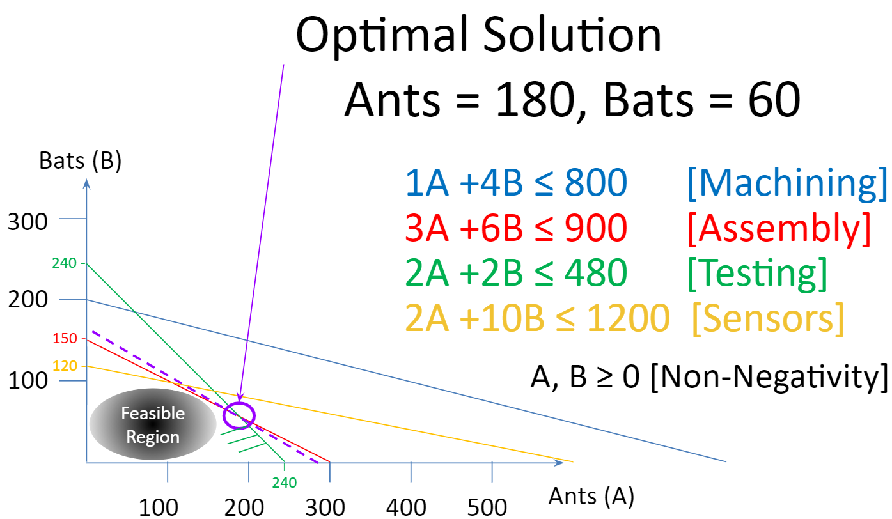

# Introduction to Linear Programming

```{r ch2setup, include=FALSE}
library(tufte)
library(tint)
library(knitr)
library(gridExtra)
knitr::opts_chunk$set(echo = TRUE)
knitr::opts_chunk$set(tidy = FALSE)
knitr::opts_chunk$set(cache = FALSE)
knitr::opts_chunk$set(width = 30)
# knitr::opts_chunk$set(fig.lp='fig:')
# library(bookdown); library(rmarkdown); rmarkdown::render("02-A_First_LP.Rmd", "tufte_book2")
```

## What is Linear Programming

Linear programming is a tool for optimization. It is a widely used tool for planning, scheduling, resource allocation and many other applications.

## Two Variable Base Case

We will use a recurring example throughout the next couple of chapters of being a small specialty drone manufacturer making animal inspired exploring robots. These robots can be used in search and rescue operations or other functions where a wheeled vehicle may not suffice. Each of the products is named after an animal that describes its general design and function. The first two types of robots are named the Ant and the Bat. The Ant is a small but precise device while the Bat is a flying device. \vspace{12pt}

The goal is to make the most profitable mix of robots. \vspace{12pt}

Each robot requires time in machining, assembly, and testing and sensors. For example, an Ant requires one hour of machining time, three hours of assembly, and two hours of testing. It uses three sensors and the net profit is \$10. The characteristics of Bats are similar but different as shown in the Table 1 on the right as well as the available amount of each limited resource. \vspace{12pt}

```{marginfigure}
| Characteristic | Ants  | Bats   |  Available | 
|---------------:|:-----:|:------:|:----------:|
|  Profit        |  $7   | $12    |            |
|  Machining     |  1    |   4    |   800      |
|  Assembly      |  3    |   6    |   900      |
|  Testing       |  2    |   2    |   480      |
|  Sensors       |  2    |  10    |   1200     |
```

```{marginfigure}
**Table 2.1**: Two variable base case
```

A simple LP now is to find the production plan of products that results in the most profit. In order to do so, we need to define certain key items:

-   the goal(s)
-   the decisions
-   the limitations

Let's start with the goal(s). In this case, the production manager is simply trying to make as much profit as possible. While cost cutting is also a goal for many organizations, in this case and many applications profit maximization is appropriate. Maximizing profit is the referred to as the *objective* of the model. \vspace{12pt}

People new to linear programming will often think of the decisions as the amount of each resource to use. Instead, the decisions in this case would be how much to make of each particular product. This drives the resource usage and the resource usage is a byproduct of these decisions. These decisions can take on a range of values and are therefore called *decision variables*. \vspace{12pt}

```{marginfigure}
**Single-Objective**: This type of linear programming result when only one objective or goal can be accommodated. 
```

The decision variables are then combined in some way to reflect the performance with respect to the organization's objective. The equation combining the decision variables to reflect this is then the *objective function*. For now we will assume that there is a single objective function but we will allow for multiple objectives in Chapter 8. \vspace{12pt}

```{marginfigure}
**Multiple-Objective**: This type of linear programming result when multiple objectives or goals can be accommodated. This will be explored in Chapter 8.
```

Lastly, what is limiting the organization from even better performance? There are typically many limits such as the number of customers, personnel, supplier capacity, etc. In this case, we focus on a set of resource limits based on staffing in different centers and the supply of sensors. Since these limitations constrain the possible values of decision variables, they are called *constraints.*

\vspace{12pt}

Every optimization model can be thought of a collection of:

-   an objective function (goal)
-   decision variable(s) (decisions)
-   constraint(s) (limitations)

Let's put things together in the context of this application. In the base case, our objective function is to Maximize Profit. We can't express it though until we define our decision variables. It is good practice to very clearly and precisely define decision variables. While this case is very straightforward, the definition of variables can get much more complicated as we move into richer and larger models.\
\vspace{12pt} Let's define them:

-   Ants = \# of Ant robots to make\
-   Bats = \# of Bat robots to make

\vspace{24pt}

Our objective function and constraints can now be written as the optimization model shown on the right.

```{marginfigure}
$$
 \begin{split}
 \begin{aligned}
    \text{Max  }   & 7\cdot Ants +12 \cdot Bats \\
    \text{s.t.:} & \\
& 1\cdot Ants + 4 \cdot Bats \leq 800 \\
& 3\cdot Ants + 6 \cdot Bats \leq 900 \\
& 2\cdot Ants + 2 \cdot Bats \leq 480 \\
& 2\cdot Ants + 10 \cdot Bats \leq 1200 \\
& Ants, Bats \geq 0  
  \end{aligned}
  \end{split}
$$
```

```{marginfigure}
**Formula 2.1**: Optimization base model with 2 variables.
```

\vspace{12pt}

Note that since the objective function and each constraint is a simple linear function of the decision variables, this is what we call a *linear* programming model or LP for short. It would not be linear if any nonlinear function is made of the decision variables. For example, squaring a decision variable, using conditional logic based on the variable value, or multiplying two variables. These and other issues would then require using nonlinear programming or NLP. NLP is also widely used but has limitations.

```{marginfigure}
**Linear programming**: (LP, also called linear optimization) is a method to achieve the best outcome (such as maximum profit or lowest cost) in a mathematical model whose requirements are represented by linear relationships.
```

\vspace{12pt}

It is impressive the number of situations that can be modeled well using linear programming. Keeping to the world of linear programming in general allows for finding the very best solution to very big problems in a short amount of time. For example, it is common for practitioners to be analyzing real-world problems with hundreds of thousands of decision variables and constraints.\
\vspace{12pt}

## Graphically Solving a Linear Program
\vspace{12pt}

Given that the linear program has two variables, it can be represented in two dimensions making it straightforward to draw and visualize.  Before we analyze it using the `R` we will walk through a graphical representation.
\vspace{12pt}

We do this by iteratively adding each constraint and trimming the feasible region. The line can be drawn by looking at the constraint from two perspectives.  First as if only Ants are produced and second as if only Bats are produced.  This gives specific point on the horizontal and vertical axes respectively which are simply connected.  
\vspace{12pt}

```{r Fig-First_Constraint, echo=FALSE, fig.margin=TRUE, out.width="2in"}
library(knitr)

```

The constraints are differentiated by color and the diagonal lines of the same color drawn off the constraint are a hatching line indicating the directionaly of the inequality constraint.  In this case, each of the constraints are less than or equal to constraints and are indicating that this constrain includes the line and the region under the line.  If it had been a greater than or equal to constraint, the hatching would have been rising above the constraint line.  If it had been an exact equality constraint rather than equality constraint, it would have been just the line with no hatching.
\vspace{12pt}

In each figure, we illustrate the feasible region as a grayed oval but it is the whole region.  
\vspace{24pt}

```{r Fig-Second_Constraint, echo=FALSE, fig.margin=TRUE, out.width="2in"}
knitr::include_graphics("images/Fig02-02-Second_Constraint.PNG")
```

The assembly constraint is drawn as a red line connecting a production plan of just 300 Ants on the horizontal axis to just 150 Bats on the vertical axis.
\vspace{24pt}

```{r Fig-Third_Constraint, echo=FALSE, fig.margin=TRUE, out.width="2in"}
knitr::include_graphics("images/Fig02-03-Third_Constraint.PNG")
```

Since both products require two hours of testing and there are 480 hours available, the Green Testing constraint connects producing just 240 Ants and just 240 Bats.  
\vspace{24pt}

```{r Fig-Fourth_Constraint, echo=FALSE, fig.margin=TRUE, out.width="2in"}
knitr::include_graphics("images/Fig02-04-Fourth_Constraint.PNG")
```

We now draw our fourth and final constraint - Sensors.  This constraint is done in yellow so it may be more difficult to see but it goes from an Ants only production plan of 600 units to a bats only production plan of 120.   
\vspace{24pt}


This now results in a feasible region that satisfies all of the contraints simultaneously.  Every point in this region is feasible or possible in that it does not violate any of the constraints.  There is an infinite number of possible points in this feasible region.  
\vspace{24pt}

```{r Fig-Feasible_Region, echo=FALSE, fig.margin=TRUE, out.width="2in"}
knitr::include_graphics("images/Fig02-05-Feasible_Region.PNG")
```

Given that we are doing linear programming and we are trying to maximize or minimize a certain ojective function, the optimal solution will be at a corner point or more formally, a vertex. In our example, we can narrow our attention from the full feasible region to just the five vertices or candidate solutions.     
\vspace{24pt}

```{r Fig-Candidate_Solutions, echo=FALSE, fig.margin=TRUE, out.width="2in"}
knitr::include_graphics("images/Fig02-06-Candidate_Solutions.PNG")
```

Lastly, we can pick from among these possible solutions by drawing parallel, equal profit lines radiating out from the origin to find the last line that still touches the feasibile region.  The figure to the right shows one line with a profit of $\$  1400$.  A second line is drawn that last touches the feasible region is at $\$  1980$. \vspace{24pt}
 

```{r Fig-Iso_Profit, echo=FALSE, fig.margin=TRUE, out.width="2in"}

```

Graphically, we could read the number of Ants and number of Bats to produce.  Accuracy would be limited to the drawing skills.  Also, each point in a two dimensional space is defined by the instersection of two lines.  
\vspace{12pt}

In this case, the optimal solution (and all of the other candidate solutions too) can be defined by the intersection of two constraint lines, listed as exact eqalities.  These can be solved as a system of equations with two equations and two unknowns.  The optimal solution here is defined by the intersection of the Assembly (Red) and the Testing (Green) constraints.  Just solve $3A+6B=900$ and $2A+2B=480$ for $A$ and $B$. \vspace{24pt}
 

```{r Fig-Optimal_Solution, echo=FALSE, fig.margin=TRUE, out.width="2in"}

```

This approach of graphical solving is helpful for understanding how optimization works but does not scale up to larger dimensions.  Three variables corresponds to three dimensions and can therefore be drawn using various drawing programs but are harder to visualize on a printed page or computer screen.  
\vspace{12pt}
Alas, real optimization problems typically have far more three variables - perhaps tens of thousands or hundreds of thousands of variables.  In general, we need to use computer tools for solving larger problems.  In our case, we will adopt `R` and `ompr` but there are a wide range of similar tools availble.
\vspace{12pt}

## Solving a Linear Program using `ompr`

For the sake of simplicity, we will implement our first R LP model using explicit variables and data consistent with the first formulation.\
\vspace{12pt}

First, let us load the required libraries. Then we will move on to the actual implementation.

```{r warning = FALSE, message = FALSE}
library (gridExtra, quietly=TRUE)
   # Another nice option for tables
library (ROI, quietly = TRUE)      
   # R Optimization Interface
library (ROI.plugin.glpk, quietly = TRUE) 
   # Plugin for solving
library (ompr, quietly = TRUE)     
   # Allows specifying model algebraically
library (ompr.roi, quietly = TRUE) 
   # Glue for ompr to solve with ROI
```

```{marginfigure}
**quietly=TRUE**: This option will not display standard messages returned when loading libraries.
```

The first line `gridExtra`, provide nice formatting of tables. \vspace{12pt} The following packages provide the optimization functions that we will be relying on frequently. The ROI package is the R Optimization Interface for for connecting various optimization solvers to R. The ROI.plugin.glpk provides a connection between the the glpk solver and R through ROI. While this would be sufficient, we are going to make use of the ompr package by Dirk Schumacher to provide algebraic representations for linear programs. The ompr package also requires a connector to ROI, aptly named ompr.roi. \vspace{12pt}

```{marginfigure}
**HINT**: As noted earlier, if these packages are not preinstalled, you may need to install them using the install.packages function or from the Packages tab in RStudio.
```

Now we move on to implement and solve the linear program. Let's go through it step by step. \vspace{12pt}

```{r base_case_no_pipes_step_1}
model0  <- MIPModel()     # Initialize an empty model
```

The first line initializes an empty model and stores it in `model0`. We can see that the model is empty by simply displaying the summary of `model0`.

```{marginfigure}
**MIP**: The term MIP used in the function call is an acronym for Mixed Integer Program. This is a more general case of LP and will be discussed in greater detail later.
```

```{r display_empty_model}
model0
```

The summary states that there are no constraints or variables. Next we will add variables. \vspace{12pt}

```{r base_case_no_pipes_step_2}
model0a <- add_variable(model0, Ants, 
          type = "continuous", lb = 0) 
model0b <- add_variable(model0a, Bats, 
          type = "continuous",lb = 0)
```

The first line takes `model0` and adds the *Ants* variable to it, creating an enhanced `model0a`. Note that the continuation of the first line specifies the type of variable and whether it has a bounds. The `Ants` variable is continuous (as compared to integer or binary), and non-negative. The variable is made non-negative by setting a zero lowerbound (`lb=0`). The lowerbound can be set to other values such as a minimum production level of ten. Also upperbounds for variables can be set using `ub` as a parameter.

The *Bats* variable is added in the same way to `model0a` creating `model0b`. Let's check the new model. \vspace{12pt}

```{r Model_Summary_with_Bats}
model0b
```

Next, we can add the objective function. We set the objective function as well as declaring it to be a *max* rather than a *min* function.

```{r base_case_no_pipes_step_3}
model0c<-set_objective(model0b,7*Ants+12*Bats,"max")
```

Now we move on to adding constraints. \vspace{12pt}

```{r base_case_no_pipes_step_4}

model0d<-add_constraint(model0c,1*Ants+4*Bats<= 800) 
  #machining
model0e<-add_constraint(model0d,3*Ants+6*Bats<= 900)  
  #assembly
model0f<-add_constraint(model0e,2*Ants+2*Bats<= 480)  
  #testing
model0g<-add_constraint(model0f,2*Ants+12*Bats<=1200) 
  #sensors

```

Notice that we do not need to include non-negativity constraints since they were in the earlier definition of the variables as lower bounds of zero. Let's take a look at the summary of the model after all of the constraints have been added.

```{r Model_Summary_with_All_Constraints}
model0g
```

Our model has the three core elements of an optimization model: variables, constraints, and an objective function. Let's go ahead and solve `model0g`. The LP can be solved using different LP engines - we'll use `glpk` for now. We'll assign the result of the solved model to `result0`.

```{marginfigure}
**glpk**: "GNU Linear Programming Kit" package is intended for solving large-scale linear programming (LP), mixed integer programming (MIP), and other related problems.
```

```{r base_case_no_pipes_step_5}
result0 <- solve_model(model0g, with_ROI(solver = "glpk"))
```

We built up the model line by line incrementally taking the previous model, adding a new element, and storing it in a new model. Note that we could keep placing them into the original model if we had wished such as the following. \vspace{12pt}

```{r base_case_no_pipes_single_model}
model0 <- MIPModel()     # Initialize an empty model
model0 <- add_variable(model0, Ants, 
                       type = "continuous", lb = 0) 
model0 <- add_variable(model0, Bats, 
                       type = "continuous",lb = 0)
model0<- set_objective(model0, 7*Ants + 12*Bats, "max")
model0<- add_constraint(model0, 1*Ants + 4*Bats <= 800) 
                        # machining
model0 <- add_constraint(model0, 3*Ants + 6*Bats <= 900) 
                        # assembly
model0<- add_constraint(model0, 2*Ants + 2*Bats <= 480) 
                        # testing
model0<- add_constraint(model0, 2*Ants + 10*Bats <= 1200) 
                        # sensors
result0 <- solve_model(model0, with_ROI(solver = "glpk"))

result0$solution
```

Let's use the `grid.table` function to display the results nicely.  

```{r}
res0 <- cbind(objective_value (result0),
           get_solution(result0, Ants),
           get_solution(result0, Bats))
colnames(res0)<-list("Profit","Ants","Bats")
rownames(res0)<-list("Solution")

```

```{r Base_2Var_Solution, fig.margin = T}
grid.table(res0)
```

```{marginfigure}
**Table 2.2**: Base Case Two Variable Solution
```

In this case, we take the previous command's output, `model0`, add an element to it, and then store it back in the same object, `model0`. We keep doing it for each element until we are done. \vspace{12pt}

This is equivalent to assigning the value of *2* to *a*. We then multiply *a* by *3* and assign the result again to *a*. \vspace{12pt}

```{r basic_assignment}
a <- 2
a <- 3*a
a
```

Note that this is part of why `<-` as an assignment operator is better than an equals sign, `=` which would make the reader think that if *a=3a* then *a* must be zero. \vspace{12pt}

It might be helpful to see what the model looks like before examining the results. \vspace{12pt}

```{r summarize_model}
model0
```

Furthermore, we can use the `extract_constraints` command to see what the actual constraints look like in the model.

```{r extract_constraints}
extract_constraints(model0)
```

This should look familiar. Let's see if we can arrange to make it look more similar to what we had given the model.  Note that the term `RHS` represents the right hand side of the constraint.  

```{r construct_constraints_for_display, eval=TRUE, fig.margin=TRUE}
constr0<-extract_constraints(model0)    
# Pass the constraints out of  model
constr00<- (cbind(as.matrix(constr0$matrix), 
                  # Get the matrix of data
                  as.matrix(constr0$sense),  
                  # Get the inequality 
                  as.matrix(constr0$rhs)))   
                  # Get the Right Hand Side
dimnames(constr00)<-c(list(c("Machining", 
                          "Assembly","Testing","Sensors")),
                      list(c("Ants", 
                          "Bats","Relationship","RHS")))
grid.table(constr00)
```

```{marginfigure}
**Table 2.3**: Elements of the Constraints
```

In the first version of the LP model implementation, we created many different versions of the model along the way while we really just keep adding stuff to the same model. This uses extra memory and will be slower. The second implementation keeps reusing the same model object until the very end when solving is done and it places the results into an object. This may be more memory efficient but is still likely slower and carries along a lot of extra notation. \vspace{12pt}

## Implementing the Base Case with Piping

In each step, we are simply taking the output of the previous step and feeding it in as the first term of the following step. It is almost like the output is a bucket that is then passed as a bucket into the next step. Rather than carrying a bucket from one step into the next one, a plumber might suggest a pipe connecting one step to the next. This is done so often that we refer to it as piping and a pipe operator.

```{marginfigure}
**The pipe symbol**: Represented by `%>%` will let us do this more compactly and efficiently. It takes a little getting used to but is a better way to build the model.  
```

Here is the equivalent process for building the base case implementation using a piping operator without all the intermediate partial models being built. Notice how it is a lot more concise. We will typically use this approach for model building but both approaches are functionally equivalent.

```{r base_case}
library (magrittr, quietly = TRUE) # Used for pipes/dplyr
# library (dplyr, quietly = TRUE)    # Data management
result0 <- MIPModel() %>%
  add_variable(Ants, type = "continuous", lb = 0) %>%
  add_variable(Bats, type = "continuous",lb = 0) %>%
 
  set_objective(7*Ants + 12*Bats, "max") %>%
  
  add_constraint(1*Ants + 4*Bats<= 800) %>% #machining
  add_constraint(3*Ants + 6*Bats<= 900) %>% #assembly
  add_constraint(2*Ants + 2*Bats<= 480)  %>% #testing
  add_constraint(2*Ants + 10*Bats<= 1200) %>% #sensors
  solve_model(with_ROI(solver = "glpk"))
  
```

Note that we loaded a new package, `magrittr`, which gives us the piping function that simplifies model building. \vspace{12pt}

```{marginfigure}
**The magrittr package**, offers a set of operators which make your code more readable by:
  
+ structuring sequences of data operations left-to-right (as opposed to from the inside and out),
+ avoiding nested function calls,
+ minimizing the need for local variables and function definitions, and
+ making it easy to add steps anywhere in the sequence of operations.

```

The first line creates the basic model. The `%>%` serves as a pipe symbol at the end of each line. It basically means take product of the previous command and feed it in as the first argument of the following command. While it may shorten each line of code and may be faster, there is drawback in that the the piped commands are treated as one very long line of code making it harder to find where an error occurs.

Let's check to see the status of the solver. Did it find the optimal solution? We do this by extracting the solver status from the result object.

```{r base_status_2var}
print(solver_status(result0))
```

Furthermore, we can do the same thing to extract the objective function value.

```{r base_objecfunc_2var}
print(objective_value(result0))
```

The command `objective_value(result0)` extracts the numerical result of the objective function (i.e. maximum possible profit) but it does not tell us what decisions give us this profit.

Since the LP solver found an optimal solution, let's now extract the solution values of the decision variables that give us this profit.

```{r base_solution_2var}
print(get_solution(result0, Ants))
print(get_solution(result0, Bats))
```

In summary, our optimal production plan is to make a mix of Ant and Bat robot models.  More specifically, should produce `r get_solution(result0, Ants)` Ants and `r get_solution(result0, Bats)` to generate a total profit of `r objective_value(result0)`.  Given the situation, this is the optimal or most profitable possible production plan.

## Adding a Third Product (Variable)

We will now extend the previous model to account for a third product, the Cat robot. The goal is still to find the most profitable production plan.  See the table to the right with a summary of the new situation.

```{marginfigure}
| | Ant| Bat | Cat |Available| 
|-------------:|:-----:|:----:|:------:|:-------:|
|  Profit      |  $7   | $12  |  $5    |       |
|  Machining   |   1   |   4  |    2   |  800  |
|  Assembly    |   3   |   6  |    2   |  900  |
|  Testing     |   2   |   2  |    1   |  480  |
|  Sensors     |   2   |  10  |    2   | 1200  |
```

```{marginfigure}
**Table 2.4**: Three variable base case
```

\vspace{12pt}

A simple LP now is to find the production plan or amount of each of the products that results in the most profit. This will require a new decision variable, Cats, to be added to the model. \vspace{12pt} Let's extend our previous model. Just to reinforce the point, it is an important habit to very clearly define the decision variables.

-   Ants = \# of Ants to Make
-   Bats = \# of Bats to Make
-   Cats = \# of Cats to Make

Our objective function and constraints can now be written as the optimization model displayed on the right.

```{marginfigure}
$$
 \begin{split}
 \begin{aligned}
    \text{Max  }   & 7\cdot Ants +12 \cdot Bats +5\cdot Cats \\
    \text{s.t.:} & \\
& 1\cdot Ants + 4\cdot Bats +2\cdot Cats \leq 800 \\
& 3\cdot Ants + 6\cdot Bats +2\cdot Cats \leq 900 \\
& 2\cdot Ants + 2\cdot Bats +1\cdot Cats \leq 480 \\
& 2\cdot Ants + 10\cdot Bats +2\cdot Cats \leq 1200 \\
& Ants, Bats, Cats \geq 0  
  \end{aligned}
  \end{split}
$$
```

```{marginfigure}
**Formula 2.2**: Optimization model adding a third product (variable).
```

\vspace{12pt}

Let's now implement the three variable case.\
\vspace{12pt}

We have already loaded the required packages so it is not necessary to reload them and we can proceed directly into setting up the model.\
\vspace{12pt}

```{r base_case_3var}
model1 <- MIPModel() %>%
  add_variable(Ants, type = "continuous", lb = 0) %>%
  add_variable(Bats, type = "continuous",lb = 0) %>%
  add_variable(Cats, type = "continuous", lb = 0) %>%
  
  set_objective(7*Ants + 12*Bats + 5*Cats,"max")%>%
  
  add_constraint(1*Ants + 4*Bats + 2*Cats<=800)%>% 
  #machining
  add_constraint(3*Ants + 6*Bats + 2*Cats<=900)%>% 
  #assembly
  add_constraint(2*Ants + 2*Bats + 1*Cats<=480)%>% 
  #testing
  add_constraint(2*Ants + 10*Bats + 2*Cats<=1200) 
  #sensors

result1 <-  solve_model(model1, with_ROI(solver="glpk"))
```

\vspace{12pt}

## Three Variable Case Results and Interpretation

Let's check to see the status of the solver and the results.

\vspace{12pt}

```{r base_status_3var}
print(solver_status(result1))
result1$solution
result1$objective_value

```
Adding a decision variable, in this case, _Cats_ enables new possibilities so it could increase profit.  

## Linear Programming Special Cases

There are several special cases where a linear program does not give the simple unique solution that we might expect. These are:

-   No feasible solution
-   Multiple optima
-   Redundant constraint
-   Unbounded solution

\vspace{12pt}

Now, let's look at how we would modify the earlier formulation to come up with each of these situations.\vspace{12pt}

*Case 1: No Feasible Solution*\
\vspace{12pt}

Let's assume that the sales manager comes in and says that we have a contractual requirement to deliver 400 Ants to customers. \vspace{12pt}

This results in the LP on the right.

```{marginfigure}
$$
 \begin{split}
 \begin{aligned}
    \text{Max  }   & 7\cdot Ants +12 \cdot Bats +5\cdot Cats \\
    \text{s.t.:} & \\
& 1\cdot Ants + 4 \cdot Bats  +2\cdot Cats \leq 800 \\
& 3\cdot Ants + 6 \cdot Bats  +2\cdot Cats \leq 900 \\
& 2\cdot Ants + 2 \cdot Bats  +4\cdot Cats \leq 480 \\
& 2\cdot Ants + 10 \cdot Bats  +1\cdot Cats \leq 1200 \\
& Ants \geq 400 \\
& Ants, Bats, Cats \geq 0  
\end{aligned}
\end{split}
$$
```

```{marginfigure}
**Formula 2.3**: Optimization model for a Non Feasible solution 
```

Now let's extend our formulation with this change. \vspace{12pt}

```{r infeasible_case}
model1infeas <- 
  add_constraint(model1, Ants >= 400)  
  #THIS IS THE NEW CHANGE

result1infeas <- solve_model(model1infeas, 
                           with_ROI(solver = "glpk"))
```

In this case, we are going to simply add the new constraint to `model1` and create a new model, `model1infeas` to solve.\
\vspace{12pt}

Note that the constraint on the minimum number of Ants could also be implemented by changing the lower bound on the `Ants` variable to be 400 instead of zero. 

```{r Infeasible_Results}
print(solver_status(result1infeas))
get_solution(result1infeas, Ants)
get_solution(result1infeas, Bats)
get_solution(result1infeas, Cats)
```

Notice that since the solver status was infeasible, the values for the decision variables are not feasible and therefore cannot be considered a reliable (or possible) production plan. This highlights why the solver's status should always be confirmed to be "Optimal" before results are discussed.

\vspace{12pt}

*Case 2: Multiple Optima* \vspace{12pt}

When a linear program is solved to optimality, it is an assurance that there is no better solution that can be found in terms of an objective function value.  It is not a guarantee of being the only way of finding that good of a solution though.  The case of different decision variable values resulting in the same, optimal objective function value is referred to as multiple optimal solutions.  

There are a couple of ways of creating situations for multiple optima. One situation is to have a decision variable be identical or a linear multiple of another variable. In this case, each Cat now consumes exactly double the resources as an Ant and generates double the profit of an Ant.  Also, we will assume the profit per Bat drops to just 2.  \vspace{12pt}  The new LP is shown in the formulation on the right.

```{marginfigure}
$$
 \begin{split}
 \begin{aligned}
    \text{Max  }   & Profit=7\cdot Ants +12 \cdot Bats +14\cdot Cats \\
    \text{s.t.:} & \\
& 1\cdot Ants + 4 \cdot Bats  +2\cdot Cats \leq 800 \\
& 3\cdot Ants + 6 \cdot Bats  +6\cdot Cats \leq 900 \\
& 2\cdot Ants + 2 \cdot Bats  +4\cdot Cats \leq 480 \\
& 2\cdot Ants + 10 \cdot Bats  +4\cdot Cats \leq 1200 \\
& Ants, Bats, Cats \geq 0  
\end{aligned}
\end{split}
$$
```

```{marginfigure}
**Formula 2.4**: Optimization model for Multiple Optima solution. Note that objective function double those of the sensor constraint. 
```

The implementation can be simplified again since we are only changing the objective function, let's change the objective function in `model1` and save it to `model2a`.

```{r Modify_Model_to_Have_Multiple_Optima}
model2a <- MIPModel() %>%
  add_variable(Ants, type = "continuous", lb = 0) %>%
  add_variable(Bats, type = "continuous",lb = 0) %>%
  add_variable(Cats, type = "continuous", lb = 0, ub = 200) %>%
  
  set_objective(7*Ants + 12*Bats + 14*Cats,"max")%>%
  
  add_constraint(1*Ants + 4*Bats + 2*Cats<=800)%>% 
  #machining
  add_constraint(3*Ants + 6*Bats + 6*Cats<=900)%>% 
  #assembly
  add_constraint(2*Ants + 2*Bats + 4*Cats<=480)%>% 
  #testing
  add_constraint(2*Ants + 10*Bats + 4*Cats<=1200)
  #sensors

result2a <-  solve_model(model2a, with_ROI(solver="glpk"))

```

```{r Forcing_Mult_Optima_to_Make_Only_Ants, echo=FALSE, include=FALSE}
# This is being done to force a particular solution in the
#    case of multiple optima since a solver might arrive
#    at different multiple optimal solutions each time it
#    is run.
# It is hidden since it may be confusing for the reader.
result2a <- model2a %>% 
  add_constraint( Ants==180) %>%
  solve_model(with_ROI(solver="glpk"))
```


```{r Show_First_Solution_from_Multiple_Optima}
print(solver_status(result2a))
res2a <- cbind(objective_value (result2a),
           get_solution(result2a, Ants),
           get_solution(result2a, Bats),
           get_solution(result2a, Cats))
colnames(res2a)<-list("Profit","Ants","Bats","Cats")
rownames(res2a)<-list("Solution 2a")
```

```{r First_Solution_Multiple_Optima, fig.margin = T}
grid.table(res2a)
```

```{marginfigure}
**Table 2.5**: First Solution of Multiple Optima Case
```

Okay. When I ran it, all the production was focused on a mix of Ants and Bats but as discussed earlier, I think that there is an alternate solution producing Cats with the same total profit. The LP engine won't necessarily tell you that there is an alternate optimal solution. Let's see if we can "trick" the LP to show an alternate solution by preventing the use of any bat by adding a constraint, $Ants=0$ to `model2a` and naming this `model2b` and the solved object or solution as `result2b`.

```{r Show_Second_Solution_from_Multiple_Optima,  fig.margin = T}
model2b <- add_constraint(model2a, Ants == 0) 
            # FORCING LP TO FIND A DIFFERENT SOLUTION
result2b <- solve_model(model2b, with_ROI(solver = "glpk"))
print(solver_status(result2b))
res2b <- cbind(objective_value(result2b),
               get_solution(result2b, Ants),
               get_solution(result2b, Bats),
               get_solution(result2b, Cats))
colnames(res2b)<-list("Profit","Ants","Bats","Cats")
rownames(res2b)<-list("Solution 2b")
grid.table(res2b)
```

```{marginfigure}
**Table 2.6**: An Alternate Optimal Solution
```

Again, a product mix is made but now instead and Ants and Bats, the mix is made up of Bats and Cats with exactly the same level of profit. This is an instance of multiple optima. Let's try one more situation by adding a constraint forcing the number of Ants to be 60 and solving.

```{r Find_a_Third_Solution_from_Multiple_Optima,  fig.margin = TRUE}
model2c <- add_constraint(model2a, Ants == 60) 
            # FORCING LP TO FIND A DIFFERENT SOLUTION
result2c <- solve_model(model2c, with_ROI(solver = "glpk"))
print(solver_status(result2c))
res2c <- cbind(objective_value(result2c),
               get_solution(result2c, Ants),
               get_solution(result2c, Bats),
               get_solution(result2c, Cats))
colnames(res2c)<-list("Profit","Ants","Bats","Cats")
rownames(res2c)<-list("Solution 2c")
```

Let's summarize these results more clearly by displaying them in a single table.

```{r Combine_Multiple_Optima_Results, echo=FALSE, include=FALSE}
res2z <- rbind(res2a, res2b, res2c)
```


```{r Summarize_Results_of_Multiple_Optima, fig.margin =T}
grid.table(res2z)
```

```{marginfigure}
**Table 2.7**: Examples of Alternate Optimal Solutions
```

Notice that all three of these solutions have exactly the same profit but different production plans to generate this profit. Furthermore while we are listing three, there are actually many more solutions. You can force the system to find other solutions by setting the number of Ants to a number between 0 and 180 or Cats between 0 and 90. In fact, the number of solutions is infinite if we allow fractional solutions. More generally, when there are two alternate optimal in a linear program with continuous variables, there is actually an infinite number of other optimal solutions between them.\
\vspace{12pt}

While our first optimization found a solution focused on bats and our second found a solution that only made ants, this is strictly dependent upon the particular solver's algorithmic implementation. The user can consider this to be relatively arbitrary. \vspace{12pt}

Which solution is the best? Within the limits of this problem, we can't distinguish between them and they are equally good. If an application area expert or the end decision maker prefers one solution over the other, there should be extra information that we can use to extend the model.\
\vspace{12pt}

*Case 3: Redundant Constraint* \vspace{12pt}

For the redundant constraint, a new constraint for painting is created. Let's assume each item is painted and requires one liter of paint. We have 500 liters. The corresponding constraint is then added to the model.

```{marginfigure}
$$
 \begin{split}
 \begin{aligned}
    \text{Max  }   & Profit=7\cdot Ants +12 \cdot Bats +5\cdot Cats \\
    \text{s.t.:} & \\
& 1\cdot Ants + 4 \cdot Bats  +2\cdot Cats \leq 800 \\
& 3\cdot Ants + 6 \cdot Bats  +2\cdot Cats \leq 900 \\
& 2\cdot Ants + 2 \cdot Bats  +1\cdot Cats \leq 480 \\
& 2\cdot Ants + 10 \cdot Bats  +2\cdot Cats \leq 1200 \\
&  Ants +  Bats  + Cats \leq 500 \\
 \end{aligned}
 \end{split}
$$
```

```{marginfigure}
**Formula 2.5**: Optimization model with a redundant constraint 
```

Now we can implement the model. Rather than building the model from scratch, let's just add this one constraint to a previously built model.

```{r Redundant_Constraint_Model}
model1redund <- add_constraint(model1, 
                          Ants + Bats + Cats 
                          <= 500)  
          #THIS IS THE NEW CHANGE

```

```{r Solve_with_Redundant_Constraint}
result3 <- solve_model(model1redund, 
                       with_ROI(solver = "glpk"))
print(solver_status(result3))
get_solution(result3, Ants)
get_solution(result3, Bats)
get_solution(result3, Cats)
```

This constraint was *redundant* because the other constraints would keep us from ever having 500 robots or therefore ever needing 500 gallons of paint. In other words, there is no way that this constraint could ever be binding at any solution regardless of what the objective function is. More precisely, elimination of a redundant constraint does not change the size of the feasible region at all. \vspace{12pt}

Note that not all non-binding constraints at an optimal solution are redundant. Deleting a non-binding constraint and resolving won't change the optimal objective function value. On the other hand, for a different objective function, that non-binding constraint might become binding and therefore different solutions would be found if it were deleted. \vspace{12pt}

```{marginfigure}
**Challenge 1:**  Can you use a calculator to simply estimate the maximum number of Ants that could be made?  Bats?  Cats?  
\vspace{12pt}

**Challenge 2:**  How would you modify the formulation to find the most total robots that could be produced?
```

*Case 4: Unbounded Solution* \vspace{12pt}

As with other cases, there are multiple ways of triggering this condition. For the unbounded solution, instead of at *most* a certain amount of resources can be used, the constraints are changed to at *least* that amount of each resource must be used. This doesn't make a lot of sense in the setting of this application. Perhaps a cynic would say that in a cost-plus business arrangement or a situation where the factory manager has a limited purview and doesn't see issues such as downstream demand limits and cost impacts, it results in this kind of myopic perspective. More commonly, an unbounded solution might be a sign that the analyst had simply reversed one or more inequalities or the form of the objective (max vs. min).

```{marginfigure}
$$
 \begin{split}
 \begin{aligned}
    \text{Max  }   & 7\cdot Ants +12 \cdot Bats +5 \cdot Cats \\
    \text{s.t.:} & \\
& 1\cdot Ants + 4 \cdot Bats + 2\cdot Cats \geq 900 \\
& 3\cdot Ants + 6 \cdot Bats + 2\cdot Cats \geq 800 \\
& 2\cdot Ants + 2 \cdot Bats + 1\cdot Cats \geq 480 \\
& 2\cdot Ants + 10 \cdot Bats + 2\cdot Cats \geq 1200 \\
& Ants, Bats, Cats \geq 0  
  \end{aligned}
  \end{split}
$$
```

```{marginfigure}
**Formula 2.6**: Optimization model with an unbounded solution 
```

\vspace{12pt}

Let's make this change to the model and the implementation by simply changing each $\leq$ to a $\geq$ for each constraint. \vspace{12pt}

```{r Unbounded_Model}
result4 <- MIPModel() %>%
 add_variable(Ants, type = "continuous", lb = 0) %>%
 add_variable(Bats, type = "continuous", lb = 0) %>%
 add_variable(Cats, type = "continuous", lb = 0) %>%
  
 set_objective(7*Ants + 12*Bats + 5*Cats,"max")%>%
  
 add_constraint(1*Ants + 4*Bats + 2*Cats>= 800) %>%
    #machining
 add_constraint(3*Ants + 6*Bats + 2*Cats>= 900) %>% 
    #assembly
 add_constraint(2*Ants + 2*Bats + 1*Cats>= 480) %>%
    #testing
 add_constraint(2*Ants + 10*Bats + 2*Cats>= 1200)%>% 
    #sensors
 solve_model(with_ROI(solver = "glpk"))
```

\vspace{12pt}

Now let's see what is reported from trying to solve this model. \vspace{12pt}

```{r Unbounded_Results}
print(solver_status(result4))
get_solution(result4, Ants)
get_solution(result4, Bats)
get_solution(result4, Cats)
```

The solver status reports that the problem is *infeasible* rather than *unbounded* but by inspection, the solution is feasible in that it satisfies all of the constraints of $/geq$ and therefore the LP is feasible.
\vspace{12pt}

```{marginfigure}
**Infeasible vs Unbounded**. This is a known issue in ompr as of 0.8.0 reported on github. It is caused by not distinguishing between the different status conditions for situations other than solved to guaranteed optimality.  The result is that you should read the ompr status of "infeasible" to indicate not assured of  optimal solution.
```

This is another good reminder that it is important to always check the status of the solver.\
\vspace{12pt}

## Abstracting the Production Planning Model

We have explicitly created two variable model and a three variable model by naming each variable independently. This process doesn't scale well for companies with dozens, hundreds, or thousands of different products. Simply writing out the full linear program gets very tedious, hard to read, and even maintain. An application for a company with a thousand products and a thousand resources would have a million terms. Assume that variables are on average seven letters long, each resource consumed is a single digit whole number and a plus symbol is used to add terms together and no spaces. This means that there will be (7+1)\*1000+999=8999 characters in each line before the inequality. Just say each constraint corresponds to 9000. If a line has 60 characters, this would mean 150 lines or around two pages for each resource (constraint.) The 1000 resources would correspond to about 2000 pages, along with an objective function, and non-negativity constraints. All in all, this single model would make for some rather dry reading. \vspace{12pt}

In practice, people don't write out the full LP explicitly for large models. This includes journals, no journal's page limit would be able to accommodate the above explicit linear program even if readers had the patience to wade through the model.\
\vspace{12pt}

Rather than writing out models explicitly, instead we should express them algebraically. The products are numbered instead of given names: Ants, Bats, and Cats become products 1, 2, and 3 respectively. \vspace{12pt}

We could adopt a variety of naming or notation conventions of the variables:

-   Ants, Bats, Cats
-   Product1, Product2, Product3
-   X1, X2, X3
-   X[1], X[2], X[3]
-   $X_1, X_2, X_3$
-   $X_i, \;  i=1,\ldots,3$

\vspace{12pt}

Each of these conventions can have its place.

The notation with brackets, X[1] is consistent R notation and that of many other computer languages. This allows us to simply use a vector of X where we can use each element of the vector for each of the products to use. This connects in very well with the data structures available to us in R (and other languages.) It would also allow us to handle any number of products. If we had a thousand products, the thousandth product is simply X[1000].\
\vspace{12pt}

The latter use subscripting to more succinctly and compactly express the same concept. The reader can think of this being a much more concise notation than the computer notation. \
\vspace{12pt}

Similarly, the resources: Machining, Assembly, Testing, and Sensors resources are numbered as 1, 2, 3, and 4 respectively. Note that we do not need to separate the resources by units, the first three are in units of hours while the last is a count of sensors.\
\vspace{12pt}

Here we are talking about abstracting the model in terms of variable names and notation. In the next chapter we will continue with generalizing the model's number of products and resources.\
\vspace{12pt}

## Advice on Homeworks

-   You can talk with classmates or colleagues but your markdown should be your own.\
-   The D2L Learning Management System has had issues with uploading HTML files. Instead use PDFs. Upload both the Rmd and PDF versions of your file.
-   Include your name as the author.
-   Explain your model or modifications and interpret the results. I explicitly had a subsection for each formulation, implementation, and results/interpretation. Frequently people try to mix all three together and this makes it very hard to help or debug. Also, formulations should be understood before moving into implementation.
-   If the solution does not make sense, acknowledge and explain.\
-   Always show your LP. It is best to show it algebraically as the problems get bigger. This will also pay off for most projects where the models become larger.\
-   Discussion of results does not need to be long but this can be an interesting part of any paper.

## Comments Specific to R

-   Using the LaTeX equations and rendering it in rmarkdown is helpful. Getting the first one written is sometimes tricky but then it is just a matter of cut and paste.
-   Installing LaTeX allows knitting to PDF which may be good for readability and turning in but please be sure to also turn in the .rmd file.
-   The R markdown documents (\*.rmd files) may cause problems with the previews in the D2L learning management system.\
-   Using R markdown documents allows you to mix both analysis and interpretation cleanly.
-   Look over this .rmd file for information and try knitting it to HTML and PDF on your computer. If you have everything installed correctly, it should work fine including the mathematical notation. If it doesn't work, you may need to do a little extra free software installation.

In particular, you might want to look over this document with respect to:

-   How to embed a linear programming formulation
-   How to denote proper subscripts in text. Ex. a dollarsign-x-underscore-i-dollarsign becomes $x_i$
-   Double subscripts such as $R_{i,j}$ would be done by replacing the i with i,j surrounded by curly brackets
-   Summations are a little tricky in both creating equations and the *ompr* model. For the former, you can just emulate my material to learn enough LaTeX to make it work. For the latter, look at Dirk's online documentation for *ompr* or chapter 2 of my book, *DEA Using R.*

```{marginfigure}
**ompr**, Model mixed integer linear programs in an algebraic way directly in R. The model is solver-independent and thus offers the possibility to solve a model with different solvers. It currently only supports linear constraints and objective functions. See the 'ompr' website <https://dirkschumacher.github.io/ompr> for more information, documentation and examples
```

-   Organizing information in tables for display is helpful. Raw output can be verbose. I hard coded a table at the beginning that works for simple data in explicit LPs. For richer data models and nicer tables, see Chapter 2 again. The `gridExtra` package makes it easy to display matrices and data tables nicely in HTML and PDF outputs.
-   Use of section and subsection headings to organize your writeups.

```{exercise, name="Adding Dog robot"}
```

Your company has extended production to allow for producing the dog robot and is now including a finishing department that primes and paints (or stains) the furniture. See Table to the right.

a)  Use R Markdown to create your own description of the model.

b)  Extend the R Markdown to show your LP Model.Be sure to define models.

c)  Solve the model in R.

d)  Interpret and discuss the model in R Markdown.

e)  Discuss how one parameter would need to change in order to result in a different production plan. Demonstrate how this affects the results.

```{marginfigure, fig.align='left', fig.width = 2}


|Char.|Ants|Bats|Cats|Dogs|Avail.| 
|----------:|:--:|:--:|:--:|:---:|:-----:|
| Prof.     | $7 |$10 | $5 | $24 |       |
| Fabr.     | 1  |  3 |  2 |   2 | 800  |
| Asse.     | 3  |  4 |  2 |   2 | 900  |
| Mach.     | 2  |  3 |  1 |   2 |  480  |
| Sens.     | 3  |  5 |  2 |   4 | 1200  |
| Pain.     | 2  |  7 |  2 |   6 |  500  |
```

```{marginfigure}
**Table 2.8**: Exercise 2.1
```

Hint: Knit your RMarkdown as a PDF or open the HTML version in your browser and print to PDF.\
\vspace{12pt}


## Miscellaneous Tips and Tricks

At this point, you are able to build your own optimization model. Here are a collection of tips and tricks that have confounded past students.

## `ompr` Related Tips and Tricks

-   `ompr` will complain if you use the same variable name for a data object in R and in `ompr`. For example, if you have variables *x* and y in a formulation, then build an `ompr` model with `x` and `y` variables. You might then assign the results to `x` and `y` objects in R, and run it again. You will then get a notification of a name space conflict from `ompr`. One work around is to prefix the `ompr` variables with a V to indicate variable thereby using `Vx` and `Vy` in `ompr` for is assigned to x and y in r.\
-   Typos can happen easily in piped models being built but are not typically localized. Try commenting in and out lines until the problem goes away. This will help to identify where the problem is.
-   Check for ompr updates. It is under active development. You may find versions on the author's github repository that are not yet available through CRAN.
-   The author of `ompr` is testing a much faster form of model building with a different syntax using `MILPmodel` rather than "MIPmodel". If you are running into delays building an ompr model but not solving the problem, this may be worth investigating.

## RMD Tips and Tricks

RMarkdown is very helpful for integrating analysis and results but the code can also be brittle. Knitting this full book can be stopped by one small error.

-   Make sure to get your header information correct. Small typos can cause problems preventing knitting from occuring.
-   Name your code chunks uniquely. Not naming code chunks can make it harder to find errors or to navigate complex documents. Once you start naming code chunks though and copying code chunks for building more complex models, you run into duplicate code chunk problems. Each name must be unique.\
-   Use code chunk options smartly. Look over the list of common options such as `eval` and `echo` which are particularly helpful and used a lot in this book.
-   Remember to put a blank line before a bulleted or numbered list.
-   Putting two blank spaces at the end of a paragraphy will give a little more spacing between paragraphs.\
-   Sometimes running all chunks will make more visible where a problem is than when an RMD is knitted.
-   Look over the generated PDF for issues like misrendered section headings or bullet lists.
-   In a bookdown project with multiple RMDs such as this book, it is much quicker to render just a chapter.  This can be done by doing a command like this: `library(rmarkdown); rmarkdown::render("02-A_First_LP.Rmd", "tufte_book2")`

## RStudio Tips and Tricks

-   RStudio.cloud can be a very helpful service sometimes it can help be a test to see if a problem is with a personal software installation. Some things will `knit` on RStudio.cloud that do not knit on local computer.
-   Installing LaTeX before RStudio resolves some problems with knitting. If you have problems with knitting documents to PDF, even the simple "New RMarkdown" document. Try uninstalling RStudio, install a LaTeX system (ex. MikTeX) if one is not already installed, and reinstalling RStudio.
-   Use the RStudio cheat sheets!

## General R Tips and Tricks

-   If you are getting an error message read it carefully. You may also be able to google generic parts that do not reference your own R code to get clues.
-   R is case sensitive. Be careful in watching for typos regarding case. A student spent many hours trying to find why a document was no longer knitting before discovering that `echo=FALSE` in one code chunk was typed in as `echo=False`.
-   Many problems might be due to R data objects now having the data as you think it is. Displying the data or a part using the `head()` or `tail()` functions can be helpful for debugging.

## LaTeX Tips and Tricks

-   Find good, working LaTeX formulations and then reuse and change it to fit the situation.
-   Using inline LaTeX is helpful and easy.

## General Tips and Tricks

-   After spending *too much* time stuck on a problem, get up walk away, and look at it with a fresh set of eyes later.
-   Join an R User's Group.
-   When you learn something new or interesting for R or related items, write it down in a Tips and Tricks section.
