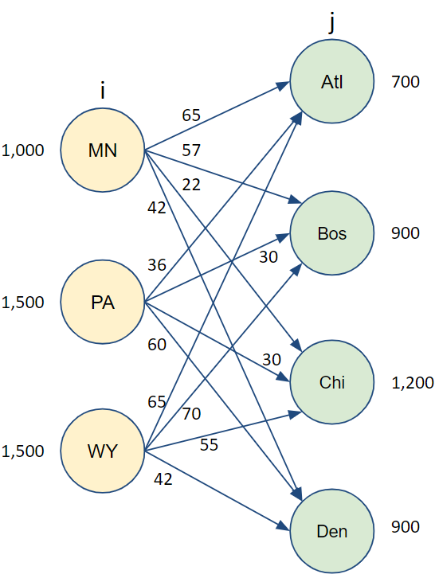
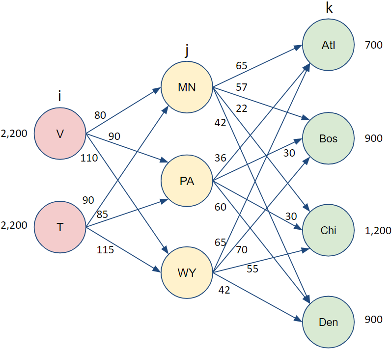
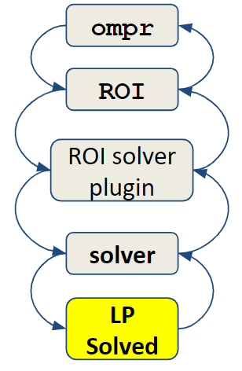
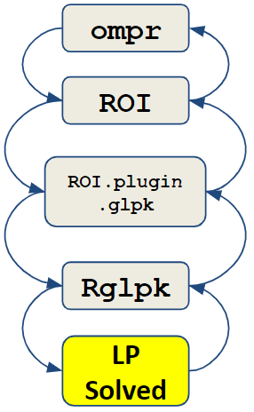

# More Linear Programming Models

```{r Ch3setup, include=FALSE}
library (tufte)
library (tint)
library (knitr)
library (gridExtra)
library (kableExtra)
library (pander)
library (magrittr)
knitr::opts_chunk$set(echo = TRUE)
knitr::opts_chunk$set(tidy = F)
knitr::opts_chunk$set(cache = FALSE)
knitr::opts_chunk$set(width = 30)

```

```{r, eval=FALSE, include=FALSE}
library(bookdown); library(rmarkdown); rmarkdown::render("03-More-LP-Models.Rmd", "tufte_book2")
```


## Types of LP Models

In this chapter, we will examine a range of classic applications of linear programs.
These applications will give ideas for how to model a variety of situations.
In each case, try to follow along with the application.

## The Algebraic Model

In the previous chapter, we examined situations with only a few products and constraints.
In general, most companies have many more products and we won't be wanting to name each product explicitly and uniquely.
Instead, we use sets of products and resources.\
\vspace{12pt}

We could also reframe the model more algebraically.
Let's use subscripts to differentiate between products and resources.
We can define that *i=1* represents Ants, *i=2* represents Bats, and *i=3* represents Cats.

```{marginfigure}
$$
 \begin{split}
 \begin{aligned}
    \text{Maximize  }   &  \sum_{i=1}^3 P_i x_i \\
    \text{subject to } & \sum_{i=1}^3 R_{i,j}x_i \leq A_j, \; j=1, 2, 3, 4\\
                       & x_1, \; x_2, \;x_3 \geq 0 
  \end{aligned}
  \end{split}
$$
```

```{marginfigure}
**Formula 3.1**: A production planning LP with 3 products and 4 contraints.
```

\vspace{12pt}

Similarly, *j=1* represents machining, *j=2*, represents assembly, etc.
Now, let's move on to defining the data.
Let's define the amount to produce of each product, *i*, as $x_i$ and resource *j* consumed by product *i* as $R_{i,j}$.
The available resource *j* is then $A_j$.
The profit per product *i* is then $P_i$.
The LP can now be rewritten as shown in the right margin, formula 3.1, if there are three products and four constraints.
\vspace{12pt}

We could further generalize this by instead of hard coding the number of products and resource constraints, we instead define the number of products and resources as *NProd* and *NResources* respectively.
We can then rewrite the previous formulation as the Formulation 3.2.

```{marginfigure}
$$
 \begin{split}
 \begin{aligned}
    \text{Max:}  &  \sum_{i=1}^{NProd} P_i x_i \\
    \text{subject to } & \sum_{i=1}^{NProd} R_{i,j}x_i \leq A_j \; \forall \; j\\
                       & x_i \geq 0  \; \forall \; i
  \end{aligned}
  \end{split}
$$
```

```{marginfigure}
**Formula 3.2**: A production planning LP for any number of products and constraints.
```

## Tips and Conventions for Algebraic Models

Learning how to read and write mathematical models is an important skill.
In this section we will provide a quick overview.
More information is provided in *Appendix A*.

The symbol, $\forall$, is read as "for all" and can be interpreted to mean "repeat this line substituting in a value for this subscript **for all** possible values of this subscript." In other words, given that *i* is used consistently for the three products, then $x_i \geq 0 \; \forall \; i$ is equivalent to $x_i \geq 0 \;,i=1,2,3$ or even $x_1 \geq 0, \; x_2 \geq 0, \; x_3 \geq 0$.
The result is that the $\forall$ symbol can simplify the description of complex models when index ranges are clear.
\vspace{12pt}

Another good practice is to use a mnemonic to help suggest the meaning of data.
That is why I chose "R" for Resource, "P" for Profit, and "A" for Available resources.
\vspace{12pt}

Another helpful convention is to use capital letters for data and lower case letters for variables.
(Some people will swap this around and use capital letters for variables and lower case letters for data - it doesn't matter as long as a model is consistent.)
\vspace{12pt}

More complex models often run out of letters that make sense.
A common approach in these models is to use a superscript.
For example, perhaps labor cost for each worker, *w*, could have different values for both normal and overtime rates.
Rather than separate data terms for such closely related concepts, we might denote regular hourly labor cost for worker *w* as $C^R_w$ and for overtime as $C^O_w$.
Again, it is very important to clearly define all the data and variables used in the model.\
\vspace{12pt}

## Building the Generalized Model in R

The concise, algebraic representation can be easily scaled to any number of products and resources.
Let's write this as the following.
I'll expand the names of data slightly for making the R code more readable but this is meant to be consistent with the above formulation.\
\vspace{12pt}

```{r, fig.margin=TRUE, echo=FALSE}
NProd <- 4
NResources <- 5
ProdNames <- lapply(list(rep("Prod",NProd)),paste0,1:NProd) 
                 # Product names: Prod1, Prod2, ... 
Profit <- matrix(c(7, 10, 5, 24), 
              ncol=NProd,dimnames=c("Profit",ProdNames))
grid.table(Profit)
```

```{marginfigure}
**Table 3.1**: Profit per product
```

Let's implement a four product model requiring varying levels of five limited resources.  The profit per product is described in Table 3.1 and and the resource consumption per product is given in table 3.2.  We will start our implementation by creating the appropriate data structures in `R`.

```{r Product_Planning_4x5, max.width=30}
NProd <- 4
NResources <- 5
ProdNames <- lapply(list(rep("Prod",NProd)),paste0,1:NProd) 
                 # Product names: Prod1, Prod2, ... 
Profit <- matrix(c(20, 14, 3, 16), 
              ncol=NProd,dimnames=c("Profit",ProdNames))
ResNames<- lapply(list(rep("Res",NResources)),
                  paste0,1:NResources) 
                 # Resource names: Res1, Res2, ... 
Resources <- matrix(c( 1, 3, 2, 3, 2, 3, 4, 3, 5, 7, 
                       2, 2, 1, 2, 2, 2, 2, 2, 4, 6), 
              ncol=NProd, 
              dimnames=c(ResNames,ProdNames))
Available <- matrix(c(800, 900, 480, 1200, 500), 
              ncol=1,dimnames=c(ResNames,"Available"))
```

```{r Display_Resources, tidy=FALSE, echo = FALSE, results='asis',fig.margin=TRUE}
grid.table(Resources)
```

```{marginfigure}
**Table 3.2**: Resources Used by Each Product
```

On the right side we can see the data.
This should match the data that we hard coded into the R linear programming model in the previous chapter.

```{marginfigure}
**cbind function**: This function joins tables in column-wise orientation by aligning the tables side by side.

**rbind function**: Same concept as cbind but in this case uses rows binding element to stack tables on top of each other.
```

Similarly, we can display the resources used by each product and the amount of each resource available.
See both tables on the right.
Table 3.2 displays the resources used by each product and Table 3.3 the amount of resources available from each product.

```{r Display_Available, tidy=FALSE, echo = FALSE, results='asis',fig.margin=TRUE}
grid.table(Available)
```

```{marginfigure}
**Table 3.3**: Amount of Each Resource Available
```

\vspace{12pt}

Now we need to define variables.

```{r Display_Resources_Available_Combined, fig.margin=TRUE}
Combined <- cbind(Resources, Available) 
grid.table(Combined)
```

```{marginfigure}
**Table 3.4**: Resources Used by Each Product and Available
```

\vspace{12pt}

On the right table, we can see the resources used and available in a single table.
We have used the *cbind* function to do a column binding of the data.
In this way the representation is more visually intuitive.

To ensure that we know how to access the data, if we want to see how the amount of the first resource used by the second product, you can enter `Resources[1,2]` in R Studio's console which is then evaluated as `r Resources[1,2]`.\^[Using inline code is a great feature of RMarkdown.
In the text of your RMarkdown, anything enclosed by a pair of single tick marks will be shown as a code chunk.
If it starts with the letter r, it will be passed instead to R for evaluation.
This allows for discussing results in a reproducible manner.
Rather than discussing the result giving a value of 47.1 in the text and a later rerun of the analysis has an updated table of results showing the result to be 47.2, by using inline code evaluation, it will always show the up to date result, in this case, 47.2.]\
\vspace{12pt}

Now, let's begin building our optimization model.\
\vspace{12pt}

First, we'll start by loading the packages that we are using.

```{marginfigure}
**Notice** that the resources available are listed as a column (vertical) vector rather than a row (flat) vector.  This differentiation will be important later.
```

```{r warning=FALSE}
library (magrittr, quietly = TRUE) 
suppressPackageStartupMessages(
  library (dplyr, quietly = TRUE))
suppressPackageStartupMessages(
  library (ROI, quietly = TRUE))
library (ROI.plugin.glpk, quietly = TRUE)
library (ompr, quietly = TRUE)
library (ompr.roi, quietly = TRUE)
```

And we will continue with the code to build the mode in a generic format.  Note that in the `ompr` model, every variable is given a `V` prefix to differentiate it from a regular `R` data object that might exist elsewhere in my `R` environment.  Conflicts between `R` objects and `ompr` variables are a common problem for modelers and this helps to avoid the problem, assuming that you don't have a lot of other `R` objects that start with `V`.  For more discussion about this issue and other common problems, see Appendix B.  

```{r Build_Prod_Model}
prodmodel <- MIPModel() %>%
  add_variable (Vx[i], i=1:NProd, 
                type="continuous", lb=0) %>%
  set_objective (sum_expr(Profit[i] * Vx[i], 
                          i=1:NProd ), "max") %>%
  add_constraint (sum_expr(Resources[j,i]*Vx[i], 
                           i=1:NProd)
                  <= Available[j],
                  j=1:NResources) %>% 
  
  solve_model(with_ROI(solver = "glpk"))
  
prodmodel
```

```{=html}
<!-- comment out for this section, which is not finish yet
Let's walk through what is done line by line.

```{marginfigure}
`prodmodel <- MIPModel() %>%`
```
-->
```
## Examining the Results

Displaying the object of `prodmodel` only shows a simple summary of the results of the analysis.
It indicates whether the model was solved to optimality (and it was!) and the objective function value (profit).\
\vspace{12pt}

This is useful to know but we are really interested in how to generate this profit.
To do this, we need to extract the values of the variables.

```{r Display_Results, fig.margin=TRUE}
results.products <- matrix (rep(-1.0,NProd), 
                            nrow = NProd, ncol=1,
                            dimnames=c(ProdNames,c("x")))
temp <- get_solution (prodmodel, Vx[i]) 
   # Extracts optimal values of variables   
results.products <- t(temp [,3] )      
   #Extracts third column
results.products <- matrix (results.products, 
                            nrow = 1, ncol=NProd,
                            dimnames=c(c("x"),ProdNames))  
                            # Resizes and renames 
grid.table(format(head(results.products),digits=4))
```

```{marginfigure}
**Table 3.5**: Optimal Production Plan
```

The table on the right displays the optimal production plan.
\vspace{12pt}

Let's examine how the resources are consumed.
To do this, we can multiply the amount of each product by the amount of each resource used for that product.
For the first product, this would be a term by term sum of each product resulting in `r Resources[1,]%*%t(results.products)` which is less than `r Available[1]`.
We can do this manually for each product.
Another approach is to use the command, `Resources[1,]%*%t(results.products)`.
This command will take the first row of the Resources matrix and multiplies it by the vector of results.\
\vspace{12pt}

```{marginfigure}
Note how we used both an inline r expression and an inline executable r code chunk.  Inline code chunks can be inserted into text by using a single tick at the beginning and end of the chunk instead of the triple tick mark for regular code chunks.  Also, the inline r code chunk starts with the letter r to indicate that it is an r code code.  A common use for this might be to show the results of an earlier analysis.
```

\vspace{12pt}

One thing to note is that the first row of `Resources` is by definition a row vector and `result.products` is also a row vector.
What we want to do is do a row vector multiplied by a column vector.
In order to do this, we need to convert the row vector of results into a column vector.
This is done by doing a *transpose* which changes the row to a column.
This is done often enough that the function is just a single letter, `t`.\
\vspace{12pt}

We can go one further step now and multiply the matrix of resources by the column vector of production.

```{r Calculate_Resources_Used, fig.margin=TRUE}
results.Resources <- Resources[]%*%t(results.products)
# Multiply matrix of resources by amount of 
# products produced
ResourceSlacks <- cbind (results.Resources,
                         Available,
                         Available-results.Resources)
colnames(ResourceSlacks)<-c("Used", "Available", "Slack")      
grid.table(format(head(ResourceSlacks),digits=4))
```

```{marginfigure}
**Table 3.6**: Resources Used
```

This section covered a lot of concepts including defining the data, setting names, using indices in *ompr*, building a generalized *ompr* model, extracting decision variable values, and calculating constraint right hand sides.
If you find this a little uncomfortable, try doing some experimenting with the model.
It may take some experimenting to get familiar and comfortable with this.

## Changing the Model

Let's modify the above model.
We can do this by simply changing the data that we pass into the model.
\vspace{12pt}

Let's number of sensors required for an ant to 5. Recall that this is the first product and the fourth resource. This is how we can change the value.

```{r Change_Data}
Resources[4,1] <- 5 
# Set value of the 4th row, 1st column to 5
# In our example, this is the number of sensors needed per ant
```

Now we will rebuild the the optimization model.  Note that simply changing the data does not change the model.  

\vspace{12pt}

```{r Rebuild_and_Solve_Model}
prodmodel <- MIPModel() %>%
  add_variable (Vx[i], i=1:NProd, 
                type="continuous", lb=0) %>%
  set_objective (sum_expr(Profit[i] * Vx[i] , 
                          i=1:NProd ), "max") %>%
  add_constraint (sum_expr(Resources[j,i]*Vx[i], 
                           i=1:NProd) 
                  # Left hand side of constraint
                  <= Available[j],    
                  # Inequality and Right side of constraint
                  j=1:NResources) %>% 
                  # Repeat for each resource, j.  
  solve_model(with_ROI(solver = "glpk"))
  
prodmodel
```

Note that the objective function has changed.

```{r Examine_Results_of_Changed_Model, fig.margin=TRUE}
results.products <- matrix (rep(-1.0,NProd), 
                            nrow = NProd, 
                            ncol=1,
                            dimnames=c(ProdNames,c("x")))
temp <- get_solution (prodmodel, Vx[i]) 
   # Extracts optimal values of variables   
results.products <- t(temp [,3] )      
   # Extracts third column
results.products <- matrix (results.products, 
                            nrow = 1, 
                            ncol=NProd,
                            dimnames=c(c("x"),ProdNames))  
   # Resizes and renames
grid.table(results.products) 
```

```{marginfigure}
**Table 3.7**: Revised Optimal Production Plan
```

The table on the right displays the new Production plan and the optimal distribution of the resources.

```{marginfigure}
**Note** that the production plan has significantly changed. At this point, we could discuss why this makes sense or not.  
```

## Blending Problems

Specific blend limitations arise in many situations.
In our example, we might say that Ants can make up no more than 40% of the overall product plan.  To demonstrate this, we will return to an explicitly defined model. 
In our original case, this would be expressed as the following.\
\vspace{12pt}

$$
 \begin{split}
 \begin{aligned}
   \frac {Ants} {Ants + Bats + Cats} \leq 0.40
  \end{aligned}
  \end{split}
$$

\vspace{12pt}

Let's rebuild our three variable production plan from Chapter 2.

```{r Base3VarModel, echo=TRUE}
model1 <- MIPModel() %>%
  add_variable(Ants, type = "continuous", lb = 0) %>%
  add_variable(Bats, type = "continuous",lb = 0) %>%
  add_variable(Cats, type = "continuous", lb = 0) %>%
  
  set_objective(7*Ants + 12*Bats + 5*Cats,"max")%>%
  
  add_constraint(1*Ants + 4*Bats + 2*Cats<=800)%>% 
  #machining
  add_constraint(3*Ants + 6*Bats + 2*Cats<=900)%>% 
  #assembly
  add_constraint(2*Ants + 2*Bats + 1*Cats<=480)%>% 
  #testing
  add_constraint(2*Ants + 10*Bats + 2*Cats<=1200) 
  #sensors

res3base <-  solve_model(model1, with_ROI(solver="glpk"))

xants <- get_solution (res3base, Ants)
xbats  <- get_solution (res3base, Bats)
xtables <- get_solution (res3base, Cats)
base_case_res           <- cbind(xants,xbats,xtables)
rownames(base_case_res) <- "Amount"
```

```{r, fig.margin=TRUE}
grid.table(base_case_res)
```

```{marginfigure}
**Table 3.8**: Production Plan for Base Case
```

The table on the right displays the optimal production plan for the original formulation without the limit on production of ants.
\vspace{12pt}

Let's add the constraint that ants can't make up more than 40% of the total production.
\vspace{12pt}

Effectively, we are saying that $\frac{Ants}{Ants+Bats+Cats} \leq 0.40$ \vspace{12pt}

Alas, this is not a linear function so we need to clear the denominator.
\vspace{12pt}

$Ants \leq 0.40 \cdot (Ants+Bats+Cats)$ \vspace{12pt}

We like to get all the variables on the left side so let's move them over.
\vspace{12pt}

$Ants - 0.4 \cdot Ants-0.4 \cdot Bats-0.4 \cdot Cats \leq 0$ \vspace{12pt}

Let's simplify this a little, which gives us the following: \vspace{12pt}

$0.6 \cdot Ants-0.4 \cdot Bats-0.4 \cdot Cats \leq 0$

\vspace{12pt}

The result is displayed as a formula on the right.

```{marginfigure}
$$
 \begin{split}
 \begin{aligned}
    \text{Max  }   & 7\cdot Ants +12 \cdot Bats +5\cdot Cats \\
    \text{s.t.:} & \\
                 & 1\cdot Ants + 4\cdot Bats +2\cdot Cats \leq 800 \\
                 & 3\cdot Ants + 6\cdot Bats +2\cdot Cats \leq 900 \\
                 & 2\cdot Ants + 2\cdot Bats +1\cdot Cats \leq 480 \\
                 & 2\cdot Ants + 10\cdot Bats +2\cdot Cats \leq 1200 \\
                 & 0.6 \cdot Ants-0.4 \cdot Bats-0.4 \cdot Cats \leq 0 \\
                 & Ants,  \; Bats, \; Cats \geq 0  
  \end{aligned}
  \end{split}
$$
```

```{marginfigure}
**Formula 3.4**: Three variable base case model with a blending constraint.  
```

\vspace{12pt}

We can simply add a constraint to an existing `ompr` model of our 3 variable base case.\
\vspace{12pt}

```{r Blending}
ModelBlending<- add_constraint(model1,
                0.6*Ants -0.4*Bats - 0.4*Cats <= 0) 
resBlending<- solve_model(ModelBlending, 
                          with_ROI(solver = "glpk"))
```

```{r Blending_Results}
blendres<-cbind(get_solution (resBlending, Ants),
                get_solution (resBlending, Bats),
                get_solution (resBlending, Cats))
```

\vspace{12pt}

Okay, now let's put both side by side in a table to show the results.\
\vspace{12pt}

```{r Compare_Blending_to_Base_Results, fig.margin=TRUE,fig.width=3}
rownames(base_case_res)<-"Base Model"
rownames(blendres)<-"with Constraint"
comparative <- rbind(base_case_res,round(blendres, 2))
colnames (comparative) <- c("Ants","Bats","Cats")
grid.table(comparative)
```

```{marginfigure}
**Table 3.9**: Compare Baseline and Production Plan due to a Blending Constraint
```

As a summary, we can see on the table on the right a comparative between the baseline case and the new production plan with the blending constraint.
\vspace{12pt}

## Allocation Models

\vspace{12pt}

An allocation model divides resources and assigns them to competing activities.
Typically it has a maximization objective with less than or equal to constraints.
Note that our production planning problem from Chapter 2 is an allocation model.

```{marginfigure}
$$
 \begin{split}
 \begin{aligned}
    \text{Max:}  &  \sum_{i=1}^3 P_i x_i \\
    \text{S.t.} \\ & 
                \sum_{i=1}^3 R_{i,j} x_i \leq A_j \; \forall \; j\\
                & x_i \geq 0  \; \forall \; i
  \end{aligned}
  \end{split}
$$
```

```{marginfigure}
**Formula 3.5**: Allocation  
```

See the Formula 3.5 on the right to understand the mathematical expression.
\vspace{12pt}

## Covering Models

\vspace{12pt}

A covering model combines resources and coordinates activities.
A classic covering application would be what mix of ingredients "covers" the requirements at the lowest possible cost.
Typically it has a minimization objective function and greater than or equal to constraints.
\vspace{12pt}

```{marginfigure}
$$
 \begin{split}
 \begin{aligned}
    \text{Min:}   &  \sum_{i=1}^3 C_i x_i \\
    \text{S.t.} & \sum_{i=1}^3 A_{i,j}x_i \geq R_j \; \forall \; j\\
                       & x_i \geq 0  \; \forall \; i
  \end{aligned}
  \end{split}
$$
```

```{marginfigure}
**Formula 3.6**: Covering  
```

See the Formula 3.6 on the right to understand the mathematical expression.
\vspace{12pt}

Consider the case of Trevor's Trail Mix Company.
Trevor creates a variety of custom trail mixes for health food fans.
He can use a variety of ingredients displayed in the table on the right.

```{marginfigure}

```

\vspace{12pt}

```{marginfigure}
|Charact.  |Mix1 |Mix2 |Mix3|Mix4 |Min Req.| 
|---------:|:---:|:---:|:--:|:---:|:------:|
| Cost     | $20 | $14 | $3 | $16 |        |
| Calcium  |  6  |  2  |  1 |   4 |  1440  |
| Protein  |  8  |  6  |  1 |   8 |  1440  |
| Carbohyd.|  6  |  4  |  1 |  25 |  2000  |
| Calories |  7  | 10  |  2 |  12 |  1000  |
```

```{marginfigure}
**Table 3.10**: Trevor Trail Mix Company ingredients  
```

Let's go ahead and build a model in the same way as we had done earlier for production planning.

```{r Trail_Mix_Data}
NMix <- 4
NCharacteristic <- 4
MixNames <- lapply(list(rep("Mix",NMix)),paste0,1:NMix) 
                 # Mix names: Mix1, Mix2, ... 
CharNames <-lapply(list(rep("Char",NCharacteristic)),
                   paste0,1:NCharacteristic)
                 # Characteristics of each mix
Cost <- matrix(c(20, 14, 3, 16), 
              ncol=NMix,dimnames=c("Cost",MixNames))
MixChar <- matrix(c( 6, 8, 6, 7, 
                     2, 6, 4, 10, 
                     1, 1, 1, 2,
                     4, 8, 25, 12), 
              ncol=4, dimnames=c(CharNames,MixNames))
CharMin <- matrix(c(1440, 1440, 2000, 1000), 
              ncol=1,dimnames=c(CharNames,"Minimum"))
```

```{r Display_Trail_Mix_Data, fig.margin=TRUE}
TTMix <-cbind(MixChar,CharMin)
grid.table(TTMix)
```

```{marginfigure}
**Table 3.11**: Data for Trevor Trail Mix Company  
```

```{marginfigure}
**Hint**: You might need to add a total amount to make! Modify the numbers until it runs...
```

Now let's build our model.

```{r trailmix}
trailmixmodel <- MIPModel() %>%
 add_variable(Vx[i],i=1:NMix,type="continuous",lb=0) %>%
 set_objective(sum_expr(Cost[i]*Vx[i],i=1:NMix ),"min")%>%
 add_constraint(sum_expr(MixChar[j,i]*Vx[i],i=1:NMix) 
                  # Left hand side of constraint
                  >= CharMin[j],    
                  # Inequality and Right side of constraint
                  j=1:NCharacteristic)  
                  # Repeat for each resource, j.  
results.trailmix <- solve_model(trailmixmodel, 
                                with_ROI(solver = "glpk"))
  
results.trailmix
xvalue <- t(get_solution(results.trailmix, Vx[i])[,3])
```

We'll leave it to the reader to clean up the output of results.
\vspace{12pt}

Another classic example of a covering problem is a staff scheduling problem.
In this case, a manager is trying to assign workers to cover the required demands throughout the day, week, or month.
\vspace{12pt}

## Transportation Models

\vspace{12pt}

A transportation model is typically for getting material from one place to another at the lowest possible costs.
It has sets of source points or nodes as well as ending or destination nodes.
The decision variables are the amount to send on each route.
Constraints are typically based on supply from the source nodes and capacity at the destination nodes.
\vspace{12pt}

This naturally lends itself to potential network diagrams such as the one to the right.  In this case we have three warehouses (or supply points) in Minnesota (MN), Pennsylvania (PA), and Wyoming (WY), each with a supply shown to the left.  On the right side, we have four customer or demand nodes:  Atlanta (ATL), Boston (Bos), Chicago (Chi), and Denver (Den) with their maximum demand shown to the right of the node.  We also have arcs connecting every supply node to every demand node, each labeled with a corresponding cost per unit to transport an item along that arc.  The goal is to get as much shipped as possible at the lowest possible cost.

```{r Fig-Transportation, echo=FALSE, fig.margin=TRUE, out.width="2in"}

```


```{marginfigure}
**Figure 3.1**: Transportation application.
```

Let's start to model this now.  We want to define the decision variables, in this case, $x_{i,j}$ is the amount of product to ship from node i to node j.
\vspace{12pt}

Let's also define the data available. The cost per unit to ship from node i to node j is $C_{i,j}$.
The supply available from each supply node is $S_i$ and the maximum demand that can be accommodate from each destination node is $D_j$.\
\vspace{12pt}

In this formulation we need to make sure that we don't ship out more than the capacity of each supply node.
\vspace{12pt}

Similarly, we need to ensure that we don't take in more than demand capacity at any destination.

```{marginfigure}
$$
 \begin{split}
 \begin{aligned}
    \text{Minimize  }   &  \sum_{i} \sum_{j} C_{i,j} x_{i,j} \\
    \text{subject to } & \sum_{i} x_{i,j} \leq D_j \; \forall \; j\\
                       & \sum_{j} x_{i,j} \leq S_i \; \forall \; i\\
                       & x_{i,j} \geq 0  \; \forall \; i,j
  \end{aligned}
  \end{split}
$$
```

```{marginfigure}
**Formula 3.7**: Base Case for Transportation model  
```

If we simply run this model, as is, the minimum cost plan would be to just do nothing!
The cost would be zero.
In reality, even though we are focused on costs in this application, there is an implied revenue and therefore profit (we hope!) that we aren't directly modeling.
We are likely to instead be wanting to ship all of the product that we can at the lowest possible cost.
More precisely, what we want to do is instead determine if the problem is supply limited or demand limited.
This is a simple matter of comparing the net demand vs. the net supply and making sure that the lesser is satisfied completely.
\vspace{12pt}

+-------------------------------+--------------------+-----------------------------+-----------------------------+
| If...                         | Then Situation is: | Source Constraints          | Demand Constraints          |
+==============================:+:==================:+:===========================:+:===========================:+
| $\sum_{i} S_i < \sum_{j} D_j$ | Supply Constrained | $\sum_{j} x_{i,j} = S_i$    | $\sum_{i} x_{i,j} \leq D_j$ |
+-------------------------------+--------------------+-----------------------------+-----------------------------+
| $\sum_{i} S_i > \sum_{j} D_j$ | Demand Constrained | $\sum_{j} x_{i,j} \leq S_i$ | $\sum_{i} x_{i,j} = D_j$    |
+-------------------------------+--------------------+-----------------------------+-----------------------------+
| $\sum_{i} S_i = \sum_{j} D_j$ | Balanced           | $\sum_{j} x_{i,j} = S_i$    | $\sum_{i} x_{i,j} = D_j$    |
+-------------------------------+--------------------+-----------------------------+-----------------------------+

In the balanced situation, either source or demand constraints can be equalities.
\vspace{12pt}

Similarly, if we try to use equality constraints for both the supply and demand nodes but the supply and demand are not balanced, the LP will not be feasible.
\vspace{12pt}

```{marginfigure}
**Hint**:  In `ompr`, a double subscripted non-negative variable, $x_{i,j}$ can be defined easily as the following:
`add_variable(x[i, j], type = "continuous", i = 1:10, j = 1:10, lb=0)`
```

Let's show how to set up a basic implementation of the transportation problem in `ompr`. This demonstrates the use of double subscripted variables. Also, it should be customized for a particular application of being demand or supply constrained but it will give a good running head start.
\vspace{12pt}

```{r transp_data}
NSupply <- 3   # 3 Supply nodes
NDest   <- 4   # 4 Destination nodes
snames <- list("MN", "PA", "WY")
dnames <- list("Atl", "Bos", "Chi", "Den")
Cost <- matrix (c(65, 36, 65, 57, 30, 70, 
                  22, 30, 55, 42, 60, 42),
                nrow = NSupply,
                dimnames =list(snames,dnames))
S <- c(1000, 1500, 1500)

D <- c(700,  900, 1200, 900)

```

\vspace{12pt}

At this point, it may be a good idea to look at the arcs and see if you can expect which routes are likely to be heavily used and which are likely to be unused.  You can also do this by looking at the matrix of transportation costs to the right.

```{r Show_Transp_Cost, eval=TRUE, fig.margin=TRUE}
grid.table (Cost)
```

```{marginfigure}
**Formula 3.8**: Costs for transportation application  
```
\vspace{12pt}

Now, let's move on to implementing the model.  
\vspace{12pt}

```{r transportation, eval=TRUE}
transportationmodel <- MIPModel() %>%
 add_variable(Vx[i, j], type = "continuous", 
               i = 1:NSupply, 
               j = 1:NDest, lb=0) %>%
 set_objective (sum_expr(Cost[i,j] * Vx[i,j] , 
                          i=1:NSupply, 
                          j=1:NDest ), "min") %>%
 add_constraint (sum_expr(Vx[i,j], i=1:NSupply) 
  # Left hand side of Demand constraints
                >= D[j],   
  # Inequality and Right side of constraint
                j=1:NDest)%>% 
  # Repeat for each demand node j.  
 add_constraint (sum_expr(Vx[i,j], j=1:NDest)
  # Left hand side of Supply constraints
                <= S[i],    
  # Inequality and Right side of constraints
                i=1:NSupply)  
  # Repeat for each supply node i.  

res.transp <-solve_model(
  transportationmodel, with_ROI(solver ="glpk"))

```
\vspace{12pt}

Let's confirm that our model solved correctly.
\vspace{12pt}

```{r transp_status, fig.margin=TRUE}
res.transp$status
```

Since it was solved to optimality, the optimal objective function value is meaningful and again we can use an inline code chunk of `R` to extract this value `r  res.transp$objective_value`.  The actual decision variable values of the solution are more interesting though.  Let's first prepare these results by extracting them from the solution object and then applying our names to them.  
\vspace{12pt}

```{r}
Transp <- matrix(res.transp$solution,
                nrow = NSupply,
                dimnames =list(snames,dnames))  
```

\vspace{12pt}
Now we can display the table of optimal transportation decisions from supply points to destinations cleanly.  
\vspace{12pt}

```{r}
grid.table (Transp)
```

\vspace{12pt}

## Transshipment Models

\vspace{12pt}

A generalization of the transportation model is that of transshipment where some nodes are intermediate nodes that are neither pure sources or destinations but can have both inflow and outflow.  We could extend our previous example with factories in Vietnam and Thailand.  Note that the facilities in the middle (Minnesota, Pennsylvania, and Wyoming) are better described as distribution centers rather than warehouses.

```{r Fig-Transshipment, echo=FALSE, fig.margin=TRUE, out.width="2in"}

```

```{marginfigure}
**Figure 3.2**: Transshipment application.
```
\vspace{12pt}

In this case, the standard convention might be to work from left to right and index the set of factories by _i_, the set of distribution centers by _j_ and the set of customers by _k_.  We might also use $x_{i,j}$ to be the amount to ship from factory _i_ to distribution center _j_ and $y_{j,k}$ to be the amount to ship from distribution center _j_ to customer _k_.
\vspace{12pt}

A common characteristic of this kind of problem is then that the inflow at each distribution center must equal the outflow.  This means that for Minnesota, $(j=1)$, we would would have a relationship of the following.
\vspace{12pt}

$$x_{1,1}+x_{2,1}=y_{1,1}+y_{1,2}+y_{1,3}+y_{1,4}$$ 

This lends itself to a summation.
\vspace{12pt}

$$\sum_{i=1}^2 x_{i,1}=\sum_{k=1}^4 y_{1,k}$$

\vspace{12pt}

We can then generalize this for every distribution center, _j_.
\vspace{12pt}

$$\sum_{i=1}^2 x_{i,j}=\sum_{k=1}^4 y_{j,k} \; \forall \; j$$
\vspace{12pt}

Now we could put everything together.  We'll differentiate the costs to ship from supply and to destination now as $C_{i,j}^S$ and $C_{j,k}^D$ respectively.

\vspace{12pt}

$$
 \begin{split}
 \begin{aligned}
    \text{Minimize  }   &  \sum_{i} \sum_{j} C_{i,j}^S x_{i,j} + 
                           \sum_{j} \sum_{k} C_{j,k}^D y_{j,k}\\
    \text{subject to } & \sum_{j} y_{j,k} \leq D_k \; \forall \; k\\
                       & \sum_{j} x_{i,j} \leq S_i \; \forall \; i\\
                       & \sum_{i} x_{i,j}=\sum_{k} y_{j,k} \; \forall \; j\\
                       & x_{i,j},  y_{j,k} \geq 0  \; \forall \; i,j,k
  \end{aligned}
  \end{split}
$$
\vspace{12pt}

The directions of the supply and demand constraint inequalities must again be considered as to whether the problem is supply or demand constrained, lest we find an optimal solution of doing nothing.
\vspace{12pt}

This transshipment application can be further enhanced to allow for losses along arcs.  In this case there might be affect amount that reaches the distribution center based on losses enroute.  For example, we might use $L_{i,j}$ to capture this effect with $L_{1,2}=0.9$ to indicate that only 90% of the material makes it from factory _1_ to distribution center _2_. We would then modify the balance constraints to take the following form  $\sum_{i} L_{i,j} \cdot x_{i,j}=\sum_{k} y_{j,k} \; \forall \; j$.  Losses might also apply in the transportation to the end customer with similar modifications to the model.
\vspace{12pt}

Another common situation is to add capacity limits to each arc, perhaps both upper and lower bounds on capacity.
\vspace{12pt}

Another common need in real world application is modeling a time dimension which leads us to issue production and inventory planning.

\vspace{12pt}

## Production and Inventory
\vspace{12pt}

A common application is production planning and inventory management planning over time.
Let's assume a company has a manufacturing cost for product *p* in time period *t* of $C^M_{p,t}$.
The cost to carry a unit of product *p* in inventory from period *t* to *t+1* is $C^I_{p,t}$.
Demand of $D_{p,t}$ must be met each period.
The maximum production in any period can vary and is denoted as $M_{p,t}$.
The beginning inventory for each product is $B_{p}$.
The goal of the manager is to find a production plan that minimizes cost.\
\vspace{12pt}

We can start by defining our decision variables.
We will need a set of decision variables for the amount to produce of each product *p* in each period *t*.
Let's define that as $x_{p,t}$.\
\vspace{12pt}

Similarly, we will define a variable for the inventory at the end of each period, $y_{p,t}$.\
\vspace{12pt}

The production cost is simply cost per product multiplied by the number of products produced or $\sum_{p} \sum_{t} C^M_{p,t} x_{p,t}$.
\vspace{12pt}

The inventory carrying cost follows the same structure, $\sum_{p} \sum_{t}  C^I_{p,t} y_{p,t}$ \vspace{12pt}

We can then combine them as $\sum_{p} \sum_{t} ( C^M_{p,t} x_{p,t} + C^I_{p,t} y_{p,t})$ \vspace{12pt}

At this point, it is important to look at the relationship between inventory, production, and sales.
\vspace{12pt}

Sometimes care must be taken for the "boundary conditions" of the first or last time period.
In our case, we have a value defined the beginning inventory of $B_p$.
For product 1, we would have $B_1 + x_{1,1} - D_{1,1} = y_{1,1}$.
For product 2, it would be $B_2 + x_{2,1} - D_{2,1} = y_{2,1}$ and so on for other products.
We would generalize this then as $B_p + x_{p,1} - D_{p,1} = y_{p,1}$.
\vspace{12pt}

For periods after the first $(t>1)$) Essentially the ending inventory is equal to the beginning inventory plus the inflow (production) minus the outflow (demand).
For product *p* in time period *t*, this then becomes $y_{p,t-1} + x_{p,t} - D_{p,t} = y_{p,t}$ \vspace{12pt}

Of course we would need to ensure appropriate upper and lower bounds on the decision variables.\
\vspace{12pt}

Let's wrap it all together in the follow formulation.

$$
 \begin{split}
 \begin{aligned}
    \text{Minimize  }   &  \sum_{p} \sum_{t} ( C^M_{p,t} x_{p,t} + C^I_{p,t} y_{p,t}) \\
    \text{subject to: } & B_{p} + x_{p,1} - D_{p,1} = y_{p,1}   \; \forall \; p,  \\
            & y_{p,t-1} + x_{p,t} - D_{p,t} = y_{p,t}   \; \forall \; p, \; t > 1 \\
            & 0 \leq x_{p,t} \leq M_{p,t} \; \forall \; p, t\\
            & y_{p,t} \geq 0 \; \forall \; p, t\\
  \end{aligned}
  \end{split}
$$

This model illustrates the basic dynamics of relating production, inventory, and demand.
Each application often requires tailoring to address specific needs.
For example:

-   Some companies require safety stocks levels to be maintained which could be done by setting minimum inventory levels.
-   Sometimes all the demand cannot be met in a period - this can be modeled by separating sales from demand with a separate variable for sales in each period.
-   Allowing backlogged demand that can be met in the following period - again modeled with an additional variable.

\vspace{12pt}

## Standard Form

\vspace{12pt}

Any linear program with inequality constraints can be converted into what is referred to as standard form.
First, all strictly numerical terms are collected or moved to the right hand side and all variables are on the left hand side.
\vspace{12pt}

It makes little difference as to whether the objective function is a *min* or a *max* function since a min objective function can be converted to a max objective function by multiplying everything by a negative one.
The converse is also true.
\vspace{12pt}

The last step is where all of the inequalities are replaced by strict equality relations.
The conversion of inequalities to equalities warrants a little further explanation.
This is done by introducing a new, non-negative "slack" variable for each inequality.
If the inequality is a $\leq$, then the slack variable can be thought of as filling the left hand side to make it equal to the right hand side so the slack variable is added to the left hand side.
If the inequality is $\geq$, then the slack variable is the amount that must be absorbed from the left hand side to make it equal the right hand side.\
\vspace{12pt}

Let's demonstrate with a two variable example.
\vspace{12pt}

$$
 \begin{split}
 \begin{aligned}
    \text{max  }   &  2 \cdot x + 3 \cdot y \\
    \text{subject to } &  10 \cdot x + 2 \cdot y \leq 110 \\
                       & 2 \cdot x + 10 \cdot y \geq 50 \\
                       & 2 \cdot x = 4 \cdot y  \\
                       & x,y \geq 0  
  \end{aligned}
  \end{split}
$$

\vspace{12pt}
This can be then transformed to standard form by rearranging terms in the third constraint and adding two non-negative slack variables to the first two constraints.
\vspace{12pt}

$$
 \begin{split}
 \begin{aligned}
    \text{max  }   &  2 \cdot x + 3 \cdot y \\
    \text{subject to } &  10 \cdot x + 2 \cdot y + s_1 = 110 \\
                       & 2 \cdot x + 10 \cdot y -s_2 = 50 \\
                       & 2 \cdot x - 4 \cdot y = 0 \\
                       & x,y, s_1, s_2 \geq 0  
  \end{aligned}
  \end{split}
$$ The standard form now consists of a system of equations, generally with far more variables (both regular and slack) than equations.
The simplex algorithm makes use of the fact that a system of equations and unknowns can be solved efficiently.
The Simplex algorithm solves for as many variables (termed basic variables) as there are equations and sets the remaining variables to zero (non-basic variables).
It then systematically swaps a variable from the set of basic variables and non-basic variables until it can no longer find an improvement.
The actual algorithm for the Simplex algorithm is beyond the scope of what we will cover in this book.\
\vspace{12pt}

Let's examine the solution to our example though.
\vspace{12pt}

```{r StdModel, echo=TRUE}
StdModel <- MIPModel() %>%
 # To avoid name space conflicts, using a prefix of V
 #    for ompr variables.
  
 add_variable(Vx, type = "continuous", lb = 0) %>%
 add_variable(Vy, type = "continuous",lb = 0) %>%
 add_variable(Vs1, type = "continuous", lb = 0) %>%
 add_variable(Vs2, type = "continuous", lb = 0) %>%
  
 set_objective(2*Vx + 3*Vy,"max") %>%
  
 add_constraint(10*Vx + 2*Vy + Vs1==110) %>%
 add_constraint(2*Vx + 10*Vy - Vs2==50) %>% 
 add_constraint(2*Vx - 4*Vy == 0) 

  resStd <- solve_model(StdModel, 
                        with_ROI(solver = "glpk"))
  resStd
  
x  <- get_solution (resStd , Vx)
y  <- get_solution (resStd , Vy)
s1 <- get_solution (resStd , Vs1)
s2 <- get_solution (resStd , Vs2)

base_case_res           <- cbind(x, y, s1, s2)
rownames(base_case_res) <- "Optimal Values"
pander(base_case_res, caption="Solution to Standard Form")
```

Notice that we had three equations and four variables (both regular and slack variables.) This meant that at every iteration of the simplex algorithm, it would set one variable equal to zero and solve for the other three variables because solving three equations with three unknowns is very easy.
This is consistent with our solution, where $s_1$ is zero and the other three variables all had values.
\vspace{12pt}

## Vector and Matrix Forms of LPs

\vspace{12pt}
One of the benefits of using an algebraic modeling approach for linear programming such as `ompr` is that it provides a direct mapping from the mathematical model of the application to the implementation.
The actual solver used such as `glpk,` `symphony,` or `gurobi` take the linear program in a different form though and `ompr` processes it into a form they can handle.

```{r Fig-ompr_structure, echo=FALSE, fig.margin=TRUE, out.width="1.5in"}

```

```{marginfigure}
**Figure 3.3**: Relationship between `ompr` and solvers.
```
\vspace{12pt}

In general, the solver thinks of the problem in terms of a vector of coefficients for the objective function, *C*, a vector of right hand side constraint values, *B*, a matrix of data, *A*, and a vector of variables, *x*.
The result is that any linear program can be thought of in a form to the right.

```{marginfigure}
$$
 \begin{split}
 \begin{aligned}
    \text{max  }   &  C \cdot x \\
    \text{s.t. } &  A \cdot x \leq B \\
                       & x \geq 0  
  \end{aligned}
  \end{split}
$$
```

```{marginfigure}
**Formula 3.10**: Optimization base model with 2 variables.
```

\vspace{12pt}

Let's examine building our first two variable LP model in this way using the `lpsolveAPI` package.  

{marginfigure}
$$
 \begin{split}
 \begin{aligned}
    \text{Max  }   & 7\cdot Ants +12 \cdot Bats \\
    \text{s.t.:} & \\
& 1\cdot Ants + 4 \cdot Bats \leq 800 \\
& 3\cdot Ants + 6 \cdot Bats \leq 900 \\
& 2\cdot Ants + 2 \cdot Bats \leq 480 \\
& 2\cdot Ants + 10 \cdot Bats \leq 1200 \\
& Ants, Bats \geq 0  
  \end{aligned}
  \end{split}
$$

{marginfigure}
**Formula 3.10**: First LP model with 2 variables.

\vspace{12pt}

```{r}
library(lpSolveAPI)
lps.model <- make.lp(0, 2) # Make empty 2 var model
xt <- c(1,4)
add.constraint(lps.model, xt, "<=", 40)
xt <- c(3,6)
add.constraint(lps.model, xt, "<=", 45)
xt <- c(2,2)
add.constraint(lps.model, xt, "<=", 24)
xt <- c(2,10)
add.constraint(lps.model, xt, "<=", 60)
set.objfn(lps.model, c(-7,-12))
name.lp(lps.model, "Simple LP")
name.lp(lps.model)
plot.lpExtPtr(lps.model)
solve(lps.model)
get.primal.solution(lps.model, orig=TRUE)
```


Earlier in the chapter, we created data structures for the generalized version of the optimization model. Recall that earlier in this chapter we created a `Resources` matrix of the resources used by each product - this corresponds to our $A$ matrix.  We also created a single column  matrix, `Available`, for the amount of each resource available which is our $B$ vector.  The `Profit` single row matrix serves as our $C$ vector.  The last item that we need to do is to specify a direction for each inequality. 
\vspace{12pt}

We could rewrite our formulation then as the following.  
\vspace{12pt}

$$
 \begin{split}
 \begin{aligned}
    \text{max  }   &  Profit \cdot x \\
    \text{s.t. } &  Resources \cdot x \leq Available \\
                       & x \geq 0  
  \end{aligned}
  \end{split}
$$
The `Rglpk` package can then be accessed directly.
\vspace{12pt}

```{r Fig-ompr_to_glpk, echo=FALSE, fig.margin=TRUE, out.width="1.5in"}

```

```{marginfigure}
**Figure 3.4**: Relationship between `ompr` and `Rglpk`.
```

```{r}
library (Rglpk)    # Load Rglpk package

dir2<- c( "<=", "<=", "<=", "<=", "<=")
                   # Set direction of each inequality

res2 <- Rglpk_solve_LP(obj=Profit,    # C vector
                       mat=Resources, # A matrix
                       dir=dir2,  # Constraint Inequalities
                       Available, # B vector
                       max=TRUE)  # False does minimization
   # Uses default bounds on all variables
   #   LB = 0, UB=infinity (just non-negativity)
   # Defaults to continuous variables
```
\vspace{12pt}

Notice that calling the solver directly such as in this way using `Rglpk` does not require naming decision variables.  A decision variable is created for each column of the matrix.  Directly accessing the solver allows for all the same features that we use through `ompr` such as placing bounds on the variables, changing to a minimization objective function, and more such as advanced solving options.  Other LP solving engines available in `R` such as `RSymphony` and `lpSolve` have similar syntax for solving.  
\vspace{12pt}

Let's look at the results. As usual, we start by examining the status. 
\vspace{12pt}

```{r}
res2$status
```

\vspace{12pt}
The status returned by `Rglpk` is zero.  This may sound bad but the package's help file indicates that returning a status value of zero means that no problems occurred and it found an optimal solution.  We can then proceed to examine the objective function value.  
\vspace{12pt}

```{r}
res2$optimum
```
\vspace{12pt}

This objective function value may look familiar.  Now let's look at the solution in terms of optimal decision variable values.
\vspace{12pt}

```{r}
res2$solution
```

Most of these LP solving engines can also allow models to be built up incrementally as well by creating an empty model, then adding an objective function and adding constraints, bounds on variables as separate lines of `R` code.  
\vspace{12pt}

While working with the solver directly has the benefit of avoiding ambiguities such as the difficulty of parsing solution status correctly, creating a single _A_ matrix for optimization problems with multiple sets of decision variables and decision variables that may have 3 or more subscripts can be very tricky, hard to maintain, and even harder to debug.  Also, the results require just as much or more care in unpacking as the solution variable values are returned as a single vector, _x_ containing all the separate decision variables.  Think of having three triple subscripted variables, _u_, _v_, and _y_ with each subscript having 12 values.  The resulting _x_ vector will have $3 \cdot 12^3=5184$ elements, each of which must always be considered in exactly the same order for each constraint or building of the _A_ matrix.
\vspace{12pt}

At this point, it may be apparent that a chief benefit of `ompr` is that allows the modeler to deal with the model at a higher level and forces the computer to handle the detailed accounting translating the model into a lower level solvable structure and then translating the solution back into the original terms.  These conversions are analogous to using a high level computer language versus a low level assembly code.  A talented programmer can write a program in assembly code to do anything that could be done in a high level language but the cost in terms of time and effort is typically prohibitive.    
\vspace{12pt}

The investment of time and effort to use a lower level, more direct access to the solver engine may be warranted when developing a package that does optimization. For example, packages for doing Data Envelopment Analysis require doing many linear programs.  These are typically done using the lower level engines such as lpSolveAPI, `Rglkp`, `lpSolveAPI`, or other tools rather than `ompr` but the platform decision should be made carefully.  A more indepth example of building optimization models using lower level access calls is in _DEA Using R_.
\vspace{12pt}

Since each low level solver may have different choices made in terms of the name or format of parameters to be passed for the LP as well as a different naming convention of elements being passed back, a translation layer has been developed, `ROI` which stands for the R Optimization Interface. There is the core `ROI` package and a specific `ROI` interface for each LP solver such as `ROI.plugin.glpk`. `ROI` can then be used to simplify switching between LP solvers.  This is demonstrated in Chapter 8.  
\vspace{12pt}

\vspace{12pt}

## Exercises

**Exercise 3.1** (Transportation)

Four manufacturing plants are supplying material for distributors in four regions.
The four supply plants are located in Chicago, Beaverton, Eugene, and Dallas.
The four distributors are in PDX (Portland), SEA (Seattle), MSP (Minneapolis), and ATL (Atlanta).
Each manufacturing plant has a maximum amount that they can produce.
For example, Chicago can produce at most 500.
Similarly, the PDX region can handle at most 700 units.
The cost to transport from Dallas to MSP is three times as high as the cost from Dallas to Atlanta.
The table on the right displays the transportation cost between all the cities.
\vspace{12pt}

```{marginfigure}
| Node        | PDX  |  SEA |  MSP | ATL  | *Supply* | 
|------------:|:----:|:----:|:----:|:----:|:--------:|
|  Chicago    |  20  |  21  |   8  | 12   | **500**  |
|  Beaverton  |   6  |   7  |  18  | 24   | **500**  |
|  Eugene     |   8  |  10  |  22  | 28   | **500**  |
|  Dallas     |  16  |  26  |  15  |  5   | **600**  |
|**Capacity** | **700**| **500**| **500**| **600**|          |

```

```{marginfigure}

**Table 3.12**: Transportation cost between cities  
```

Formulate an explicit model for the above application that solves this transportation problem to find the lowest cost way of transporting as much as product as we can to distributors.
Hint: You might choose to define variables based on the first letter of source and destination so *XCP* is the amount to ship from Chicago to PDX.\
\vspace{12pt}

Implement and solve the model using `ompr`.
Be sure to interpret and discuss the solution as to why it makes it sense.
\vspace{12pt}

**Exercise 3.2** (Generalized Transportation Model)

Formulate a generalized model for the above application that solves this transportation problem to find the lowest cost way of transporting as much product as we can to distributors.
\vspace{12pt}

```{marginfigure}
**Hint**: Feel free to use my LaTeX formulation for the general transportation model and make change(s) to reflect your case.
```

Implement and solve the model using ompr.
Be sure to discuss the solution as to why it makes sense.
\vspace{12pt}

**Exercise 3.3** (Convert LP to Standard Form)

Convert the three variable LP represented in Table 3.13 into standard form.

```{marginfigure}
$$
 \begin{split}
 \begin{aligned}
    \text{Max:} & \\
                & Profit=20Ants+10Bats+16Cats \\
    \text{S.t.} & \\
                & 6Ants+3Bats+4Cats \leq 2000 \\
                & 8Ants+4Bats+4Cats \leq 2000 \\
                & 6Ants+3Bats+8Cats \leq 1440 \\
                & 40Ants+20Bats+16Cats \leq 9600 \\
                & Cats  \leq 200 \\
                & Ants, Bats, Cats \geq 0  
  \end{aligned}
  \end{split}
$$
```

```{marginfigure}
**Table 3.13**: Base LP Model 
```

\vspace{12pt}

**Exercise 3.4** (Convert LP to Standard Form)

Implement and solve the standard form of the LP using R.
Be sure to interpret the solution and discuss how it compares to the solution from the original model.

\vspace{12pt}

**Exercise 3.5** (Convert Generalized LP to Standard Form)

Convert the generalized production planning LP, displayed on the right in formula 3.7, into standard form.\
Hint: define a set of variables, $s_j$ to reflect these changes and add it to the following formulation.

```{marginfigure}
$$
 \begin{split}
 \begin{aligned}
    \text{Maximize  }   &  \sum_{i=1}^3 P_i x_i \\
    \text{subject to } & \sum_{i=1}^3 R_{i,j}x_i \leq A_j  \; \forall \; j\\
                       & x_i \geq 0  \; \forall \; i
  \end{aligned}
  \end{split}
$$
```

```{marginfigure}
**Formula 3.6**: Generalized LP case
```

\vspace{12pt}

**Exercise 3.6** (Staff Scheduling)

Happy Patient Hospital (HPH), has varying needs for nurses throughout the day.
They expect the following numbers of nurses to be needed over the typical 24 hour period.
Nurses work eight hour shifts, starting at each 4 hour time period specified in the table.

```{r, nurse_scheduling, fig.margin=TRUE}
hph_needs <- matrix (c(50, 140, 260, 140, 100, 80), ncol=1, 
    dimnames = c(list(c("midnight - 4 AM",
                        "4 AM - 8 AM",
                        "8 AM - noon",
                        "noon - 4 PM",
                        "4 PM - 8 PM",
                        "8 PM - midnight")),
                 list(c("Required Nurses"))))
grid.table (hph_needs)
```

Create an appropriate optimization model to minimize the number of nurses needed to cover the requirements.

Implement and solve the model in R.
Discuss and explain your solution.
