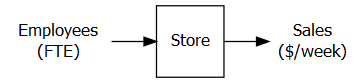

---
output:
  pdf_document: default
  html_document: default
---

```{r, include=FALSE, eval=FALSE}
knitr::opts_chunk$set(echo = TRUE)
knitr::opts_chunk$set(tidy = FALSE)
knitr::opts_chunk$set(cache = FALSE)
library(bookdown); library(rmarkdown); 
rmarkdown::render("05-DEA.Rmd", "pdf_book")
```

# Data Envelopment Analysis

```{r Ch5setup, warning=FALSE, include=FALSE}
knitr::opts_chunk$set(echo = TRUE)
knitr::opts_chunk$set(tidy = FALSE)
knitr::opts_chunk$set(cache = FALSE)
library (dplyr, quietly = TRUE)
library (ROI, quietly = TRUE)
library (ROI.plugin.glpk, quietly = TRUE)
library (ompr, quietly = TRUE)
library (ompr.roi, quietly = TRUE)
library (knitr)
library (DiagrammeRsvg, quietly=TRUE) 
library (rsvg, quietly=TRUE) 
library (htmltools, quietly=TRUE)
library (kableExtra)
library (TRA) # Requires installation from github
     # DiagrammeRsvg, rsvg, htmltools are used for IO diagrams

```

## Introduction

Data envelopment analysis or DEA is a powerful tool for conducting studies of efficiency and has been used in thousands of publications since its inception in the 1970s.[^dea-1] \index{Data envelopment analysis} \index{DEA|see{Data envelopment analysis}}

[^dea-1]: This chapter is drawn from an introduction chapter in the book, *Data Envelopment Analysis Using R* by the same author. More details on DEA are available from that book. This book is also available via github at <https://github.com/prof-anderson>\[github.com/prof-anderson\]

While tools exist for conducting the evaluations, it is important to understand how the tools work. Many DEA studies have been conducted and published by authors with only a superficial understanding of the technique. This is equivalent to having a house built by carpenters that only (barely?) understand how to use a hammer. The purpose of this document is to show how DEA works, what it means, and how to use R for getting started with DEA. In order to keep things simple, this first step only looks at the input-oriented envelopment model with constant returns to scale. We introduce other models at the end of this chapter.\

This chapter walks through how DEA works and then shows how to implement the model in R using two very different approaches. Over the years, I have built DEA models in many languages and platforms: Pascal, LINDO, LINGO, Excel Macros, Excel VBA, GAMS, AMPL, XPress-MOSEL, and GLPK among others.\

In this chapter, we will use a few functions from an R package, `TRA`, that I have created. This package is for doing a range of functions related to Technology, Research, and Analytics. \index{TRA package} The `TRA` package is not posted on CRAN but is instead available from github. You can download a current version from github. The result is that you will need to install it using the `devtools` package.\

```{r load_TRA_from_github, eval=FALSE}
library (devtools)
devtools::install_github("prof-anderson/TRA")
library (TRA)
```

## Creating the Data

Let's start by defining data. DEA applications can have multiple inputs and outputs. The input(s) are typically resources that are consumed in the production of output(s). Inputs are referred to as "bads" in that higher levels at the same level of output is considered worse. Similarly, holding everything else constant, an increase in any single output is laudable. Examples of inputs might include capital, labor, or number of machines.\

In contrast, outputs are the "good" items that are being produced by the actions of the producers. Examples of outputs might include automobiles produced, customers served, or graduating students.\

Let's start by creating a simple application - assume that you are a regional manager of a grocery chain. You have four stores and would like to assess the performance of the store managers using number of employees, *x*, as an input and the weekly sales, *y*, as an output.\

As the manager responsible for the stores in the region, there are many questions that you may want answered:

-   Which of these stores are the best?
-   Which stores are laggards?
-   For those that are underperforming, are there objective performance targets they should be able to reach?
-   Which stores might be employing best practices that could be adopted by other stores?
-   Among the stores that are lagging in performance, are there particular stores they should focus attention on for learning best practices?

We'll start by drawing a visual representation of the input-output model. The function `DrawIOdiagram` is from the `TRA` package and allows for creating a nicely formatted input-output diagram. \index{DrawIOdiagram}\

```{r DEA-IO-Plot1, out.width="3in", fig.align='center', fig.cap="A Simple DEA Model for Store Management"}
library (TRA) # Note, may need to install directly from github
              # remotes::install_github("prof-anderson/TRA")

Figure <- DrawIOdiagram (c("Employees\n(FTE)" ), 
                         c("Sales\n($/week)"), 
                         '"\nStore\n "')
tmp<-capture.output(rsvg_png(charToRaw(export_svg(Figure)),
                             'images/DEA_IO_stores.PNG')) 


```

The figure for drawing input-output diagrams is worth a little discussion and explanation.

This follows three steps to work for both HTML & PDF:

1.  Generate diagram object and save to Figure object
2.  Export Figure as image to images directory
3.  Display image

Note that it assumes that there is a subdirectory for images - if there isn't a subdirectory for images, you can create one or edit the path.\

Furthermore, note that the text passed to the function such as `"Sales\n($/week)"` allows for a line return character such as `"\n"`

Let's get started now with R.

```{r Displaying_First_Dataset}
x <- matrix(c(10,20,30,50),ncol=1, 
            dimnames=list(LETTERS[1:4],"x"))
y <- matrix(c(75,100,300,400),ncol=1,
            dimnames=list(LETTERS[1:4],"y"))

storenames<- c("Al\'s Pantry", 
               "Bob\'s Mill", 
               "Trader Carrie\'s", 
               "Dilbertson\'s")
temp<-cbind(storenames,x,y)
colnames(temp)<-c("Store Name", "Employees (x)", 
                  "Sales (y)")
```

```{r first-dataset-table}
kbl (temp, booktabs=T, escape=F,
     caption="First Dataset for DEA") |>
  kable_styling(latex_options = "hold_position")
```

The above commands create matrices that hold the data and have named rows and columns to match. The `<-` symbol is a key function in R and means to assign what is in the right to the object on the left.\

For benchmarking, we want to know which ones are doing the best job.\

Can you tell which stores represent the best tradeoff between inputs and outputs? None of the stores are strictly dominated by any of the other stores. Dominance would be producing more outputs using less input so let's move on to looking at it graphically.\

## Graphical Analysis

Let's start by doing a simple plot of the data. For now, I'm going to make use of a function in Peter Bogetoft and Lars Otto's `Benchmarking` package [@BogetoftBenchmarkingDEASFA2013] which provides a very handy and nicely formatted two-dimensional plot in the format often used for showing production. \index{Benchmarking package} Many of the functions in the package are also described in their book.\

```{r DEA-Isoquant-Plot, fig.height=4, fig.cap="Store Benchmarking Example"}
library(Benchmarking, quietly=TRUE)
dea.plot(x, y, RTS="crs", ORIENTATION="in-out", 
         txt=LETTERS[1:length(x)], 
         add=FALSE, wx=NULL, wy=NULL, TRANSPOSE=FALSE, 
         xlab="Employees (x)", ylab="Sales (y)",
         fex=1, GRID=TRUE, RANGE=FALSE, param=NULL)
```

Note that the function call `dea.plot` from `Benchmarking` uses options from the standard `r` function `plot`. \index{dea.plot} This includes items such as axis labeling `xlab` and `ylab` along with the figure title `main`. It also provides DEA specific options such as `RTS`, `ORIENTATION`, `add`, `wx`, `wy`, and more. The various options for `plot` and `dea.plot` can be found in their respective help pages.\

This chart clearly shows that store *C* (Trader Carrie's) has the best ratio of sales (output, *y*) to employees (input, *x*). The diagonal line represents an efficiency frontier of best practices that could be achieved by scaling up or down store *C*. As the input is scaled up or down, it is assumed that the output of store *C* would be scaled up or down by the same value. We will revisit this assumption in a later section but for now, think of this as saying that store *C* cannot enjoy economies of scale by getting larger or suffer from diseconomies of scale by getting smaller so it is referred to as constant returns to scale or CRS.\

Furthermore, we can graphically examine the technical efficiency of each of the other stores. I'm going to start with store B since it is a little easier to visualize. For now, let's think of the question, how much more or less input would *C* require to produce as much output as *B*.\

To determine this efficiency score, simply draw a horizontal line from *B* to the efficiency frontier on the left. This point can be thought of as a target for *B* to be efficient. This point has the same output as *B* but uses only half as much input. The efficiency score can be calculated as the ratio of the distance from the vertical axis to the target divided by the distance from the vertical axis to *B*. This distance is simply 10/20 or 50%.\

Another question is how to construct the target for *B*'s evaluation. It is simply made by scaling down *C* to a third of its original size. This results in a target that is composed of about 0.333 of *C*. Also, it should be noted that it makes use of no part of *A*, *B*, or *D*. This value of 0.333 can be thought of as a recipe for how to make a target of performance for *B*. We will use a set of variables, $\lambda$ to describe this recipe or way of constructing a target. More specifically, we would note that $\lambda_C=0.333$ and $\lambda_A=\lambda_B=\lambda_D=0$.\

The same steps can be followed for analyzing stores *A*, *C*, and *D* resulting in efficiencies of 75%, 100%, and 80% respectively.

## The Linear Programs for DEA

### An Explicit Linear Program for DEA

The graphical approach is intuitive but accuracy is limited to that of drawing tools. More importantly, it does not scale to more complex models with multiple inputs and outputs. Let's frame this topic mathematically so that we can proceed systematically. Furthermore, benchmarking of stores is only one application area of literally thousands so rather than limiting ourselves to stores, we will refer to them as *decision making units* (DMUs) \index{Decision making unit} \index{DMU|see{Decision making unit}} or units for short.\

A key way to begin the mathematical development of the envelopment model is to ask, can you find a combination of units that produces a target with at least as much output using less input? The blend of other units is described by a vector $\lambda$. Another way to denote this is $\lambda_j$ which is the specific amount of a unit *j* used in setting the target for performance for the unit being studied, *k*. In this case, *k=2* since we are analyzing the second store, B. Furthermore, we can state that we want to find how much less input our target for B needs compared with what B actually used. This value for input usage is a unitless variable, $\theta$ where $\theta =1$ indicates that a reduction cannot occur for each input while maintaining B's level of output. Similarly, a value of $\theta =0.9$ indicates a 10% reduction in input usage could be obtained.\

We could express the evaluation of store B as a linear program as follows.\

$$
 \begin{split}
 \begin{aligned}
    \text{Min    } & \theta \\
    \text{S.t.:  } & 10 \lambda_A + 20 \lambda_B +
                    30 \lambda_C + 50 \lambda_D 
                    \leq 20 \theta \\
                  & 75 \lambda_A + 100 \lambda_B +
                    300 \lambda_C + 400 \lambda_D 
                    \geq 100 \\
                  & \theta, \; \lambda_A , \; \lambda_B , \; \lambda_D , \; \lambda_D \geq 0  
  \end{aligned}
  \end{split}
$$

Implementing this formulation in `ompr` or another system is straightforward and similar to the production planning linear programs examined in earlier chapters.\

To solve for other stores, we would simply change the values on the right hand side of the constraints and solve again. This means that we solve as many linear programs as there are units to evaluate. We are in effect iterating for *k=1,...,Number of Units* or with the four store case, *k=1,...,4*.\

### A Generalized Linear Program for DEA

This can be easily expanded to the multiple input and multiple output case by defining $x_{i,j}$ to be the amount of the *i*'th input used by unit *j* and $y_{r,j}$ to be the amount of the *r*'th output produced by unit *j*. For simplicity, this example will focus on the one input and one output case rather than the *m* input and *s* output case but the R code explicitly allows for $m,s>1$. To make the code more readable, I will use a slightly different convention $N^X$ or `NX` instead of *m* to refer to the number of inputs (x's) and $N^Y$ or `NY` to be the number of outputs (y's) instead of *s*. Also, the normal mathematical convention is to use *n* to denote the number of Decision Making Units (DMUs) so I will use $N^D$ or `ND` to indicate that in the R code.\

Rather than jumping straight to the linear program, let's take a step back and focus on the construction of the target of performance.\

The core idea of the envelopment model of a DMU *k* can be thought of as to find a target constructed of a mix of the DMU's described by a vector $\lambda$ that uses no more of any input to achieve the same or more of every output as DMU *k*. The amount of the *i'th* input used by the target is then $\sum_{j=1}^{N^D} x_{i,j}\lambda_j$. By the same token, the amount of the *r'th* output produced by the target is $\sum_{j=1}^{N^D} y_{r,j}\lambda_j$.\

This gives us two sets of constraints along with a restriction of non-negativity. These are shown in the following relationships that must all be satisfied simultaneously.\

$$
 \begin{split}
 \begin{aligned}
    \ & \sum_{j=1}^{N^D} x_{i,j}\lambda_j \leq x_{i,k} \; \forall \; i\\
                       & \sum_{j=1}^{N^D} y_{r,j}\lambda_j \geq  y_{r,k} \; \forall \; r\\
                       & \lambda_j \geq 0  \; \forall \; j
  \end{aligned}
  \end{split}
  (\#eq:ConstructingTargets)
$$

This is not yet a linear program because it is missing an objective function. It defines what is an acceptable target of performance that is at least as good as DMU *k* but does not try to find a *best* target.\

The two most common approaches to finding the best target are the input-oriented and output-oriented models. In the output-oriented model, the first (input) constraint is satisfied while trying to *exceed* the second constraint (output) by as much possible. This focus on increasing the output is then called an *output orientation*.\

In this chapter, we will focus on satisfying the second constraint while trying to improve upon the first by as much as possible. In other words, we will satisfy the second (output) constraint but try to form a target that uses as little input as possible. The focus on reducing inputs gives it the name of the input-oriented model.\

In fact, we will go one step further and say that we want to find the maximum possible input reduction in *k*'s input or conversely, the minimum amount of the input that could be used by the target while still producing the same or more output. We do this by adding a new variable, $\theta$, which is the radial reduction in the amount of DMU *k*'s input. We want to find how low we can drive this by *minimizing* $\theta$. Let's define the proportion of the studied unit's input needed by the target as $\theta$. A value of $\theta=1$ then means no input reduction can be found in order to produce that unit's level of output.\

This gives us the following linear program.

$$
 \begin{split}
 \begin{aligned}
    \text{min    }   & \theta \\
    \text{s.t.:  } & \sum_{j=1}^{N^D} x_{i,j}\lambda_j \leq \theta x_{i,k} \; \forall \; i\\
                       & \sum_{j=1}^{N^D} y_{r,j}\lambda_j \geq  y_{r,k} \; \forall \; r\\
                       & \lambda_j \geq 0  \; \forall \; j
  \end{aligned}
  \end{split}
  (\#eq:LPCCRIOE-NoSlack-Simple)
$$

Expressing the target on the left and the actual unit's value and radial reduction on the right is conceptually straightforward to understand. Some optimization software requires collecting all the variables on the left and putting constants on the right hand side of the inequalities. This is easily done and shown in the following linear program for completeness but a benefit of `ompr` is that we can specify the model in the original format.

$$
\begin{split}
\begin{aligned}
    \text{min     }   & \theta \\
    \text{s.t.:  } & \sum_{j=1}^{N^D} x_{i,j}\lambda_j - \theta x_{i,k} \leq 0 \; \forall \; i\\
                       & \sum_{j=1}^{N^D} y_{r,j}\lambda_j \geq  y_{r,k} \; \forall \; r\\
                       & \lambda_j \geq 0  \; \forall \; j
  \end{aligned}
 \end{split}
  (\#eq:LPCCRIOE-NoSlack)
$$

## Creating the LP - The Algebraic Approach

There are two fundamentally different approaches to setting up linear programs for solving. The first approach is to define data structures to pass vectors for the objective function coefficients and constraint right hand sides along with a matrix of data describing the constraints. This requires careful setting up of the linear programs and is a big cognitive step away from the mathematical representation. Another approach is to use algebraic modeling languages. Standalone algebraic optimization modeling languages include LINGO, AMPL, GAMS, GMPL, and others.\

Until recently, R did not have the ability to do algebraic modeling optimization but a few new packages have provided support for this. In particular, `ompr`, provides an algebraic perspective that matches closely to the summation representation of a linear program shown earlier. Don't worry, if you want to see the data structure format approach, that is covered in the *DEA Using R* book.\

Let's define some data structures for holding our data and results.

```{r Declaring_Structures_of_Results_ompr}
  ND <- nrow(x); NX <- ncol(x); NY <- ncol(y); 
                 # Define data size
  xdata<-x[1:ND,] 
  dim(xdata)<-c(ND,NX) 
  ydata<-y[1:ND,]
  dim(ydata)<-c(ND,NY)
                 # Now we will create lists of names
  DMUnames <- list(c(LETTERS[1:ND]))            
     # DMU names: A, B, ...
  Xnames<- lapply(list(rep("X",NX)),paste0,1:NX)
     # Input names: x1, ...
  Ynames<- lapply(list(rep("Y",NY)),paste0,1:NY)
     # Output names: y1, ...
  Vnames<- lapply(list(rep("v",NX)),paste0,1:NX)
     # Input weight names: v1, ...
  Unames<- lapply(list(rep("u",NY)),paste0,1:NY)  
     # Output weight names: u1, ...
  SXnames<- lapply(list(rep("sx",NX)),paste0,1:NX)
     # Input slack names: sx1, ...
  SYnames<- lapply(list(rep("sy",NY)),paste0,1:NY)
     # Output slack names: sy1, ...
  Lambdanames<- lapply(list(rep("L_",ND)),
                       paste0,LETTERS[1:ND])
  results.efficiency <- matrix(rep(-1.0, ND), 
                               nrow=ND, ncol=1)
  dimnames(results.efficiency)<-c(DMUnames,"CCR-IO")
     # Attach names
  
  results.lambda <- matrix(rep(-1.0, ND^2), 
                           nrow=ND,ncol=ND)
  dimnames(results.lambda)<-c(DMUnames,Lambdanames)
  results.xslack     <- matrix(rep(-1.0, ND*NX), 
                               nrow=ND,ncol=NX) 
  dimnames(results.xslack)<-c(DMUnames,SXnames)
  results.yslack     <- matrix(rep(-1.0, ND*NY), 
                               nrow=ND,ncol=NY) 
  dimnames(results.yslack)<-c(DMUnames,SYnames)
```

We're going to use our data from earlier but first we will load a collection of libraries to be used later. The `ompr`package is for optimization and serves as a general human readable format of optimization models that can then interface with a variety of solver engines. The `ROI.plugin.glpk` package is for the specific solver engine, `glpk`, that we used. Other LP solving engines are available and can be used instead. We demonstrate other solvers in chapter 7.\

```{r loading_packages, message=FALSE, warning=FALSE}
library(dplyr, quietly=TRUE)           # For data structure manipulation
library(ROI, quietly=TRUE)             # R Optimization Interface package
library(ROI.plugin.glpk, quietly=TRUE) # Connection to glpk as solver
library(ompr, quietly=TRUE)            # Optimization Modeling using R
library(ompr.roi, quietly=TRUE)        # Connective tissue
```

Now that we have loaded all of the packages that we use as building blocks, we can start constructing the model.\

We are going to start by building a model for just one DMU, in this case, the second DMU (B).\

```{r first-ompr-model}
k<-2    # DMU to analyze.  
        # Let's start with just one DMU, B, for now.
result <- MIPModel() |>
  add_variable(vlambda[j], j = 1:ND, type = "continuous", 
               lb = 0) |>
  add_variable(vtheta, type = "continuous") |>
  set_objective(vtheta, "min") |>
  add_constraint(sum_expr(vlambda[j] * xdata[j,1], j = 1:ND) 
                 <= vtheta * xdata[k,1]) |>
  add_constraint(sum_expr(vlambda[j] * ydata[j,1], j = 1:ND) 
                 >= ydata[k,1]) |>
  solve_model(with_ROI(solver = "glpk")) 
omprtheta <-  get_solution(result, vtheta) 
omprlambda <-  get_solution(result, vlambda[j])
ND <- 4 # Four Decision Making Units or DMUs
NX <- 1 # One input
NY <- 1 # One output
   # Only doing analysis for one unit at a time to start
results.efficiency <- matrix(rep(-1.0, 1), nrow=1, ncol=1)
results.lambda     <- matrix(rep(-1.0, ND), nrow=1,ncol=ND)
results.efficiency <- t(omprtheta)
colnames(results.efficiency) <- c("CCR-IO")
results.lambda <- t(omprlambda[3])
   # Takes third column from results and transposes results
   #  to be structured correctly for later viewing
results_B <- cbind (results.efficiency, results.lambda)
colnames(results_B) <- 
  c("$\\theta^{CRS}$", "$\\lambda_A$", "$\\lambda_B$",
    "$\\lambda_C$", "$\\lambda_D$")
rownames(results_B) <- c("Optimal results for DMU B")
kbl(results_B, digits=4,booktabs=T, escape=F, caption=
      "Input-Oriented Envelopment Analysis for DMU B") |>
  kable_styling(latex_options = "hold_position")
```

The above table follows a few convenient conventions. First, rather than using $\theta$, we label the efficiency score by the model used for the model, in this case the constant returns to scale is labeled as CCR after Charnes, Cooper, and Rhodes [@RhodesDataEnvelopmentAnalysis1978]. Later we will cover other models including the variable returns to scale model, labeled BCC after Banker, Charnes, and Cooper [@banker1984].

Another convention is to embed the *orientation* in the table. The term IO refers to an input-oriented model where the primary focus is on achieving efficiency through input reduction. Output-orientation is also very common where the primary goal is for a unit to increase output with the requirement of not using any more input. \index{Data envelopment analysis!Orientation}\ \index{Orientation|see{Data envelopment analysis!Orientation}} \index{Data envelopment analysis!Input-oriented}\  \index{Input-oriented|see{Data envelopment analysis!Input-oriented}} \index{Data envelopment analysis!Output-oriented}\  \index{Output-oriented|see{Data envelopment analysis!Output-oriented}} 

The results in the table indicate that DMU *B* has an efficiency score of 50%. The target of performance is made of DMU *C* scaled down by a factor of 0.33. These results match the graphical results from earlier.\

Let's now extend it to handle multiple inputs, *NX,* and outputs, *NY.* Of course this doesn't have any impact on our results just yet since we are still only using a single input and output but we now have the structure to accommodate the more general case of DEA. To provide a little variety, we'll change it to the first DMU, A, to give a little more variety.\

Another item to note is that we are using some of the flexibility of `kable` in our table.  In particular, we are able to use LaTeX in ou in column headings as long as we set `escape=F`. Note from the code chunk that the actual use requires an extra slash. \index{kable!LaTeX in column names} \index{LaTeX!LaTeX in tables|see{kable!LaTeX in column names}} \

```{r ompr-mult-IO, message=FALSE, results='asis'}
k<-1    # Analyze first unit, DMU A.
result <- MIPModel() |>
  add_variable(vlambda[j], j = 1:ND, type = "continuous", 
               lb = 0) |>
  add_variable(vtheta, type = "continuous") |>
  set_objective(vtheta, "min") |>
  add_constraint(sum_expr(vlambda[j] * xdata[j,i], j = 1:ND) 
                 <= vtheta * xdata[k,i], i = 1:NX) |>
  add_constraint(sum_expr(vlambda[j] * ydata[j,r], j = 1:ND) 
                 >= ydata[k,r], r = 1:NY) |>
  solve_model(with_ROI(solver = "glpk")) 
omprtheta <-  get_solution(result, vtheta) 
omprlambda <-  get_solution(result, vlambda[j])
results.efficiency <- t(omprtheta)
colnames(results.efficiency) <- c("CCR-IO")
results.lambda <- t(omprlambda[3])

# Note the use of LaTeX formatting in column names.

results_A <- cbind (results.efficiency, results.lambda)
colnames(results.lambda) <- c("$\\theta^{CRS}$, 
                              $\\lambda_A$", "$\\lambda_B$",
                              "$\\lambda_C$", "$\\lambda_D$")
rownames(results_B) <- c("Optimal results for DMU A")
kbl(results_A, booktabs=T, escape=F, caption=
      "Input-Oriented Envelopment Analysis for DMU A") |>
  kable_styling(latex_options = "hold_position")
```

Again, the results match what would be expected the graphical analysis.\

Now we should extend this to handle all four of the decision making units. A key new function that we use here is the `for` command to loop the previous code that we had used for analyzing A and B separately. Notably, we assign the results to matrices at the end of each loop.\

```{r ompr-mult-DMUs, message=FALSE}
results.efficiency <- matrix(rep(-1.0, 1), nrow=ND, ncol=1)
results.lambda     <- matrix(rep(-1.0, ND), nrow=ND,ncol=ND)
for (k in 1:ND) {
  result <- MIPModel()                                       |>
    add_variable(vlambda[j], j=1:ND, type = "continuous", 
                 lb = 0)                                     |>
    add_variable(vtheta, type = "continuous")                |>
    set_objective(vtheta, "min")                             |>
    add_constraint(sum_expr(vlambda[j]*xdata[j,i], j=1:ND) 
                   <= vtheta * xdata[k,i], i = 1:NX)         |>
    add_constraint(sum_expr(vlambda[j] * ydata[j,r], j=1:ND) 
                   >= ydata[k,r], r = 1:NY)                  |>
    solve_model(with_ROI(solver = "glpk")) 
  
  print(c("DMU=",k,solver_status(result)))
  results.efficiency[k] <-  get_solution(result, vtheta)       
  results.lambda[k,] <- t(as.matrix(as.numeric(
    get_solution(result, vlambda[j])[,3] )))
}
```

Success! This indicates each of the four linear programs was solved to optimality. By itself, it doesn't help much though. We need to now display each column of results. Lambda, $\lambda$, reflects the way that a best target is made for that unit.\

```{r Display-Envelopment-Results, results='asis'}
Lambdanames <- list("$\\lambda_A$", "$\\lambda_B$", 
                    "$\\lambda_C$", "$\\lambda_D$")
DMUnames <- list("A", "B", "C", "D")
dimnames(results.efficiency)<-list(DMUnames,"CCR-IO")
eff.crs <- results.efficiency
dimnames(results.lambda)<-list(DMUnames,Lambdanames)
kbl (cbind(results.efficiency, results.lambda),
     booktabs=T, escape=F, digits=4, caption=
       "Input-Oriented Efficiency Results") |>
  kable_styling(latex_options = c("hold_position"))
```

```{r, echo=FALSE}
kbl(cbind(results.efficiency, poscol(results.lambda)), 
       booktabs=T, escape=F, digits=4, 
    col.names=c("CCR-IO", "$\\lambda_C$"),
    caption=
      "Results with Inefficient DMU Columns Removed.") |>
  kable_styling(latex_options = "hold_position")
```

The results match those observed graphically but let's discuss them. These results indicate that only DMU *C* is efficient. Rescaled versions of *C* could produce the same level of output of *A*, *B*, or *D*, while using just 25%, 50%, and 20% less input respectively. The targets of performance for *A* and *B* are constructed by scaling down unit *C* to a much smaller size, as shown by the the values of $\lambda$. In contrast, *D*'s performance is surpassed by a 33% larger version of *C*.\

It is an important step of any DEA study to carefully examine the results. In this case, it might be argued that for certain applications, *C*'s business practices do not readily scale and therefore could not be assumed to operate at a much smaller or larger size. Recall our original application of stores. It might be that practices employed by store C, Trader Carrie's, do not easily scale to larger or smaller operations. Al's Pantry (store A) is a much smaller operation and just trying to keep the store in operation with ten employees may be a major challenge. Perhaps all of the stores offer 24 hour a day operation. During the slow time after midnight, Trader Carrie's could have just one employee working. Meanwhile Al's Pantry could not stay in business with one third of an employee working at 3 AM!\

Similarly, Trader Carrie's may not scale to larger operations. In a mid-sized store, employees may feel more comfortable with all parts of the store but in a larger store, people work in separate departments such as the produce department and the meat department. This separation by departments may yield benefits or disbenefits.\

Up until this point, we have assumed constant returns to scale but there are other versions of returns to scale to better fit the needs of each application. Next, let's incorporate modeling returns to scale.\

## Returns to Scale

Let's also add a constraint that will accommodate returns to scale. All it needs to do is constrain the sum of the $\lambda$ variables equal to 1 enforces variables returns to scale or VRS. or redundant under CRS.\

$$
\begin{split}
\begin{aligned}
    \text{minimize  }   & \theta \\
    \text{subject to } & \sum_{j=1}^{n} \lambda_j  = 1\\
                       & \sum_{j=1}^{n} x_{i,j}\lambda_j - \theta x_{i,k} \leq 0 \; \forall \; i\\
                       & \sum_{j=1}^{n} y_{r,j}\lambda_j \geq  y_{r,k} \; \forall \; r\\
                       & \lambda_j \geq 0  \; \forall j
  \end{aligned}
 \end{split}
  (\#eq:LPBCCIOE) 
$$

To incorporate this, we can add another constraint to our previous model and solve it. Let's define a parameter, "RTS" to describe which returns to scale assumption we are using and only add the VRS constraint when RTS="VRS".\

The other very common returns to scale option is constant returns to scale or CRS which is what we have used up to this point. For CRS, you can delete the VRS constraint but it may be helpful in some implementations to maintain a consistent model size for reading out sensitivity information. To maintain the number of rows (constraints) we can make it a redundant constraint by constraining the sum of $\lambda$ to be greater than or equal to zero, $\sum_{j=1}^{n} \lambda_j \geq 0$ Since $\lambda$'s are by definition non-negative, the sum of $\lambda$'s is also non-negative and therefore the constraint is superfluous or redundant.\

```{r Adding-VRS}
RTS<-"VRS"
for (k in 1:ND) {
  
  result <- MIPModel() |>
    add_variable(vlambda[j], j = 1:ND, type = "continuous", 
                 lb = 0) |>
    add_variable(vtheta, type = "continuous") |>
    set_objective(vtheta, "min") |>
    add_constraint(sum_expr(vlambda[j] * xdata[j,i], 
                            j = 1:ND) 
                   <= vtheta * xdata[k,i], i = 1:NX) |>
    add_constraint(sum_expr(vlambda[j] * ydata[j,r], 
                            j = 1:ND) 
                   >= ydata[k,r], r = 1:NY) 
    if (RTS=="VRS") {result <- add_constraint(result, 
                       sum_expr(vlambda[j], j = 1:ND)
                       == 1) 
                     }  #Returns to Scale
result <- solve_model(result, with_ROI (solver = "glpk")) 
    
    results.efficiency[k] <-  get_solution(result, vtheta)       
    results.lambda[k,] <- t(as.matrix(as.numeric(
              get_solution(result, vlambda[j])[,3] )))
}  # Repeat for each unit, k
dimnames(results.efficiency)<-list(DMUnames,"BCC-IO")
eff.vrs <- results.efficiency
dimnames(results.lambda)<-list(DMUnames,Lambdanames)
kbl (cbind(results.efficiency, results.lambda),
     booktabs=T, escape=F, digits=4, caption=
       "Input-Oriented VRS Envelopment Results") |>
  kable_styling(latex_options = "hold_position")
```

Notice that the efficiencies have generally increased or stayed the same. Whereas earlier three out of four DMUs were inefficient, now three out of four are efficient. One way of thinking of returns to scale is whether doubling the inputs should be expected to result in doubling the outputs that should be achieved. Another way to think of it is whether it is fair to think of scaling up or down an efficient significantly to set a performance target for a much bigger or smaller unit. For example, would it be *fair* to compare a small convenience store such as Al's Pantry or to use a common realworld example, 7-11, to a CostCo store scaled down by a factor of a 100? Much more could be said about returns to scale.\

```{r DEA-VRS-Frontier-Plot, echo=FALSE, fig.cap="BCC (VRS) Efficiency Frontier"}
library(Benchmarking, quietly=TRUE)
dea.plot(x, y, RTS="vrs", ORIENTATION="in-out", 
         txt=LETTERS[1:length(x)], 
         add=FALSE, wx=NULL, wy=NULL, TRANSPOSE=FALSE, 
         fex=1, GRID=TRUE, RANGE=FALSE, param=NULL)
```

The Constant Returns to Scale, CRS, model is often referred to in the DEA literature by CCR after Charnes, Cooper, and Rhodes [@CharnesDataEnvelopmentAnalysis1978]. The Variable Returns to Scale, VRS, model is also referred to as the BCC model after Banker, Charnes, and Cooper. In addition to the CRS and VRS models, two other common approaches are Increasing Returns to Scale (IRS) and Decreasing Returns to Scale (DRS). Technically, IRS is sometimes more precisely referred to as non-decreasing returns to scale. Similarly, DRS corresponds to non-increasing returns to scale.  A less commonly used approach is Free Disposal Hull (FDH).  In the case of FDH, DMUs are only compared against other individual units.  Since it makes use of binary variables and is less commonly used in DEA, we will not implement it in the chapter. \index{Data envelopment analysis!Returns to scale}\  \index{Returns to Scale|see{Data envelopment analysis!Returns to Scale}} \index{RTS|see{Data envelopment analysis!Returns to scale}} \index{CRS|see{Data envelopment analysis!Returns to scale}} \index{VRS|see{Data envelopment analysis!Returns to scale}} \index{IRS|see{Data envelopment analysis!Returns to scale}} \index{DRS|see{Data envelopment analysis!Returns to scale}} \index{NDRS|see{Data envelopment analysis!Returns to scale}} \index{NIRS|see{Data envelopment analysis!Returns to scale}} \index{FDH|see{Data envelopment analysis!Returns to scale}}\ 

| Returns to Scale | Envelopment Constraint              |
|------------------|-------------------------------------|
| CRS              | No constraint needed                |
| VRS              | $\sum_{j=1}^{N^D} \lambda_j = 1$    |
| IRS/NDRS         | $\sum_{j=1}^{N^D} \lambda_j \geq 1$ |
| DRS/NIRS         | $\sum_{j=1}^{N^D} \lambda_j \leq 1$ |
| FDH              | $\sum_{j=1}^{N^D} \lambda_j = 1, \lambda_j \in \{0,1\} \; \forall \; j$    |

: Returns to Scale Envelopment Constraints

Now, we will generalize this by allowing a parameter to set the returns to scale.\

```{r Adding-RTS}
RTS<-"DRS"
for (k in 1:ND) {
  
  result <- MIPModel() |>
    add_variable(vlambda[j], j = 1:ND, type = "continuous", 
                 lb = 0) |>
    add_variable(vtheta, type = "continuous") |>
    set_objective(vtheta, "min") |>
    add_constraint(sum_expr(vlambda[j] * xdata[j,i], 
                            j = 1:ND) 
                   <= vtheta * xdata[k,i], i = 1:NX) |>
    add_constraint(sum_expr(vlambda[j] * ydata[j,r], 
                            j = 1:ND) 
                   >= ydata[k,r], r = 1:NY)
    if (RTS=="VRS") {result <-
      add_constraint(result, sum_expr(vlambda[j], 
                                      j = 1:ND) == 1) }  
    if (RTS=="IRS") {result <-
      add_constraint(result, sum_expr(vlambda[j], 
                                      j = 1:ND) >= 1) }  
    if (RTS=="DRS") {result <-
      add_constraint(result, sum_expr(vlambda[j], 
                                      j = 1:ND) <= 1) }  
result <- solve_model(result, with_ROI(solver = "glpk")) 
    
    results.efficiency[k] <-  get_solution(result, vtheta)       
    results.lambda[k,] <- t(as.matrix(as.numeric(
              get_solution(result, vlambda[j])[,3] )))
}
dimnames(results.efficiency)<-list(DMUnames,"DRS-IO")
eff.drs <- results.efficiency
dimnames(results.lambda)<-list(DMUnames,Lambdanames)
kbl (cbind(results.efficiency, results.lambda),
     booktabs=T,  escape=F, digits=4, 
     caption="Input-Oriented Model with  
        Decreasing Returns to Scale") |>
  kable_styling(latex_options = "hold_position")
```

Simply changing from `RTS<-"DRS"` to `RTS<-"IRS"` in the first line allows to now evaluate the Increasing Returns to Scale case.

```{r stores-IRS, echo=FALSE}
RTS<-"IRS"
for (k in 1:ND) {
  
  result <- MIPModel() |>
    add_variable(vlambda[j], j = 1:ND, type = "continuous", 
                 lb = 0) |>
    add_variable(vtheta, type = "continuous") |>
    set_objective(vtheta, "min") |>
    add_constraint(sum_expr(vlambda[j] * xdata[j,i], 
                            j = 1:ND) 
                   <= vtheta * xdata[k,i], i = 1:NX) |>
    add_constraint(sum_expr(vlambda[j] * ydata[j,r], 
                            j = 1:ND) 
                   >= ydata[k,r], r = 1:NY)
    if (RTS=="VRS") {result <-
      add_constraint(result, sum_expr(vlambda[j], 
                                      j = 1:ND) == 1) }  
    if (RTS=="IRS") {result <-
      add_constraint(result, sum_expr(vlambda[j], 
                                      j = 1:ND) >= 1) }  
    if (RTS=="DRS") {result <-
      add_constraint(result, sum_expr(vlambda[j], 
                                      j = 1:ND) <= 1) }  
result <- solve_model(result, with_ROI(solver = "glpk")) 
    
    results.efficiency[k] <-  get_solution(result, vtheta)       
    results.lambda[k,] <- t(as.matrix(as.numeric(
              get_solution(result, vlambda[j])[,3] )))
}
Lambdanames <- list("$\\lambda_A$", "$\\lambda_B$", 
                    "$\\lambda_C$", "$\\lambda_D$")
DMUnames <- list("A", "B", "C", "D")
dimnames(results.efficiency)<-list(DMUnames,"IRS-IO")
eff.irs <- results.efficiency
dimnames(results.lambda)<-list(DMUnames,Lambdanames)
kbl (cbind(results.efficiency, results.lambda), 
     booktabs=T, escape=F, digits=4,
     caption="Input-Oriented Increasing Returns 
        to Scale Model Results") |>
  kable_styling(latex_options = "hold_position")
```

```{r DEA-IRS-Frontier-Plot, echo=FALSE, fig.height=4, fig.cap="Increasing (Non-Decreasing) Returns to Scale Efficiency Frontier"}
library(Benchmarking, quietly=TRUE)
dea.plot(x, y, RTS="irs", ORIENTATION="in-out", 
         txt=LETTERS[1:length(x)], 
         add=FALSE, wx=NULL, wy=NULL, TRANSPOSE=FALSE, 
         fex=1, GRID=TRUE, RANGE=FALSE, param=NULL)
```

```{r DEA-DRS-Frontier-Plot, echo=FALSE, fig.height=4, fig.cap="Decreasing(Non-Increasing) Returns to Scale Efficiency Frontier"}
library(Benchmarking, quietly=TRUE)
dea.plot(x, y, RTS="drs", ORIENTATION="in-out", 
         txt=LETTERS[1:length(x)], 
         add=FALSE, wx=NULL, wy=NULL, TRANSPOSE=FALSE, 
         fex=1, GRID=TRUE, RANGE=FALSE, param=NULL)
```

\index{Data envelopment analysis!Returns to scale}

```{r Compare-RTS-Results}
kbl (cbind(eff.crs, eff.vrs, eff.drs, eff.irs), 
     booktabs=T, digits=4,
     caption="Comparison of Efficiency under 
       Alternate Returns to Scale Assumptions") |>
  kable_styling(latex_options = "hold_position")
```

## Multiple Inputs and Multiple Outputs

Using DEA for two-dimensional examples such as the one-input, one-output model is easy to draw and visualize but overkill and not generally very useful.\

Let's move on to a larger application of examining technology transfer success from university research by revisiting [@AndersonMeasuringefficiencyuniversity2007]. This paper used data from the Association of University Technology Managers, AUTM, and their 2004 survey. We will start by loading the data from the paper. The dataset can be accessed as a comma separated file (CSV) format from our github repository. Note that in RStudio, many datasets can be easily loaded using the `Import Dataset`command from under the File pulldown command. This provides a nice graphical user interface wrapper around various importing functions with a preview of the imported data along with R code that can be copied to an R script or RMarkdown document.\

```{r, message=FALSE}
library(readr)
univ_lic_2007 <- read_csv("univ_lic_2007.csv", show_col_types=FALSE)
```

Next, it is always helpful to look over the dataset. The names of the columns will be long and awkward for displaying results. Let's abbreviate the names to make it more manageable.\

```{r Simplify-data}
colnames(univ_lic_2007) <- c("University", 
                             "LicInc", 
                             "LicOpt",
                             "Startup", 
                             "PatFile",
                             "PatIss",
                             "Spend")

utt2007 <- univ_lic_2007 [1:25,]  
           # Use first 25 universities

utt2007 <- utt2007 [,-5]   
           # Drop the fifth column (Patents Filed)

kbl (head(utt2007), booktabs=T, 
     caption="Simplified data for University Technology Transfer") |>
  kable_styling(latex_options = "hold_position")
```

Rather than using the full dataset. We are going to simplify the data a little. First we limit it to just the first 25 universities instead of the full set of 54. Second, we will drop the measure of patents filed.

Now, let's prepare our data for the upcoming analyses.

```{r Prepare_Univ_data}

xdata <- as.matrix(utt2007 [,6])
rownames(xdata)<-as.matrix(utt2007[,1])

ydata <- as.matrix(utt2007 [,2:5])
rownames(ydata)<-as.matrix(utt2007[,1])

Xnames <- colnames(xdata)
Ynames <- colnames(ydata)
DMUnames <-list(as.matrix(utt2007[,1]))

dimnames(xdata)              <- c(DMUnames,Xnames)
#dimnames(ydata)              <- c(DMUnames,Ynames)
colnames(ydata)              <- Ynames

ND <- nrow(xdata)  # Number of DMUs (universities)
NX <- ncol(xdata)  # Number of inputs (just 1 in this case)
NY <- ncol(ydata)  # Number of outputs

res.efficiency <- matrix(rep(-1.0, ND), nrow=ND, ncol=1)
res.lambda     <- matrix(rep(-1.0, ND^2), nrow=ND,ncol=ND)
dimnames(res.efficiency) <- c(DMUnames,"CCR-IO")
dimnames(res.lambda)     <- c(DMUnames,DMUnames)

#Define printable names to be used as appropriate
ynames_printable<-c("Licensing Income\n($M)", 
                    "Licenses and \n Options Executed",
                    "Startup Companies",
                    "US Patents Issued")
xnames_printable<-c("Total Research\n Spending ($M)")
DMUnames_printable <- as.matrix(utt2007[,1])
```

As usual, let's preview the data.\

```{r}
kbl (head(cbind(xdata,ydata)), booktabs=T, 
     caption="Selected university technology 
     transfer characteristics from 2004.")
```

Now, let's move on to the DEA input-output diagram. We use the total research spending as an input and then five separate outputs for the various dimensions of technology transfer success measured by AUTM. This can be visualized with our input-output diagram.\

```{r DEA_IO_Plot_Univ, out.width="4in"}
Figure <- DrawIOdiagram (xnames_printable, 
                         ynames_printable,
                        '"\n\nUniversity\nTechnology\nTransfer\n\n"')
tmp<-capture.output(rsvg_png(
  charToRaw(export_svg(Figure)),
  'images/DEA_Univ_IO.PNG'))
knitr::include_graphics(
  "images/DEA_Univ_IO.PNG")
```

```{r utt_example1_CCR}
RTS<-"CRS"
for (k in 1:ND) {
  
  modUTT_CCR <- MIPModel() |>
    add_variable(vlambda[j], j = 1:ND, type = "continuous", 
                 lb = 0) |>
    add_variable(vtheta, type = "continuous") |>
    set_objective(vtheta, "min") |>
    add_constraint(sum_expr(vlambda[j] * xdata[j,i], 
                            j = 1:ND) 
                   <= vtheta * xdata[k,i], i = 1:NX, 
                   .show_progress_bar=FALSE ) |>
    add_constraint(sum_expr(vlambda[j] * ydata[j,r], 
                            j = 1:ND) 
                   >= ydata[k,r], r = 1:NY, 
                   .show_progress_bar=FALSE ) 
    if (RTS=="VRS") {result <- add_constraint(result, 
                 sum_expr(vlambda[j],j = 1:ND) == 1) }  
        #Returns to Scale
  res <- solve_model(modUTT_CCR, with_ROI(solver = "glpk")) 
    
  res.efficiency[k] <-  get_solution(res, vtheta)       
  res.lambda[k,] <- t(as.matrix(as.numeric(
                     get_solution(res, vlambda[j])[,3] )))
}
```

```{r full-table}
kbl (cbind(res.efficiency, poscol(res.lambda)),
     booktabs=T, digits=4,
     caption="Results from University Technology 
     Transfer Example (CRS)") |>
  kable_styling(latex_options = 
                  c("hold_position", "scale_down"))
UTT_CCR.Res<-cbind(res.efficiency, res.lambda)
```

Note that the results are different from those in the UTT paper because the model is different and the data is trimmed. This model is an input-oriented model with constant returns to scale. In contrast, the UTT paper uses an output-oriented variable returns to scale model with a weight restriction relationship. Recall that the data is trimmed to the first 25 universities and patents filed is dropped as less important than patents issued.\

Every DMU is compared to one or more of the efficient DMUs. In this case there are three efficient DMUs. These are New York University (NYU), University of Wisconsin at Madison (UW-Madison), and California Institute of Technology (Cal Tech). The `poscol` function from the `TRA` package trimmed out all of the unused columns in the matrix of lambdas. \index{poscol function} \index{TRA package} This then left us with just the efficiency scores and the three columns with values of $\lambda$ for each of these efficient universities. Given the length of the names of the names of the universities, it would still exceed text size. The `kableExtra` package has an option of `scale_down` which makes it easy to fit a table in the printable area. \

The University of California System, UC-System, receives an efficiency score of 0.4663. It is made up of approximately 0.107 of New York University (NYU), 1.066 of the University of Wisconsin at Madison, 1.186 of Cal Tech. This means that if the UC-System were operating efficiently as defined in this model, it would be able to produce the same or more outputs as it actually did using only 47% of the input (Research Funding) as it actually used. This target of performance is made up more more than two other universities and part of a third.

Note that these values are rounded using the `digits=4` from `kable`. The result of this is it masks odd some values of $\lambda$ that could warrant a more careful look. In particular, there may be very small positive or negative numbers in the table that are shown as 0.0000. These numbers are due to computational issues in the linear programming solvers and should be interpreted as zero. Rounding the results can make the tables easier for interpretation by the user. The pander packages makes it easy to round numbers to varying levels of precision. The small, nearly zero, values that may appear in DEA calculations can cause some computational difficulty. For example, testing for zero lambda values could miss cases where the value is approximately but not exactly zero.\
\

Perhaps the leader of the UC-System would contend that running a ten campus university system with over a quarter million students is very much unlike running the others added together (although NYU is also a large system.) This could suggest a Variable Returns to Scale model which reflects that it operating at a very large and very small scale provide special challenges.

Let's compare the results from the constant and variable returns to scale cases. \index{Data envelopment analysis!Returns to scale}

```{r UTT_example1-BCC}
RTS<-"VRS"
for (k in 1:ND) {
  
  modUTT_BCC <- MIPModel() |>
    add_variable(vlambda[j], j = 1:ND, type="continuous", 
                 lb = 0) |>
    add_variable(vtheta, type = "continuous") |>
    set_objective(vtheta, "min") |>
    add_constraint(sum_expr(vlambda[j] * xdata[j,i], 
                            j = 1:ND) 
                   <= vtheta * xdata[k,i], i = 1:NX, 
                   .show_progress_bar=FALSE ) |>
    add_constraint(sum_expr(vlambda[j] * ydata[j,r], 
                            j = 1:ND, 
                   .show_progress_bar=FALSE ) 
                   >= ydata[k,r], r = 1:NY) 
    if (RTS=="VRS") {modUTT_BCC <- 
      add_constraint(modUTT_BCC, 
                 sum_expr(vlambda[j],j = 1:ND) == 1) }  
                 #Returns to Scale
res <- solve_model(modUTT_BCC, with_ROI(solver = "glpk")) 
    
    res.efficiency[k] <- get_solution(res, vtheta)       
    res.lambda[k,] <- t(as.matrix(as.numeric(
                     get_solution(res, vlambda[j])[,3] )))
}
#UTT_BCC.Res<-cbind(res.efficiency, res.lambda)
UTT_BCC.Res<-res.efficiency
colnames(UTT_BCC.Res)[1] <- "$//theta^{BCC}$"
```

```{r Compare-CRS-to-VRS, fig.fullwidth = TRUE}
kbl (cbind(UTT_CCR.Res[,1, drop=FALSE],
           UTT_BCC.Res), digits=6, booktabs=T,
     caption=
         "Comparison of CRS vs. VRS Efficiency Scores") |>
  kable_styling(latex_options = "hold_position")
```

A few takeaways from these results:

-   Switching from CRS to VRS will never hurt the efficiency of a DMU. From an optimization perspective, think of this as adding a constraint which will increase or leave unchanged the objective function value from a minimization linear program. \index{Data envelopment analysis!Returns to scale}
-   Another way to view the impact of adding a returns to scale assumption is that this makes it *easier* for a DMU to find some way of being *best* or efficient. They can do this by now having the largest of any output or the smallest of input as well as many other ways.
-   At a simple level, the CCR (CRS) efficiency score can be thought of as a combination of how efficient someone is considering their operational and size efficiency. The BCC (VRS) efficiency is how efficient they are given their current operating size.
-   The use of `drop=FALSE` in the subsetting of UTT_CCR.Res enables retaining the original structure of the matrix, which allows the column names to remain. The default is drop=TRUE which simplifies the data object into a form that doesn't have a column name.\

## Extracting Multiplier Weights from Sensitivity Analysis

The following process can be used for extracting the row duals from the linear program results. This extraction is based upon knowing the structure of the model that was built. \index{Data envelopment analysis!Multiplier weights} \

```{r Multiplier-Weights-from-Env-Model}
res.vweight    <- matrix(rep(-1.0, ND*NX), nrow=ND,ncol=NX) 
res.uweight    <- matrix(rep(-1.0, ND*NY), nrow=ND,ncol=NY) 

Vnames<- lapply(list(rep("v",NX)),paste0,1:NX)
     # Input weight names: v1, ...
Unames<- lapply(list(rep("u",NY)),paste0,1:NY)  
     # Output weight names: u1, ...

dimnames(res.vweight)    <- c(DMUnames,Vnames)
dimnames(res.uweight)    <- c(DMUnames,Unames)

rduals <- as.matrix(get_row_duals(res))
res.vweight[k,] <- -1*rduals[1:NX]
   # Extract first NX row duals assuming first set of 
   #    constraints for inputs
   # Multiply input weights by -1 to adjust 
   #    for inequality direction
res.uweight[k,] <- rduals[(NX+1):(NX+NY)]
   # Extract next NY row duals, assuming output 
   #    constraints follow inputs 
kbl (c(res.vweight[k,],res.uweight[k,]), booktabs=T, digits=5,
       caption="Input and output weights for last DMU") |>
  kable_styling(latex_options = "hold_position")
```

These results are for just the last unit examined.\

Let's now wrap this into the full series of linear programs so as to calculate the multiplier weights for each unit.\

```{r UTT-example-w-mult-weight}
RTS<-"CRS"
for (k in 1:ND) {
  
  modUTT_CRS <- MIPModel() |>
    add_variable(vlambda[j], j = 1:ND, type = "continuous", 
                 lb = 0) |>
    add_variable(vtheta, type = "continuous") |>
    set_objective(vtheta, "min") |>
    add_constraint(sum_expr(vlambda[j] * xdata[j,i], 
                            j = 1:ND) 
                   <= vtheta * xdata[k,i], i = 1:NX, 
                   .show_progress_bar=FALSE ) |>
    add_constraint(sum_expr(vlambda[j] * ydata[j,r], 
                            j = 1:ND) 
                   >= ydata[k,r], r = 1:NY, 
                   .show_progress_bar=FALSE ) 
    if (RTS=="VRS") {modUTT_CRS <- 
      add_constraint(modUTT_CRS, 
                 sum_expr(vlambda[j],j = 1:ND) == 1) }  
    resUTT_CRS <- solve_model(modUTT_CRS, 
                           with_ROI(solver = "glpk")) 
    
    res.efficiency[k] <-  get_solution(resUTT_CRS, vtheta)       
    res.lambda[k,] <- t(as.matrix(as.numeric(
                     get_solution(resUTT_CRS, 
                                  vlambda[j])[,3] )))
    rduals  <- as.matrix(get_row_duals(resUTT_CRS))
    res.vweight[k,] <- -1*rduals[1:NX]
    res.uweight[k,] <- rduals[(NX+1):(NX+NY)]
    }
kbl (cbind(res.efficiency, res.vweight, 
              res.uweight), booktabs=T, digits=5, 
        caption="Multiplier Weights from UTT Example") |>
  kable_styling(latex_options = c("hold_position", "scale_down"))
```

A few things should be noticed with respect to the multiplier weights:

-   Multiplier weights can be quite small because in general, they are multiplied by inputs and the product is typically less than one. They may appear to round to zero but still be significant.

-   Multiplier weights are not unique for strongly efficient DMUs. This is explored in more detail in the multiplier chapter of *DEA Using R* and in other DEA specific publications.

-   Multiplier weights are usually unique for inefficient DMUs and should match the results obtained using either the row duals of the envelopment model or those obtained directly from the multiplier model.

-   People new to DEA are often "offended" by units that place zero weight on certain inputs or on certain outputs as was done by nursing homes B and D. Approaches such as weight restrictions exist to deal with this directly should this be a problem but should be carefully considered.

## Slack Maximization

Situations can arise where units may appear to be radially efficient but can still find opportunities to improve one or more inputs or outputs. This is defined as being weakly efficient.\

In order to accommodate this, we need to extend the simple radial model by adding variables to reflect nonradial slacks. We do this by converting the model's input and output constraints from inequalities into equalities by explicitly defining slack variables.\ \index{Data envelopment analysis!Slacks}  

$$
\begin{split}
 \begin{aligned}
    \text{minimize  }   & \theta \\
    \text{subject to } & \sum_{j=1}^{N^D} x_{i,j}\lambda_j - \theta x_{i,k} + s^x_i = 0 \; \forall \; i\\
 & \sum_{j=1}^{N^D} y_{r,j}\lambda_j - s^y_r =  y_{r,k} \; \forall \; r\\
                       & \lambda_j , s^x_i, s^y_r \geq 0  \; \forall \; j,i,r
  \end{aligned}
   \end{split}
  (\#eq:LPCCRIOE-Slacks)
$$

Simply formulating the model with slacks is insufficient. We want to maximize these slacks after having found the best possible radial contraction (minimum value of $\theta$.) This is done by adding a term summing the slacks to the objective function. Note that this sum of slacks is multiplied by $\epsilon$ which is a non-Archimedean infinitesimal.\

The value of $\epsilon$ should be considered to be so small as to ensure that minimizing theta takes priority or maximizing the sum of slacks. Note also that maximizing the sum of slacks is denoted by minimizing the negative sum of slacks.\

$$
\begin{split}
 \begin{aligned}
    \text{minimize  }   & \theta - \epsilon ( \sum_{i} s^x_i + \sum_{r} s^y_r)\\
    \text{subject to } & \sum_{j=1}^{N^D} x_{i,j}\lambda_j - \theta x_{i,k} + s^x_i = 0 \; \forall \; i\\
                       & \sum_{j=1}^{N^D} y_{r,j}\lambda_j - s^y_r =  y_{r,k} \; \forall \; r\\
                       & \lambda_j , s^x_i, s^y_r \geq 0  \; \forall \; j,i,r
  \end{aligned}
 \end{split}
  (\#eq:LPCCRIOE-Two-Phase)
$$

A common mistake in implementing DEA is to use a finite approximation for $\epsilon$ such as $10^{-6}$. Any finite value can cause distortions in $\theta$. For example, an application comparing companies using revenue and expenses might have inputs and outputs on the order of millions or billions. In this case, non-radial slacks could also be on the order of $10^{6}$. Multiplying the two results in a value similar in magnitude to the maximum possible efficiency score ($10^{-6} \cdot 10^{6}=1$) which would then potentially overwhelm the radial efficiency, $\theta$, part of the objective function and lead to distorted results.\

The proper way to implement slack maximization is to treat it as a preemptive goal programming problem. The primary goal is to minimize $\theta$ in a first phase linear program and the second goal, holding the level of $\theta$ fixed from the first phase, is to then maximize the sum of the slacks.\

The first phase can take the form of any of our earlier linear programs without the $\epsilon$ and sum of slacks in the objective function. The second phase is the following where $\theta^*$ is the optimal value from phase one and $\theta$ is then held constant in the second phase. This is implemented by adding a constraint, $\theta=\theta^*$ to the second phase linear program.\

$$
\begin{split}
 \begin{aligned}
    \text{maximize  }  & \sum_{i}s^x_i + \sum_{r}s^y_r\\
    \text{subject to } & \sum_{j=1}^{N^D} \lambda_j  = 1\\
                       & \sum_{j=1}^{N^D} x_{i,j}\lambda_j - \theta x_{i,k} + s^x_i = 0 \; \forall \; i\\
                       & \sum_{j=1}^{N^D} y_{r,j}\lambda_j - s^y_r =  y_{r,k} \; \forall \; r\\
                       & \theta = \theta^*\\
                       & \lambda_j , s^x_i, s^y_r \geq 0  \; \forall \; j,i,r
  \end{aligned}
\end{split}
(\#eq:LPCCRIOE-Second-Phase)
$$

Implementing this is straightforward.

```{r Slack-max}
RTS<-"CRS"
for (k in 1:ND) {
  
  LPSlack <- MIPModel() |>
    add_variable(vlambda[j], j = 1:ND, type = "continuous", 
                 lb = 0) |>
    add_variable(vtheta, type = "continuous") |>
    add_variable(xslack[i], i = 1:NX, type = "continuous", 
                 lb=0) |>
    add_variable(yslack[r], r = 1:NY, type = "continuous", 
                 lb=0) |>
    
    set_objective(vtheta, "min") |>
    
    add_constraint(sum_expr(vlambda[j] * xdata[j,i] + 
                              xslack[i], j = 1:ND) 
                   - vtheta * xdata[k,i]==0, i = 1:NX, 
                   .show_progress_bar=FALSE ) |>
    
    add_constraint(sum_expr(vlambda[j] * ydata[j,r] -
                              yslack[r], j = 1:ND) 
                    ==ydata[k,r], r = 1:NY, 
                   .show_progress_bar=FALSE ) 
    if (RTS=="VRS") {LPSlack<-
      add_constraint(LPSlack, sum_expr(vlambda[j],
                                       j = 1:ND) == 1) }  
  #Returns to Scale
    result <- solve_model(LPSlack, with_ROI(solver = "glpk")) 
    # The following are key steps to slack maximization 
    phase1obj <-  get_solution(result, vtheta)  
    # Get Phase 1 objective value
    add_constraint(LPSlack, vtheta==phase1obj)   
        # Passing result from phase 1 to phase 2
    
    set_objective(LPSlack, sum_expr(
              xslack[i], i=1:NX)+sum_expr(
                yslack[r], r=1:NY), "max")
          # Modify the objective function for phase 2
    result <- solve_model(LPSlack, with_ROI(solver = "glpk")) 
  
    res.efficiency[k] <-  get_solution(result, vtheta)       
    res.lambda[k,] <- t(as.matrix(
                 as.numeric(get_solution(result, 
                                         vlambda[j])[,3] )))
}

```

```{r, eval=FALSE}

kbl(head(cbind(res.efficiency,poscol(res.lambda[1:25,]))),
    booktabs=T, escape=F,
    caption="Selected Input-oriented Efficiency Results 
    with Slack Maximization") |>
  kable_styling(latex_options = "hold_position")
```

## DEA Packages

Over the years, there have been several R packages developed for doing DEA. Each package is often developed by a researcher or team for their specific needs. Some continue to be enhanced over time. At this point the reader will have an understanding of many of the basics of the implementation and have a greater appreciation of how the packages. The following packages are currently available through CRAN.

-   `Benchmarking` by Bogetoft and Otto stands out for the comprehensive toolset and documentation in their book.
-   `deaR` provides some interesting classic datasets along with both standard and less commonly used variations of DEA.
-   `DJL` incorporates a variety of DEA techniques and is officially an abbreviation of distance measurement based judgement and learning. Perhaps not too coincidentally, it matches the author's, Dong-Joon Lim's, initials.
-   `MultiplierDEA` was developed by Aurobindh Kalathil Kumar from Portland State University and emphasizes the multiplier model of DEA.
-   `nonparaeff` draws its name from the nonparametric nature of DEA.
-   `rDEA` stands for Robust DEA.

In each case, the notation for calling DEA varies. This includes the way that data is structured, how returns to scale is specified, whether a second phase for slack maximization is conducted, and more. The result is that reading the help file for a package is necessary.

## DEA Model Building

> "All models are wrong but some are useful" - George Box, 1978

### Selection of Inputs and Outputs

At its simplest, the analyst should try to build a model that reflects the most important resources used in the production of the unit's most important outputs. No DEA input-model is perfect and they all represent tradeoffs between data availability, accuracy, and other issues.

The subject of DEA model building is involved and arguably as much an art as it is a science. Economists will argue (correctly) that the production function axioms that underlie theoretical foundations of DEA require that inputs can have tradeoffs between them in the production of the outputs and that outputs also have tradeoffs between them. Also, that all inputs contribute to all outputs. In other words, a benchmarking study of hospitals that had as one one of the inputs heart surgeons and as one of the outputs heart transplants performed but another output such as kidney transplants could be problematic.

Data Envelopment Analysis is by its very name data driven. This highlights the fact that data is needed for conducting the analysis. Unlike multiple regression in which the need for more observations as a function of the number of independent variables is well known, there is no simple sufficiency test for DEA models. Common heuristics of needing at least three times as many DMUs as the input-output model complexity is generally helpful. (Note that model complexity is sometimes interpreted as number of inputs plus the number of outputs or as the product of the number of inputs and outputs.)

Since DMUs can be efficient by being the best on any ratio of an output to an input, the higher the number of inputs and outputs, the less *discrimination* between DMUs is typically found. This *curse of dimensionality* means that highly complex models may find most or all DMUs to be efficient. Forced fixes to adjust for this often lead to difficulties.

Correlations among inputs and correlations among outputs do not generally affect the efficiency score. In effect, two highly correlated inputs tend to behave like one and do not increase the *curse of dimensionality* although they might have unintended consequences elsewhere and violate production economics ideas. Also, they may cause multiplier weights to be less interpretable.

Note that if an input or an output is inaccurate, this affects the accuracy of the final efficiency scores.

Furthermore, DEA is an extreme point technique. As such, it is important that the frontier points be valid instances. A bad data point (DMU) can have a profound affect on the efficiency of many other units. As such, the analyst should carefully review the efficient points. (Techniques such as super-efficiency can be used to highlight and prioritize efficient DMUs worth detailed examination.)

### Model Choices

The issues of returns to scale and input vs. output-orientation should be carefully justified in terms of the particular application being examined.

With respect to returns to scale, it is straightforward to examine results and consider what makes the most sense in the application.  Does it really make sense to scale up or down a unit to an extreme extent without distorting their actual operations? \index{Data envelopment analysis!Returns to scale} 

In terms of orientation, is the primary goal to increase outputs or decrease inputs?  Note that there are DEA models that allow for both simultaneously but input and output orientation remain the most commonly used orientations. \index{Data envelopment analysis!Orientation} \

### Application Area Expertise

It is always critical to bring solid application expertise to any DEA study in all phases of model building and at the interpretation stage as well. Years ago, I did a study of university technology transfer performance and found the efficient universities included schools that might be expected such as MIT and Georgia Tech but I found the inclusion of BYU surprising. I went and talked with Julie Reed, a lawyer specializing intellectual proper and technology transfer. She said that she was not at all surprised to see BYU listed as efficient-they are small but very highly respected for their technology transfer. While not a formal validation, this is an indirect form of validation.

There is no detailed statistical test for the validity of a DEA model and results. This means that there is greater responsibility on the analyst to ensure that a meaningful model was built and appropriate model options were used.

Lastly, it is always helpful to look to the literature. With over 10,000 published DEA papers since 1977, you can almost always find a paper in the same or similar application area. Look at the authors' choices of inputs and output as well as the particulars of the DEA model being used. This can serve as a starting point for building an even better paper. Having said that, just because a paper or presentation uses a particular input-output model doesn't mean that it is a good model. A recent presentation at a major international conference highlights that previous studies are not always great examples. The authors conducted a benchmarking study of hospitals. The inputs were relatively traditional such as number of nurses and hospital beds. Outputs included traditional measures such as the number of patients served but one output was unique, *number of deaths* - yes, researcher based his analysis on the implicit assumption that the route to efficiency for inefficient hospitals was to *increase the number of deaths!*  While the research stated that this was a measure of workload for the hospital, this clearly a bad modeling choice. There are DEA models that can accommodate "bad outputs" such as toxic byproducts in manufacturing or energy product. Another option would be to emphasize the lives saved.

In short, a DEA application should always bring together both application area expertise and familiarity with DEA to ensure meaningful results.  

## Further Reading

This section covers the second chapter of the book and introduces DEA and R working through a model and looping through a series of analyses. The interested reader is referred to the book *DEA Using R* for more information on DEA. In particular, chapters covers topics such as:

-   a matrix-oriented implementation of DEA,
-   output-orientation (maximizing the production of outputs)
-   multiplier model (weighting inputs and weighting models)
-   an easy to understand application applied to over 100 years of data
-   examples of previously published applications applied to R&D project evaluation.

## Exercises

::: {.exercise name="Graphically Adding DMU E"}
Add a fifth unit, E, to the first example that produces 400 units output using 30 units of input. Graphically evaluate all five units for their efficiency scores and lambda values. Interpret the solution in terms of who is doing well, who is doing poorly, and who should be learning from whom. \
:::

::: {.exercise name="Adding DMU E Using R"}
Examine the new unit, E, using R. Interpret the solution in terms of who is doing well, who is doing poorly, and who should be learning from whom. \
:::

::: {.exercise name="Looping"}
Wrap a for loop around the model from the previous exercise to examine every unit. Discuss results. \
:::

::: {.exercise name="Bigger Data"}
Use a bigger data set and conduct an analysis & interpretation (more inputs, outputs, and units.)
:::

::: {.exercise name="Compare Results"}
Check results against a DEA package (ex. `DEAMultiplier`, `Benchmarking`, `nonparaeff`). \
:::

::: {.exercise name="Slacking"}
Construct an example where Phase 2 increases positive slacks from Phase 1.\
:::

::: {.exercise name="DEA Application"}
Conduct a DEA study for an application that you are personally familiar with. (Pick one for which data is readily available but something that you are passionate about. It can have scrubbed or anonymized data. Examples might include your favorite sports league, team salaries, coaching salaries, wins, etc. or it can be USAF related.)

a.  Describe the application.
b.  Describe and justify the data including the inputs and outputs used as well as items explicitly not used.
c.  Select an appropriate DEA model and conduct the analysis.
d.  Discuss the results.
:::

::: {.exercise name="DEA Technique Choices"}
Choosing Inputs and Outputs: The DEA store example in chapter 5 uses an input-output model of sales and employees. Describe a richer input-output model that you feel would make for a better case. Be sure to discuss tradeoffs and other DEA model choices, including how results could be used.
:::

::: {.exercise name="Using DEA to Compare Products"}
Conduct a DEA study on the given sample data about cameras specifications in different smartphone models from different companies i.e. Apple, Samsung, Google, LG etc. The inputs can be camera characters and output can be cost of phone. See an example below:

|         | Cost(\$) | Storage Space(GB) | Resolution(MP) | Lens Thickness(mm) |
|--------:|:--------:|:-----------------:|:--------------:|:------------------:|
| Phone A |   250    |        16         |       12       |         4          |
| Phone B |   225    |        16         |       8        |         5          |
| Phone C |   300    |        32         |       16       |        4.5         |
| Phone D |   275    |        32         |       8        |         4          |

a)  Add more DMUs to above data so that there are minimum 10 in total.
b)  Add more inputs and outputs as needed. Describe and justify the data including the inputs and outputs used as well as items explicitly not used.
c)  Select an appropriate DEA model and conduct the analysis.
d)  Discuss the results.
:::

