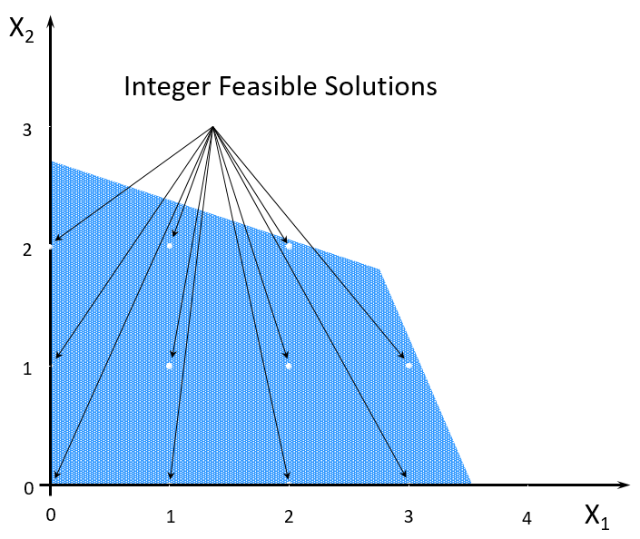
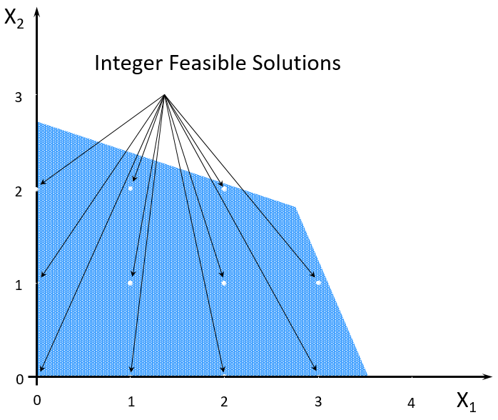
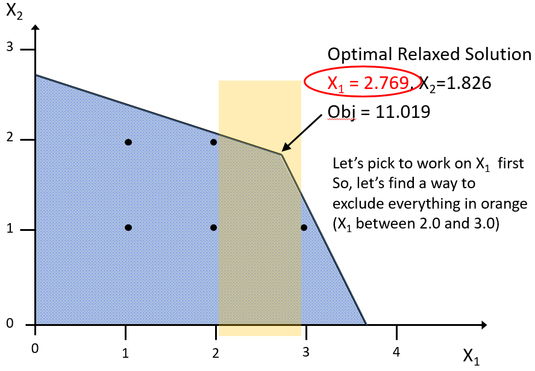
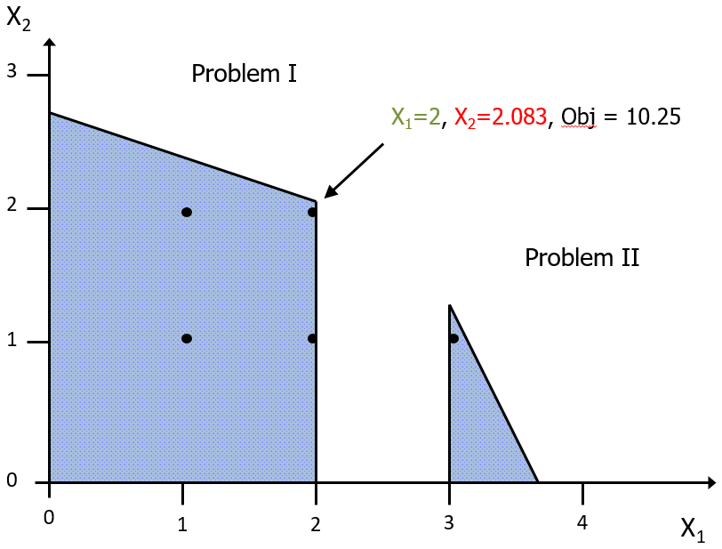
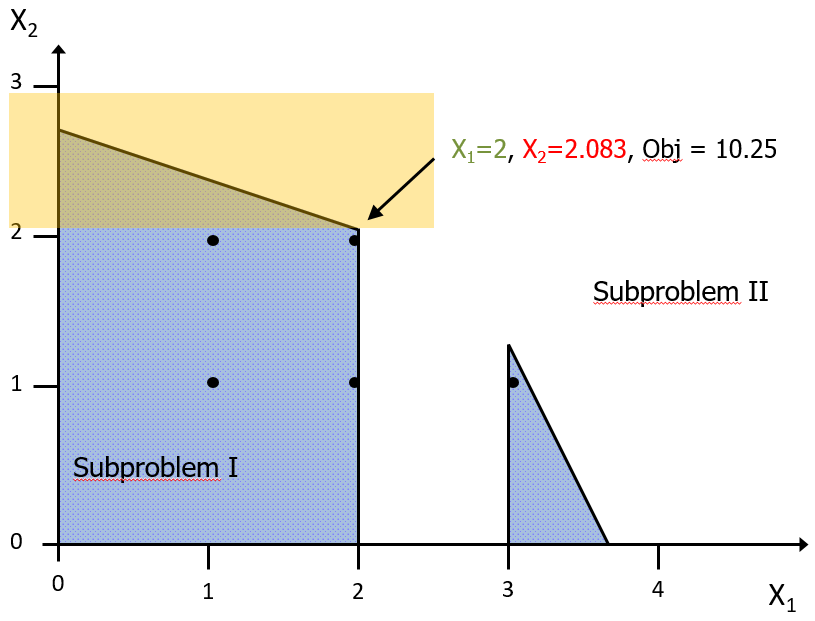
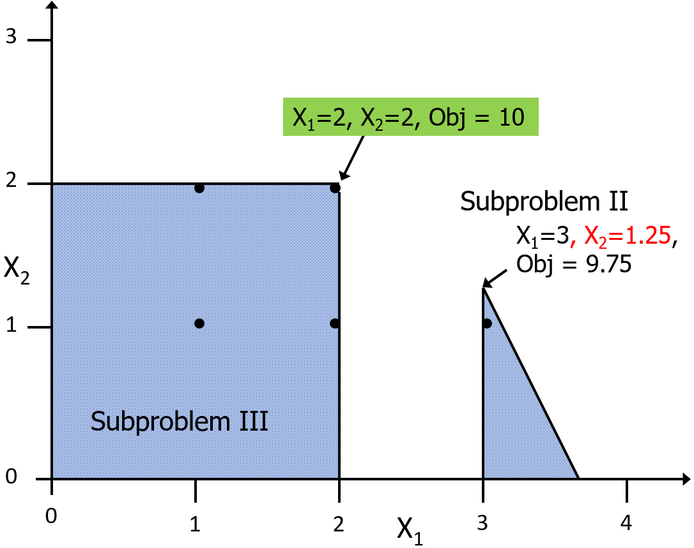
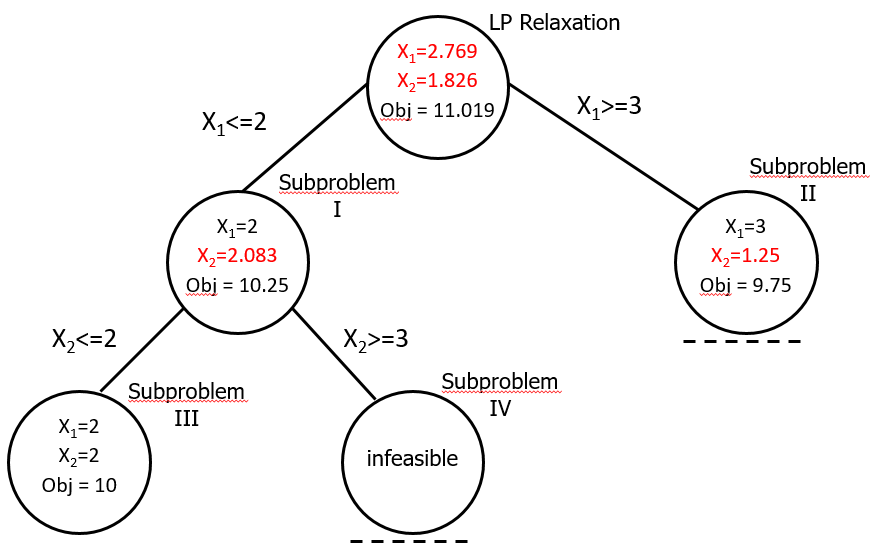

\pagestyle{headings}

```{r Ch6setup, include=FALSE}
knitr::opts_chunk$set(echo = TRUE)
knitr::opts_chunk$set(tidy = F)
knitr::opts_chunk$set(cache = TRUE)
suppressPackageStartupMessages(library(magrittr))  # Used for pipes
suppressPackageStartupMessages(library(dplyr))     # Used for data management
suppressPackageStartupMessages(library(ROI))
suppressPackageStartupMessages(library(ROI.plugin.glpk))
suppressPackageStartupMessages(library(ompr))
suppressPackageStartupMessages(library(ompr.roi))
suppressPackageStartupMessages(library(pander))    # Used for nice tables
library (tint)
library (tufte)
library (knitr)
```

# Mixed Integer Optimization

Up until this point, we have always assumed that variables could take on fractional (or non-integer) values.  In other words, they were continuous variables.  Sometimes the values conveniently turned out to be integer-valued, in other cases, we would brush off the non-integer values of the results.
\vspace{12pt}

Allowing for integer values opens up many more important areas of applications as we will see.  
\vspace{12pt}
Let's look at two numerical examples.  The first shows a case where integrality makes little difference, the second where it has a major impact.
\vspace{12pt}

Unfortunately, there is no such thing as a free lunch-adding integrality can make problems much more computationally demanding. We will go through an example of how many optimization routines do integer optimization to demonstrate why it can be more difficult algorithmically even if looks trivially easy from the perspective of the change in the ompr function.

## Example of Integrality having Little Impact

Let's revisit the earlier example of producing chairs, desks, and tables.  Where we add one extra hour of labor to the machining center, instead of 1440 hours, we will have 1441 hours.  The resulting LP is shown below.

$$
 \begin{split}
 \begin{aligned}
    \text{Max  }   & 20Chairs+14Desks+16Tables \\
    \text{subject to } & 6Chairs+2Desks+4Tables \leq 2000 \\
                       & 8Chairs+6Desks+4Tables \leq 2000 \\
                       & 6Chairs+4Desks+8Tables \leq 1441 \\
                       & 40Chairs+25Desks+16Tables \leq 9600 \\
                       & Tables \leq 200 \\
                       & Chairs,  \; Desks, \; Tables \geq 0  
  \end{aligned}
  \end{split}
  (\#eq:ContinuousVars)
$$

We use the following implementation.  

```{r BaseModelCDT}
BaseModelCDT <- MIPModel() %>%
  add_variable(Chairs, type = "continuous", lb = 0) %>%
  add_variable(Desks, type = "continuous",lb = 0) %>%
  add_variable(Tables, type = "continuous", lb = 0, 
               ub = 200) %>%
  
  set_objective(20*Chairs + 14*Desks + 16*Tables, "max") %>%
  
  add_constraint(6*Chairs+2*Desks+4*Tables<=2000) %>% 
                                      #fabrication
  add_constraint(8*Chairs+6*Desks+4*Tables<=2000) %>% 
                                      #assembly
  add_constraint(6*Chairs+4*Desks+8*Tables<=1441) %>% 
                                      #machining
  add_constraint(40*Chairs+25*Desks+16*Tables<= 9600) %>% 
                                      #wood
  solve_model(with_ROI(solver = "glpk"))

obj_val <- objective_value(BaseModelCDT)
xchairs <- get_solution (BaseModelCDT, Chairs)
xdesks  <- get_solution (BaseModelCDT, Desks)
xtables <- get_solution (BaseModelCDT, Tables)
inc_mc_res  <- cbind(xchairs,xdesks,xtables,obj_val)
rownames(inc_mc_res) <- ""
colnames(inc_mc_res) <- c("Chairs", "Desks", "Tables", "Obj. Function Value")
pander(inc_mc_res,
       caption="Production Plan with Continuous Variables")
```

In this case, the fractional value of *Chairs* would be only somewhat concerning.  We wouldn't actually ship a half of a chair to a customer-at least I hope not.  The difference between 162 and 163 is relatively small over a month of production.  This is a difference of less than 1% and none of the numbers specified in the model appear to be reported to more than two significant digits or this level of precision.  The result is that we could specify the answer as 162.5 and be satisfied that while it is our actual best guess or might reflect a chair half finished for the next month, it isn't a major concern.
\vspace{12pt}

For the sake of illustration, let's show how we would modify the model to be integers.  If we had wanted to modify the problem to force the amount of each item to be produced to be an integer value, we can modify our formulation and the implementation with only a few small changes.
\vspace{12pt}

In the formulation, we can replace the non-negativity requirement with a restriction that the variables are drawn from the set of non-negative integers.

$$
 \begin{split}
 \begin{aligned}
    \text{Max  }   & 20Chairs+14Desks+16Tables \\
    \text{subject to } & 6Chairs+2Desks+4Tables \leq 2000 \\
                       & 8Chairs+6Desks+4Tables \leq 2000 \\
                       & 6Chairs+4Desks+8Tables \leq 1441 \\
                       & 40Chairs+25Desks+16Tables \leq 9600 \\
                       & Tables \leq 200 \\
                       & Chairs,  \; Desks, \; Tables \in \{0,1,2,3,...\}  
  \end{aligned}
  \end{split}
  (\#eq:IntegerProdPlan)
$$

The `ompr` implementation has a similar, straightforward change. In the declaration of variables (`add_variable` function), we simply set the type to be `integer` rather than `continuous`.
\vspace{12pt}

```{r IntegerModelCDT}
IntModelCDT <- MIPModel() %>%
  add_variable(Chairs, type = "integer", lb = 0) %>%
  add_variable(Desks, type = "integer",lb = 0) %>%
  add_variable(Tables, type = "integer", lb = 0, 
               ub = 200) %>%
  
  set_objective(20*Chairs+14*Desks+16*Tables,"max") %>%
  
  add_constraint(6*Chairs+2*Desks+4*Tables<=2000) %>% 
                                      #fabrication
  add_constraint(8*Chairs+6*Desks+4*Tables<=2000) %>% 
                                      #assembly
  add_constraint(6*Chairs+4*Desks+8*Tables<=1441) %>% 
                                      #machining
  add_constraint(40*Chairs+25*Desks+16*Tables<= 9600) %>% 
                                      #wood
  solve_model(with_ROI(solver = "glpk"))

obj_val <- objective_value(IntModelCDT)
xchairs <- get_solution (IntModelCDT, Chairs)
xdesks  <- get_solution (IntModelCDT, Desks)
xtables <- get_solution (IntModelCDT, Tables)
IntModelCDTres  <- cbind(xchairs,xdesks,xtables,obj_val)
rownames(IntModelCDTres) <- ""
colnames(IntModelCDTres) <- c("Chairs", "Desks", "Tables", "Obj. Function Value")
pander(IntModelCDTres,
       caption="Production Plan with Integer Variables")
```

Notice that in this case, there was a small adjustment to the production plan and a small decrease to the optimal objective function value.  This is not always the case, sometimes the result can be unchanged.  In other cases, it may be changed in a very large way.  In still others, the problem may in fact even become infeasible.
\vspace{12pt}

## Example of Integality having a Large Impact

Let's take a look at another example.  Acme makes two products, let's refer to them as product 1 and 2.  Product 1 generates a profit of $2000 per product, requires one liter of surfactant for cleaning, and 2.5 kilograms of high grade steel.
\vspace{12pt}

In contrast, each unit of Product 2 produced generates a higher profit of $3000 per product, requires 3.0 liters of surfactant, and 1.0 kilograms of high grade steel.  Acme has 8.25 liters of surfactant and 8.75 kilograms of high grade steel.  
\vspace{12pt}

Only completed products are sellable, what should be Acme's production plan?
\vspace{12pt}

Formulating the optimization problem is similar to our earliest production planning problems.  Let's define $x_1$ to be the amount of product 1 to produce and $x_2$ to be the amount of product 2 to produce. 

$$
 \begin{split}
 \begin{aligned}
    \text{Max  }   & 2000 x_1 + 3000 x_2 \\
    \text{subject to } & 1.0 x_1 + 3.0 x_2 \leq 8.25 \\
                       & 2.5 x_1 + 1.0 x_2 \leq 8.75 \\
                       & x_1,  \; x_2 \geq 0  \\
                       & x_1,  \; x_2  \in \{0,1,2,3,...\}
  \end{aligned}
  \end{split}
  (\#eq:ILP)
$$

The last constraint cannot be solved directly strictly using linear programming.  It is instead referred to as an integer linear program or ILP.  
\vspace{12pt}

Again, we could try solving it with and without the imposition of the integrality constraint.

```{r SolveLPRelaxation0}
LPRelax <- MIPModel() %>%
  add_variable(Vx1, type = "continuous", lb = 0) %>%
  add_variable(Vx2, type = "continuous",lb = 0) %>%
  set_objective(2*Vx1 + 3*Vx2, "max") %>%
  add_constraint(1.0*Vx1 + 3.0*Vx2 <= 8.25) %>% #Surfactant
  add_constraint(2.5*Vx1 + 1.0*Vx2  <= 8.75) %>% #Steel
  solve_model(with_ROI(solver = "glpk"))
  obj_val <- objective_value(LPRelax)
  x1 <- get_solution (LPRelax, 'Vx1')
  x2  <- get_solution (LPRelax, 'Vx2')
acme_res_lp  <- cbind(x1,x2,obj_val)
colnames(acme_res_lp) <- list("x1", "x2", "Profit")
rownames(acme_res_lp) <- "LP Solution"
```

```{r SolveIP0}
IPSoln <- MIPModel() %>%
  add_variable(Vx1, type = "integer", lb = 0) %>%
  add_variable(Vx2, type = "integer",lb = 0) %>%
  set_objective(2*Vx1 + 3*Vx2, "max") %>%
  add_constraint(1.0*Vx1 + 3.0*Vx2 <= 8.25) %>% #Surfactant
  add_constraint(2.5*Vx1 + 1.0*Vx2  <= 8.75) %>% #Steel
  solve_model(with_ROI(solver = "glpk"))
  obj_val <- objective_value(IPSoln)
  x1 <- get_solution (IPSoln, 'Vx1')
  x2  <- get_solution (IPSoln, 'Vx2')
acme_res_ip  <- cbind(x1,x2,obj_val)
colnames(acme_res_ip) <- list("x1", "x2", "Profit")
rownames(acme_res_ip) <- "IP Solution"
pander(rbind(acme_res_lp,acme_res_ip),
       caption="Production Plan-Continuous vs. Integer")
```

```{r Fig-LP_Feasible_Region, echo=FALSE, fig.margin=TRUE, }


```

Simply rounding down did not yield an optimal solution.
Notice that production of product 1 went down while product 2 went up.  The net impact was a profit reduction of almost _10%_.

```{r Fig-IP_Feasible_Region, echo=FALSE, fig.margin=TRUE, }


```

## The Branch and Bound Algorithm

The simplicity of making the change in the model from continuous to integer variables hides or understates the complexity of what needs to be done to computationally to solve the optimization problem.  This small change can have major impacts on the computational effort needed to solve a problem.  Solving linear programs with tens of thousands of continuous variables is very quick and easy computationally.  Changing those same variables to general integers can make it *very* difficult. Why is this the case?
\vspace{12pt}

At its core, the basic problem is that the simplex method and linear programming solves a system of equations and unknowns (or variables).  It is trivial to solve one equation with one unknown such as $5x=7$. It is only slightly harder to solve a system of two equations and two unknowns. Doing three equations and three unknowns requires some careful algebra but is not too hard. In general, solving *n* equations and *n* unknowns is readily solvable. On the other hand, none of this algebraic work of solving for unknown variables can require that the variables take on integer values. Even with only one equation and one unknown, *x* will only be integer for certain combinations of numbers in the above equation.  Specifically when the number on the right is a multiple of the number in front of *x*.  It gets even less likely to have an all integer solution as the number of equations and unknowns increase.  
\vspace{12pt}

Another way to visualize integer solutions for general systems of inequalities is to think of the two equation and two unknown (*x* and *y*) case. Finding a solution is the same as finding where two lines intersect in two dimensional space.  The odds of getting lucky and having the two lines intersect at an integer solution is small.  Even if we limit ourselves to x and y both being between 0 and 10, this means that there are $11^2=121$ possible integer valued points in this space such as (0,0), (0,3), and (10,10). In contrast, the set of all points, including non-integers, in this region includes all of the above points as well as (0,0.347) and (4.712, 7.891) among infinitely more. The result is that if you think of this as a target shooting, the probability of finding an integer solution by blind luck is  $\frac{121}{\infty}\approx 0$.
\vspace{12pt}

What we need to do is an algorithm around the simplex method to accomplish this. A basic and common and approach often used for solving integer variable linear programming problems is called branch and bound.  We start with a solution that has presumably continuous valued variables.  We then branch (create subproblems) off of this result and add bounds (additional constraints) to rule out the fractional value of that variable.  
\vspace{12pt}

*The LP Relaxation*

To solve this using branch and bound, we *relax* the integrality requirements and solve what is called the LP Relaxation. To do this, we simply remove the integrality requirement.
\vspace{12pt}

$$
 \begin{split}
 \begin{aligned}
    \text{Max  }   & 2000 x_1 + 3000 x_2 \\
    \text{subject to } & 1.0 x_1 + 3.0 x_2 \leq 8.25 \\
                       & 2.5 x_1 + 1.0 x_2 \leq 8.75 \\
                       & x_1,  \; x_2 \geq 0  \\
  \end{aligned}
  \end{split}
  (\#eq:LPRelaxation)
$$

This is a problem that we **can** solve using linear programming so let's go ahead do it!  Well, we already did so let's just review the results for what is now called the LP Relaxation because we are _relaxing_ the integrality requirements.
\vspace{12pt}

```{r SolveLPRelaxation}
pander(acme_res_lp,
       caption="Acme's Production Plan based 
       on the LP Relaxation")
```

```{r Fig-LP_Relaxation, echo=FALSE, fig.margin=TRUE, }


```
\vspace{12pt} 

*Subproblem I*

\vspace{12pt}

Alas, this production plan from the LP Relaxation is not feasible from the perspective of the original integer problem because it produces _2.769_ of  product 1 and _1.827_ of product 2.  If both of these variables had been integer we could have declared victory and been satisfied that we had easily (*luckily?*) found the optimal solution to the original integer programming problem so quickly.
\vspace{12pt}

Instead, we will need to proceed with the branch and bound process. Since both of the variables in the LP relaxation have fractional values, we need to start by choosing which variable to use for branching first. Algorithmic researchers would focus on how to best pick a branch but for our purposes to improve solution speed but it doesn't really matter for illustration so let's arbitrarily choose to branch on $x_1$.  
\vspace{12pt}

For the branch and bound algorithm, we want to include two subproblems that exclude the *illegal* value of $x_1=2.769$ as well as everything else between 2 and 3.  We  say that we are _branching_ on $x_1$ to create two subproblems. The first subproblem (I) has an added constraint of $x_1\le 2.0$ and the other subproblem (II) has an added constraint of $x_1\ge 3.0$.  

$$
 \begin{split}
 \begin{aligned}
    \text{Max  }   & 2000 x_1 + 3000 x_2 \\
    \text{subject to } & 1.0 x_1 + 3.0 x_2 \leq 8.25 \\
                       & 2.5 x_1 + 1.0 x_2 \leq 8.75 \\
                       & x_1 \leq 2.0 \\
                       & x_1,  \; x_2 \geq 0  \\
  \end{aligned}
  \end{split}
  (\#eq:Sub1)
$$


```{r SolveLPSub1}
LPSubI <- MIPModel() %>%
  add_variable(Vx1, type = "continuous", lb = 0) %>%
  add_variable(Vx2, type = "continuous",lb = 0) %>%
  set_objective(2*Vx1 + 3*Vx2, "max") %>%
  add_constraint(1.0*Vx1 + 3.0*Vx2 <= 8.25) %>% #Surfactant
  add_constraint(2.5*Vx1 + 1.0*Vx2  <= 8.75) %>% #Steel
  add_constraint(Vx1 <= 2.0) %>% #Bound for Subproblem 1
  solve_model(with_ROI(solver = "glpk"))
  obj_val <- objective_value(LPSubI)
  x1 <- get_solution (LPSubI, 'Vx1')
  x2  <- get_solution (LPSubI, 'Vx2')
LPSubI_res  <- cbind(x1,x2,obj_val)
rownames(LPSubI_res) <- ""
pander(LPSubI_res,
       caption="Production Plan based on Subproblem I")
```
```{r Fig-Subproblem_I, echo=FALSE, fig.margin=TRUE, }


```

Looking over the results, we now get an integer value for $x_1$ but not for $x_2$. We repeat the same process by creating subproblems from subproblem I by branching off of $x_2$.  
\vspace{12pt}

```{r Fig-Subproblem_Ia, echo=FALSE, fig.margin=TRUE, }


```
\vspace{12pt}

*Subproblem III*
\vspace{12pt}

Choosing which subproblem to examine next is one of the areas that large scale integer programming software and algorithms specialize and provide options. One way to think of it is to focus on searching down a branch and bound tree deeply or to search across the breadth of the tree.  For this example, let's go deep (we'll return to subproblem II later.)  
\vspace{12pt}

Since $x_2$ is now a non-integer solution, we will create branches with bounds (or constraints) on $x_2$ in the same manner as before.  Subproblem III has an added constraint of  $x_2 \le2.0$ and Subproblem IV has $x_2 \ge3.0$.  
\vspace{12pt}

To simplify the implementation, I can simply change the upper and lower bounds on variables rather than adding separate variables.  

```{r SolveLPSubIII}
LPSubIII <- MIPModel() %>%
  add_variable(Vx1, type = "continuous", lb = 0, ub = 2) %>%
  add_variable(Vx2, type = "continuous",lb = 0, ub = 2) %>%
  set_objective(2*Vx1 + 3*Vx2, "max") %>%
  add_constraint(1.0*Vx1 + 3.0*Vx2 <= 8.25) %>% #Surfactant
  add_constraint(2.5*Vx1 + 1.0*Vx2  <= 8.75) %>% #Steel
  solve_model(with_ROI(solver = "glpk"))
  obj_val <- objective_value(LPSubIII )
  x1 <- get_solution (LPSubIII , 'Vx1')
  x2  <- get_solution (LPSubIII , 'Vx2')
LPSubIII_res  <- cbind(x1,x2,obj_val)
rownames(LPSubIII_res) <- ""
pander(LPSubIII_res,
       caption="Production Plan based on Subproblem III")
```

```{r Fig-Subproblem_III_and_II, echo=FALSE, fig.margin=TRUE, }


```

This results in integer values for both $x_1$ and $x_2$ so it is feasible with respect to integrality in addition to the production constraints.  It does generate less profit than the LP relaxation.  While it is feasible, it doesn't prove that it is optimal though.  We need to explore the other potential branches.  
\vspace{12pt}

*Subproblem IV*
\vspace{12pt}

Next, let's look at Subproblem IV.  This problem adds the bound of $x_2\ge3.0$ to subproblem I.  Notice that in the MIPModel, the variable for $x_1$ has an upperbound (ub) of 2 in order to implement bounding constraint for subproblem I and the lower bound on $x_2$ of 3 in the variable declarations.

```{r SolveLPSubIV}
LPSubIV <- MIPModel() %>%
  add_variable(Vx1, type = "continuous", lb = 0, ub = 2) %>%
  add_variable(Vx2, type = "continuous",lb = 3) %>%
  set_objective(2*Vx1 + 3*Vx2, "max") %>%
  add_constraint(1.0*Vx1 + 3.0*Vx2 <= 8.25) %>% #Surfactant
  add_constraint(2.5*Vx1 + 1.0*Vx2  <= 8.75) %>% #Steel
  solve_model(with_ROI(solver = "glpk"))
  obj_val <- objective_value(LPSubIV )
  x1 <- get_solution (LPSubIV , 'Vx1')
  x2  <- get_solution (LPSubIV , 'Vx2')
LPSubIV_res  <- cbind(x1,x2,obj_val)
LPSubIV$status
rownames(LPSubIV_res) <- ""
pander(LPSubIV_res,
       caption=
"Infeasible Production Plan based on Subproblem IV")
```

At first glance, this looks okay but if you look more closely at the value of $x_2$, and the surfactant constraint, $x_1+3x_2\leq 9$, there isn't enough enough surfactant to make three units of the second product.  This means that by inspection we can see that this production plan is infeasible!  What is going on here?  
\vspace{12pt}

We should check the status of the solver before examining the result.  

```{r subproblem_IV_status}
LPSubIV
```

The returned status value of this solved LP indicates that this tell us that subproblem IV is *infeasible.*  It still returned values that were used when it determined that the problem was infeasible which is why it gave the results in the previous table.  From here on out, it is good to check the status. Note that it can be used as in-line evaluated expression to simply say was it feasible or not?  Yes, it was `r LPSubIV$status`.
\vspace{12pt}

*Subproblem II*
\vspace{12pt}

Now, we have searched down all branches or subproblems except for subproblem II.  Let's go back and do that problem.  We do that by simply adding one new bound to the LP Relaxation.  That is $x_1\ge 3.0$.

```{r SolveLPSubII}
LPSubII <- MIPModel() %>%
  add_variable(Vx1, type = "continuous", lb = 3) %>%
  add_variable(Vx2, type = "continuous",lb = 0) %>%
  set_objective(2*Vx1 + 3*Vx2, "max") %>%
  add_constraint(1.0*Vx1 + 3.0*Vx2 <= 8.25) %>% #Surfactant
  add_constraint(2.5*Vx1 + 1.0*Vx2  <= 8.75) %>% #Steel
  solve_model(with_ROI(solver = "glpk"))
  obj_val <- objective_value(LPSubII )
  x1 <- get_solution (LPSubII , 'Vx1')
  x2  <- get_solution (LPSubII , 'Vx2')
LPSubII_res  <- cbind(x1,x2,obj_val)
cat("Status of Subproblem II:",LPSubII$status)
rownames(LPSubII_res) <- ""
pander(LPSubII_res,
       caption="Production Plan based on LP Subproblem II")
```

At this point, our first reaction may be to breathe deeply and do the same branch and bound off of $x_2$. On the other hand, if we step back and take note that the objective function value is 9.75, while optimal for this subproblem, it is less than what we found from a feasible, fully integer-valued solution to subproblem III. Given that adding constraints can't improve an objective function value, we can cleverly trim all branches below subproblem II.  
\vspace{12pt}

Given that we now no longer have any branches to explore, we can declare that we have found the optimal solution.  The optimal solution can now be definitively stated to be what we found from Subproblem III.  

```{r create_table_subproblem_III}
pander(LPSubIII_res,
       caption="Acme's Optimal Production Plan 
       based on Subproblem III")
```

Before this, we could only say that it was feasible solution and candidate to be optimal since no better integer feasible solution had been found.
\vspace{12pt}

Let's summarize the results of the series of LPs solved.
\vspace{12pt}

```{r create_table_of_subproblem_results}
LPSubIV_res <- c("-", "-", "Infeasible")
        # Make adjustment for misinterpretation of status
BandB <- rbind(format(round(acme_res_lp,  3), nsmall = 3), 
               format(round(LPSubI_res,   3), nsmall = 3),
               format(round(LPSubIII_res,  3), nsmall = 3),
               LPSubIV_res, 
               format(round(LPSubII_res,  3), nsmall = 3))
rownames(BandB) <- list("LP Relaxation", "Subproblem I", 
                        "Subproblem III", "Subproblem IV", 
                        "Subproblem II")
pander(BandB, caption="Branch and Bound's Sequence of LPs")
```

```{r Fig-B_and_B_Summary, echo=FALSE, fig.margin=TRUE, }


```
\vspace{12pt}

## Computational Complexity

As for computational complexity, this was a small problem with only two integer variables but it still required solving the LP Relaxation and four separate LP subproblems for a total of five linear programs in all.  As the number of variables and constraints increases, so do the number of LPs needed to typically find a solution using branch and bound.  Small and medium size problems can generally be solved quickly but worst case scenarios have a combinatorial explosion.  
\vspace{12pt}

*Full Enumeration*

Another approach to integer programming is full enumeration which means listing out all possible solutions and then determining if that solution is feasible and if so, what the objective function value is. Alas, this can result in a combinatorial explosion. For example, if a problem has 1,000 non-negative integer variables each of which can range from zero to nine, full enumeration would require listing $10^{1000}$ possible solutions. This is far larger than the number of grains of sand on Earth (~$10^{19}$) or the number of stars in the universe (~$10^{19}$).  In fact this is much larger than the number of atoms in the universe (~$10^{80}$).  Needless to say explicit enumeration for large problems is not an option.  
\vspace{12pt}

The Branch and Bound algorithm has the benefit that it will find the optimal solution.  Sometimes it will find it quickly, other times it may take a very long time.  
\vspace{12pt}

Worst case scenarios for Branch and Bound may approach that of full enumeration but in practice performs much better.  A variety of sophisticated algorithmic extensions have been added by researchers over the years but solving large scale integer programming problems can still be quite difficult.
\vspace{12pt}

One option to deal with long solving times is to set early termination conditions such as running for a certain number of seconds.  If it is terminated early, it may report the best feasible solution found so far and a precise bound as to how much better an as yet unfound solution might be based on the best remaining open branch.  This difference between the best feasible solution found so far and the theoretically possible best solution to be found gives a gap that an analyst can set. This acceptable gap is sometimes referred to as a suboptimality tolerance factor.  In other words, what percentage of suboptimality is the analyst willing to accept for getting a solution more quickly. For example, a suboptimality tolerance factor of 10% would tell the software to terminate the branch and bound algorithm if a feasible solution is found and it is certain that regardless of how much more time is spent solving, it is impossible to improve upon this solution by more than 10%.

\vspace{12pt}

In practice, even small suboptimality tolerance factors like 1% can allow big problems to be solved quickly and are often well within the margin of error for model data. In other cases, organizations may be interested in finding *any* feasible solution to large, vexing problems.  
```{marginfigure}
Note that our Acme example only specified two digits of accuracy for resource usage and may have only one digit of accuracy for profitability per product.
```

\vspace{12pt}

Note that in our earlier example, if we had a wide enough suboptimality tolerance, say 30% and followed the branch for $x_1\ge3.0$ first rather than $x_1\le2.0$, we might have terminated with a suboptimal solution.  
\vspace{12pt}


## Binary Variables and Logical Relations

Binary variables are a special case of general integer variables. Rather than variables taking on values such as 46 and 973, acceptable values are limited to just 0 and 1.  This greatly reduces the possible search space for branch and bound since you know that in any branch, you will never branch on a single variable more than once.  On the other hand, with a large number of variables, the search space can still be very large.  If the previous case with 1000 variables were binary, a full enumeration list would rely on a list of $2^{1000}$ or one followed by about 300 zeros) possible solutions.  While better than the case of integers, it is still vastly more than the number of  atoms in the universe.
\vspace{12pt}

The important thing is is that binary variables give us a lot of rich opportunities to model complex, real world situations.
\vspace{12pt}

Examples include assigning people to projects, go-no go decisions on projects, and much more.  
\vspace{12pt}

Let's explore the impact of binary restrictions with another example.  The world famous semiconductor company, Outtel has a choice of five major R&D projects:   
1) Develop processor architecture for autonomous vehicles (project A)
2) Next generation microprocessor architecture (project B)
3) Next generation process technology (project C)
4) New fabrication facility (project D)
5) New interconnect technology  (project E)
\vspace{12pt}

The key data is described as follows.  NPV is Net Present Value of the project factoring in costs.  _Inv_ is the capital expenditures or investment required for each project. The company has $40 Billion in capital available to fund a portfolio of projects.  Let's set up the data as matrices in R.  

```{r capital_budgeting_data}
I <- matrix(c(12,24,20,8, 16), ncol=1, 
            dimnames=list(LETTERS[1:5],"Inv"))
N <- matrix(c(2.0, 3.6, 3.2, 1.6, 2.8), ncol=1,
            dimnames=list(LETTERS[1:5],"NPV"))
pander (cbind(I,N), 
        caption="Data for the Outtel Example")
```

These projects all carry their own expenses and engineering support. There are limits to both the capital investment and engineering resources available. To start, consider all of these project to be independent.

\vspace{12pt}

```{exercise, name="Formulate the model mathematically"}
```

Create a mathematical model for the basic model. To start, let's assume that partial projects are acceptable and that they can be repeated.  (Hint: You don't need binary variables yet.)

\vspace{12pt}

```{exercise, name="Create and solve the model"}
```

Formulate and solve a basic, naive model that allows project to repeated and partially completed.  Implement and solve your model.  What is the optimal decision?  Is this result surprising?  Does this make sense in terms of the application?  

\vspace{12pt}

```{exercise, name="No Project is Repeated"}
```

Now, let's explore one aspect of moving towards binary variables.  What constraint or constraints are needed to ensure no project is done more than once while allowing partial projects to still be funded and incur both proportionate costs and benefits.  How does this solution compare to that of above?

\vspace{12pt}

```{exercise, name="No Partial Projects"}
```

What change is needed to prevent partial funding of projects.  How does this solution compare to that of above?  Can you envision a situation where it might make sense to have partially funded projects?  Could this be similar to corporate joint ventures where investments and benefits are shared across multiple entities?  

\vspace{12pt}

Now that effectively have binary constraints, let's explore the impact of logical restrictions with a series of separate scenarios.  In each of these cases, make sure that you implement the relationship as a linear relationship.  This means that you cannot use a function such as an "If-then", "OR", "Exclusive OR", or other relationship.  Furthermore, you can't multiply variables together or divide variables into variables.  In each of the following sections create a linear relationship that models this situation.  

\vspace{12pt}

```{exercise, name="Chip Architects"}
```

Let's assume that projects A and B require the focused effort of the Outtel's top chip architects and Outtel has decided therefore that it is not possible to do both projects.  Therefore, they want to ensure that at most one of the two projects can be pursued.  What needs to be added to enforce this situation?

\vspace{12pt}

```{exercise, name="Interconnects Need Something to Connect"}
```

Instead of the constraint on chip architects, let's consider the situation of the interconnect technology.  Assume that project E on interconnect technology would only provide strong benefit if a new architecture is also developed.  In other words, E can only be done if A or B is done.  Note that if both A and B are done, E will certainly have a use!


\vspace{12pt}

```{exercise, name="Manufacturing"}
```

Outtel knows that staying aggressive in manufacturing is important in this competitive industry but that it is too risky to do too much at once from manufacturing perspective.  The result is that Outtel want to ensure that exactly one major manufacturing initiative (C or D) must be done.  In other words, project C or project D must be done but not both.  

\vspace{12pt}

```{exercise, name="Solving Each Case"}
```

Solve for the base case and then show the results of just each constraint at once.  Combine the results into a single pander table.  Discuss the results.  

\vspace{12pt}

```{exercise, name="Full Enumeration?"}
```

When projects can be neither partially funded nor repeated, how many candidate solutions would there be by full enumeration?  Can you list them out?  

\vspace{12pt}

```{exercise, name="Revisiting Dirk's Course Planning"}
```

Take a look at Dirk Schumacher's vignette for "Course Planning".  https://dirkschumacher.github.io/ompr/articles/problem-course-assignment.html 
\vspace{12pt}

Dirk is the author of ompr and has a nice collection of vignettes.  
\vspace{12pt}

Consider the application of senior design capstone projects where a class of 32 students is going to be divided up to work on 6 projects.  Outside sponsors pitch topics and then each student of the 32 students gives a score of 0 to 10 to indicate how interested they are in the topic.  Using the student project preferences, you want to assign students to the projects that they are most interested in.  
\vspace{12pt}

You may use Dirk's vignette as a starting point to build your own model for assigning students to projects based on their preferences.   Projects can have no more than 6 people on a single capstone project and every student needs to be assigned to a project.
\vspace{12pt}

Student preferences can be loaded from the comma separated file as shown below or typed in.

```{r Student_Preference_Data}
#studentpref<-read.csv(file="HW5data.csv")
#pander (studentpref, 
#     caption="Student to Project Preferences")
```

Build and solve an appropriate model.  Be sure to describe your formulation and discuss the results.

```{marginfigure}
Can this problem ever be infeasible if the number of students is less than 6 times the number of projects?  Why or why not?
```

## Fixed Charge Models

Fixed charge models are a special case of integer programming models where situations where product cost has a fixed cost component and a marginal (per unit) cost component. A common example of this is when a machine must be setup before any production can occur. 

*Fixed Charge Example-Introduction*


```{marginfigure}
This example is based on a writeup from Thanh Thuy Nguyen in the Fall 2018 ETM 540 class.
```

We do that by connecting the two decision variables for each of the products. A common example of this kind of situation is a fixed charge problem.  Let's explore an example of that.    
\vspace{12pt}

Widget Inc. is re-evaluating their product production mix. As the plant manager, you are responsible for determining what products the company should manufacture. Since the company is leasing equipment, there are setup costs for each product. You need to determine the mix that will maximize profit for the company.  
\vspace{12pt}

The profit for each Widget is shown below, as well as the setup costs (if you decide to produce any of that that Widget). The materials you have sourced allow you to only produce each Widget up to its capacity.

| Product  | Profit | Setup Cost | Capacity |
|---------:|:------:|:----------:|:--------:|
| Widget 1 |  $15   |    $1000   |   500    |
| Widget 2 |  $10   |    $1500   |   1000   |
| Widget 3 |  $25   |    $2000   |   750    |

To produce each Widget, the hours required at each step of the manufacturing process are shown below. Also shown are the availability (in hours) of the equipment at each step.

| Production        | Widget 1 | Widget 2 | Widget 3 | Available |
|------------------:|:--------:|:--------:|:--------:|:---------:|
| Pre-process       |     2    |     1    |     4    |    1000   |
| Machining         |     1    |     5    |     2    |    2000   |
| Assembly          |     2    |     1    |     1    |    1000   |
| Quality Assurance |     3    |     2    |     1    |    1500   |

In order to develop our optimization model, we determine the objective function (goal), decision variables
(decisions) and constraints (limitations).
\vspace{12pt}

Objective Function:  
Maximize profit
\vspace{12pt}

Decision Variables:

* $W_1$ = Number of Widget 1 to produce  
* $W_2$ = Number of Widget 2 to produce
* $W_3$ = Number of Widget 3 to produce  
* $Y_1$ = 1 if you choose to produce Widget 1; $Y_1$ = 0 otherwise 
* $Y_2$ = 1 if you choose to produce Widget 2; $Y_2$ = 0 otherwise 
* $Y_3$ = 1 if you choose to produce Widget 3; $Y_3$ = 0 otherwise 

Constraints:  

1) Using no more than 1000 hours of Pre-process  
2) Using no more than 2000 hours of Machining  
3) Using no more than 1000 hours of Assembly  
4) Using no more than 1500 hours of Quality Assurance  
5) Producing no more than 500 of Widget 1  
6) Producing no more than 1000 of Widget 2  
7) Producing no more than 750 of Widget 3

Our base model:

$$
 \begin{split}
 \begin{aligned}
    \text{Max  }   & 15W_1+10W_2+25W_3 - 1000Y_1 - 1500Y_2 - 2000Y_3 \\
    \text{subject to } & 2W_1+1W_2+4W_3 \leq 1000 \\
                       & 1W_1+5W_2+2W_3 \leq 2000 \\
                       & 2W_1+1W_2+1W_3 \leq 1000 \\
                       & 3W_1+2W_2+1W_3 \leq 1500 \\
                       & W_1 \leq 500 \\
                       & W_2 \leq 1000 \\
                       & W_3 \leq 750 \\
                       & W_1, W_2, W_3 \geq 0 \\
                       & Y_1, Y_2, Y_3 \in \{0,1\}  \\
  \end{aligned}
  \end{split}
  (\#eq:FixedChargeBase)
$$

Let's examine the results if we run this model.  
\vspace{12pt}

For Fixed Charge problems, we need to link our Widgets to our decision on whether or not we produce the Widget (and its associated setup costs). We do this what is called the "Big M" method.

```{r base_fixed_charge}
fc_base_model <- MIPModel() %>%
 add_variable(W1, type = "integer", lb = 0) %>% #Widget 1
 add_variable(W2, type = "integer", lb = 0) %>% #Widget 2
 add_variable(W3, type = "integer", lb = 0) %>% #Widget 3
 add_variable(Y1, type = "binary") %>% 
    #Binary Decision for Widget 1
 add_variable(Y2, type = "binary") %>% 
    #Binary Decision for Widget 2
 add_variable(Y3, type = "binary") %>% 
    #Binary Decision for Widget 3
 
 set_objective(15*W1 + 10*W2 + 25*W3 
               - 1000*Y1 - 1500*Y2 - 2000*Y3, "max") %>%
 add_constraint(2*W1 + 1*W2 + 4*W3 <= 1000) %>% 
             # Pre-process availability 
 add_constraint(1*W1 + 5*W2 + 2*W3 <= 2000) %>% 
             # Machining  
 add_constraint(2*W1 + 1*W2 + 1*W3 <= 1000) %>% 
             # Assembly  
 add_constraint(3*W1 + 2*W2 + 1*W3 <= 1500) %>% 
             # Quality Assurance  
 
 add_constraint(W1 <= 500)  %>%  # Widget 1 capacity 
 add_constraint(W2 <= 1000) %>%  # Widget 2 capacity 
 add_constraint(W3 <= 750)       # Widget 3 capacity 
  
fc_base_res <- solve_model(fc_base_model, 
                           with_ROI(solver = "glpk"))
fc_base_res
```

Let's now examine the results in more detail.  

```{r reviewing_base_case_results}
fc_base_summary <- 
  cbind(fc_base_res$objective_value,
        t(as.matrix(fc_base_res$solution)))
colnames(fc_base_summary)<-
  c("Obj Func Value", "W1","W2","W3",
    "Y1","Y2","Y3")
pander(fc_base_summary, caption = 
         "Base Case Solution for Fixed Charge Problem")
```

We are producing all three products since $W_1$, $W_2$, and $W_3$ are all positive but $Y_1=Y_2=Y_3=0$. This is a nice, very high profit situation because we are not paying for the production setups. It may not be surprising that the optimization model chooses to avoid "paying" the fixed charge for production.  This is a "penalty" in the objective function.  What we need is a way of connecting the amount to produce of a widget and the decision to produce any of that widget.  In reality, it would be necessary to pay the 4500 setup cost bring the total profit down to 3660.  Perhaps a higher profit could be found if we could streamline our product offerings!

\vspace{12pt}

What we need is a way to connect, associate, or dare I say "link" the $W_1$ and $Y_1$.  In fact, this connection is called a _linking constraint_ and is quite common in mixed integer programming problems.

## Linking Constraints with "Big M"

I like to think of the linking constraint as the following:  $W_1 \leq M \cdot Y_1$.  The value $M$ is a big value that is so large that it does not prematurely limit the production for widget 1.  Whatever value of $M$ is used, $W_1$ can never exceed that value.  
\vspace{12pt}

Our linking constraints force our new values to 0 or 1. If $W_1 > 0$, then this constraint forces the associated $Y_1$ to be equal to 1. If $W_1 = 0$, then this constraint allows $Y_1$ to be either 0 or 1.  However, our objective function will cause Solver to avoid paying a setup by setting $Y_1=0$.
\vspace{12pt}

It might be tempting to select a very large number such as a billion 10^10 but picking excessively large numbers, can result in poor computational performance.  As we've discussed large, real-world optimization problems are hard enough, let's not make it any harder. Albert Einstein once said "A model should be as simple as possible, but no simpler."  Essentially, a value for M should be as small as possible, but no smaller.  
\vspace{12pt}

Since $M$ serves to impose an upper bound on $W_1$, this might suggest how we can use this information to pick an appropriate value for M and that we can do so for each product separately, using a separate value $M_i$ for each widget.
\vspace{12pt}

Let's examine the constraints for the production plan in the situation gives all resources to the production of Widget 1 and nothing to Widget 2 and Widget 3.  
\vspace{12pt}

More formally, using the non-negative lower bounds on widget production, we can set $W_2=W_3 = 0$ and substitute into the constraints of the optimization model.  The constraints now look like the following:

$$
 \begin{split}
 \begin{aligned}
      2 \cdot W_1+1 \cdot 0+4 \cdot 0 \leq 1000 \\
      1 \cdot W_1+5 \cdot 0+2 \cdot 0 \leq 2000 \\
      2 \cdot W_1+1 \cdot 0+1 \cdot 0 \leq 1000 \\
      3 \cdot W_1+2 \cdot 0+1 \cdot 0 \leq 1500 \\
      W_1 \leq 500 \\
      0 \leq 1000 \\
      0 \leq 750 \\
  \end{aligned}
  \end{split}
  (\#eq:FixedChargeW1Only1)
$$

This can be further simplified as the following.

$$
 \begin{split}
 \begin{aligned}
      2 \cdot W_1 \leq 1000 \\
      1 \cdot W_1 \leq 2000 \\
      2 \cdot W_1 \leq 1000 \\
      3 \cdot W_1 \leq 1500 \\
      W_1 \leq 500 \\
  \end{aligned}
  \end{split}
  (\#eq:FixedChargeW1Only2)
$$

It can be further simplified as the following:

$$
 \begin{split}
 \begin{aligned}
      W_1 \leq \frac{1000}{2} = 500 \\
      W_1 \leq 2000 \\
      W_1 \leq \frac{1000}{2} = 500 \\
      W_1 \leq \frac{1500}{3} = 500 \\
      W_1 \leq 500 \\
  \end{aligned}
  \end{split}
  (\#eq:FixedChargeW1Only3)
$$

Since all constraints need to be satisfied, we can represent this to mean that Widget 1 manufacturing could never be higher than the smallest (most restrictive) of these constraints. 

Therefore, 
$$W_1 \leq min \{ \frac{1000}{2}, \frac{2000}{1}, \frac{1000}{2}, \frac{1500}{3}, 500 \}$$

or 
$$W_1 \leq min \{ 500, 2000, 500, 500, 500 \} = 500$$
Therefore, we know that Widget 1 production can never exceed 500 units regardless of the amount of other Widgets ($W_2$ and $W_3$) produced.  We can then safely set the Big M value for Widget 1 to be 500.  In other words, $M_1=500$.  
\vspace{12pt}

We can follow the same process for setting Big M values for widget 2.  We start by setting $W_2=W_3 = 0$. We know that $W_2$ must be no larger than the most restrict constraint. I'll skip rewriting the constraints and jump a little ahead.

$$W_2 \leq min \{ \frac{1000}{2}, \frac{2000}{5}, \frac{1000}{2}, \frac{1500}{2}, 1000 \}=400$$

Therefore, we can safely use a Big M value for $W_2$ of $M_2=400$.
\vspace{12pt}

Again we can follow the same process for $W_3$ to find a small Big M value.

$$W_3 \leq min \{ \frac{1000}{4}, \frac{2000}{2}, \frac{1000}{2}, \frac{1500}{1}, 750 \}=250$$
\vspace{12pt}
Our updated model with "Big M":

$$
 \begin{split}
 \begin{aligned}
    \text{Max  }   & 15W_1+10W_2+25W_3 - 1000Y_1 - 1500Y_2 - 2000Y_3 \\
    \text{subject to } & 2W_1+1W_2+4W_3 \leq 1000 \\
                       & 1W_1+5W_2+2W_3 \leq 2000 \\
                       & 2W_1+1W_2+1W_3 \leq 1000 \\
                       & 3W_1+2W_2+1W_3 \leq 1500 \\
                       & W_1 \leq 500 \\
                       & W_2 \leq 1000 \\
                       & W_3 \leq 750 \\
                       & W_1 - 500Y_1 \leq 0 \\
                       & W_2 - 400Y_2 \leq 0 \\
                       & W_3 - 250Y_3 \leq 0 \\
                       & W_1, W_2, W_3 \geq 0 \\
                       & Y_1, Y_2, Y_3 \in \{0,1\}  \\
  \end{aligned}
  \end{split}
  (\#eq:FC-BigM)
$$

## Fixed Charge Implementation

Given that we have already created a model without the Big M constraints, we can simply add the constraints to the model. We'll skip the piping operator and just add

```{r fixedcharge}
fc_bigM_model <- add_constraint(fc_base_model, 
                                W1 - 500*Y1 <= 0) %>%  
              # W1's Big M linking constraint 
 add_constraint(W2 - 400*Y2 <= 0) %>%  
              # W2's Big M linking constraint 
 add_constraint(W3 - 250*Y3 <= 0)  
              # W3's Big M linking constraint
  
fc_bigM_res <- solve_model(fc_bigM_model, 
                           with_ROI(solver = "glpk"))
fc_bigM_res
```

Our model was able to find an `r {fc_bigM_res$status}` solution with an objective value of `r {fc_bigM_res$objective_value}`. Our optimal production plan is shown below. As we can see, our model returned a production plan with only one model of widget being produced.
\vspace{12pt}

Interesting---the objective function value has gone down significantly.  
Let's look this over in more detail and compare it to the results that we had when we avoided paying for setups.
\vspace{12pt}

```{r reviewing_bigM_case_results}
fc_base_summary_rev <- fc_base_summary
fc_base_summary_rev [1] <- fc_base_summary_rev [1] - 4500
fc_M_summary <- cbind(fc_bigM_res$objective_value,
                         t(as.matrix(fc_bigM_res$solution)))
colnames(fc_M_summary)<-c("Obj Func Value", "W1","W2","W3",
                             "Y1","Y2","Y3")
fc_combined_res <- rbind (fc_base_summary, 
                          fc_base_summary_rev, fc_M_summary)
rownames(fc_combined_res)<-c("Base Case w/o Setup", 
                             "Base Case with Setup", 
                             "Optimal Fixed Charge")
pander(fc_combined_res, 
       caption = "Fixed Charge Problem")
```

Notice that the the high setup costs have caused us to focus our production planning decisions.  Rather than spreading ourselves across three different product lines, we are producing as many of widget 1 as we can.  
\vspace{12pt}

## Model Results and Interpretation

We can also calculate our resource usage. 
\vspace{12pt}

```{r fixed_charge_usage}
fc_bigM_res.W1 <- get_solution(fc_bigM_res, W1) 
        # Extract solution value for decision variable, W1
fc_bigM_res.W2 <- get_solution(fc_bigM_res, W2) 
        # Extract solution value for decision variable, W2
fc_bigM_res.W3 <- get_solution(fc_bigM_res, W3) 
        # Extract solution value for decision variable, W3
fc_bigM_res.df <- data.frame(c(fc_bigM_res.W1,
                               fc_bigM_res.W2,
                               fc_bigM_res.W3)) 
fc_bigM_res.r1 <- t(data.frame(c(fc_bigM_res.W1*2,
                                 fc_bigM_res.W2*1,
                                 fc_bigM_res.W3*4)))
               #multiply results with hours used
rownames(fc_bigM_res.r1) <- "Pre-process"
fc_bigM_res.r2 <- t(data.frame(c(fc_bigM_res.W1*1,
                                 fc_bigM_res.W2*5,
                                 fc_bigM_res.W3*2)))
               #multiply results with hours used
rownames(fc_bigM_res.r2) <- "Machining"
fc_bigM_res.r3 <- t(data.frame(c(fc_bigM_res.W1*2,
                                 fc_bigM_res.W2*1,
                                 fc_bigM_res.W3*1)))
               #multiply results with hours used
rownames(fc_bigM_res.r3) <- "Assembly"
fc_bigM_res.r4 <- t(data.frame(c(fc_bigM_res.W1*3,
                                 fc_bigM_res.W2*2,
                                 fc_bigM_res.W3*1)))
               #multiply results with hours used
rownames(fc_bigM_res.r4) <- "Quality Assurance"
fc_bigM_res.tot <- data.frame(c(sum(fc_bigM_res.r1),
                                sum(fc_bigM_res.r2),
                                sum(fc_bigM_res.r3),
                                sum(fc_bigM_res.r4)))
               #sum each step
colnames(fc_bigM_res.tot) <- "Total Used"
fc_bigM_res.avail <- data.frame(
  c("1000","2000","1000","1500"))
               #print available hours for each step
colnames(fc_bigM_res.avail) <- "Available"
pander(cbind(rbind(fc_bigM_res.r1,fc_bigM_res.r2,
                   fc_bigM_res.r3,fc_bigM_res.r4),
                   fc_bigM_res.tot,
                   fc_bigM_res.avail),
       caption = "Manufacturing Resource Usage")
```

As can be seen, we used all of our Pre-processing hours, Assembly hours, and Quality Assurance hours. There is a significant amount of time available in Machining though.
\vspace{12pt}

Further analysis could examine alternatives such as redesigning widget 2 and 3 to be less resource instensive in production to see at what point we would choose to produce them.  

\vspace{12pt}

```{exercise, name="Redesign Widget 3"}
```

How much would you produce of Widget 3 if there were no setup (fixed) cost for production of Widget 3?  Experiment with the above model to find the lowest setup cost for Widget 3 where you still choose to not produce any of Widget 3. 

```{exercise, name="Reducing Fixed Costs"}
```

How would production change if the setups costs were cut in half due to implementing lean production approaches?


