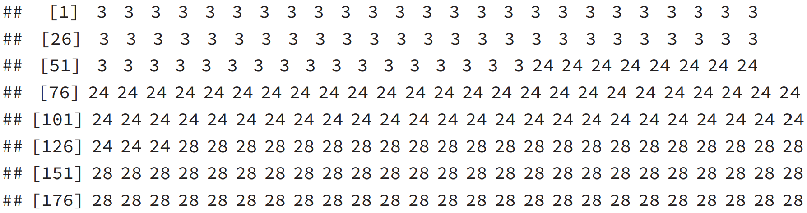

# More Integer Programming Models

```{r, eval=FALSE, include=FALSE}
library(bookdown); library(rmarkdown); rmarkdown::render("07-More-Mixed-MIP.Rmd", "pdf_book")
```

```{r Ch7setup, echo=FALSE, warning=FALSE}
knitr::opts_chunk$set(echo = TRUE)
knitr::opts_chunk$set(tidy = FALSE)
knitr::opts_chunk$set(cache = FALSE)
library (kableExtra)
library (tidyr)
library (ggplot2)
library (ggrepel)
library (ompr)
library (ompr.roi)
library (ROI.plugin.glpk)
library (tictoc, quietly = TRUE) 
library (ROI.plugin.lpsolve, quietly = TRUE) 
library (ROI.plugin.symphony, quietly = TRUE)
library ("ggplot2")
library ("dlstats")
library (sudokuAlt)
suppressPackageStartupMessages(library(dplyr))
```

## Overview

This chapter consists of a collection of rich MILP models that can be used for inspiration on products.
Some of these cases are expansions of Dirk Schumacher's `ompr`vignettes.
These make for excellent resources demonstrating a variety of features such as creation of simulated data and visualization of results.
I strongly recommend reading the original.
These vignettes can be viewed from the package documentation, Dirk Schumacher's github web [site](https://dirkschumacher.github.io/ompr/articles/index.html), or downloading his github repository.

-   All text from Dirk Schumacher's articles are set in block quotes.
-   Code chunks are generally based on Dirk Schumacher's articles unless stated otherwise.
-   The LaTeX formulations are generally based on Dirk Schumacher's LaTeX with some modifications to support LaTeX environments.

## Revisiting the Warehouse Location Problem

Let's start by reviewing Dirk's original description of the warehouse location problem.

> In this article we will look at the [Warehouse Location Problem](https://en.wikipedia.org/wiki/Facility_location_problem).
> Given a set of customers and set of locations to build warehouses, the task is to decide where to build warehouses and from what warehouses goods should be shipped to which customer.
>
> Thus there are two decisions that need to made at once: where and if to build warehouses and the assignment of customers to warehouses.
> This simple setting also implies that at least one warehouse must be built and that any warehouse is big enough to serve all customers.
>
> As a practical example: you run the logistics for an NGO and want to regularly distribute goods to people in need.
> You identified a set of possible locations to set up your distribution hubs, but you are not sure where to build them.
> Then such a model might help.
> In practice however you might need to incorporate additional constraints into the model.
> Let's start by defining the decision variables.
> Each possible location of a warehouse, $j$ can have a warehouse be built or not be built.
> We will use $y_j=1$ to indicate that warehouse $j$ is built.
> Conversely, $y_j=0$ indicates that we are not building a warehouse at location $j$.
> Since a warehouse is either built or not built, a binary variable is appropriate for $y_j$.

\vspace{12pt}
Similarly, the variable $x_{i,j}$ is the decision of assigning customer $i$ to warehouse $j$.
It also needs to be a binary variable since partial assignments are not allowed.
Therefore, $x_{3,7}=1$ means that customer *3* is assigned to warehouse *7* and we would expect $x_{3,8}=0$ since a customer can't be assigned to two warehouses.\

Now, that we have a handle on the variables, let's move on to the constraints.
Each customer must be assigned to one and only one warehouse.
For illustration, this means that one of the variables $x_{1,j}$ must be set to one and the others are zero.
To enforce this constraint, we can simply add the $x$ variables for warehouse 1 for each of the warehouses.
We could do this with $x_{1,1}+x_{1,2}+ \ldots + x_{1,m}$ and requiring it to be one.
We could rewrite this using a summation as $\sum\limits_{j=1}^{m} x_{1, j} = 1$.
That constraint is limited to just customer 1 though.
We don't want to write this constraint out separately for each customer so we can generalize this by repeating it for all $n$ customers as $\sum\limits_{j=1}^{m} x_{i, j} = 1, \> i=1 ,\ldots, n$.

It would not work to assign a customer to an unbuilt warehouse.
For example, it would not work to have customer 23 assigned to warehouse 7 if warehouse 7 was not built.
In other words, the combination of $x_{23,7}=1$ and $y_7=0$ would be a big problem and should not happen.
We need to connect the decision variable $x_{23,7}$ and $y_7$.
One way to do that is creating a constraint, $x_{23,7} \leq y_7$ which explicitly blocks assigning customer 23 to warehouse 7 unless warehouse 7 is operating.
This can be generalized as $x_{i, j} \leq y_j, \> i=1 , \ldots, n, \> j=1 ,\ldots, m$.

Our objective is to minimize cost.
We have a cost assumed for each customer to warehouse assignment.
This might be related to distance.
Let's refer to this cost as $\operatorname{transportcost}_{i,j}$.
The cost based on the transportation from warehouse to customer is then $\sum\limits_{i=1}^{n}\sum\limits_{j=1}^{m}\operatorname{transportcost}_{i,j} \cdot x_{i, j}$.
Note that we could concisely abbreviate it as something like $C_{i,j}^T$.
In this case, using a capital *C* to indicate cost and a superscript T to indicate transportation cost.\

We also have a cost factor for each warehouse that we choose to build/operate.
Again, if we define $\operatorname{fixedcost}_{j}$ as the fixed cost for building warehouse $j$, the cost of our decisions is simply, $\sum\limits_{j=1}^{m}\operatorname{fixedcost}_{j} \cdot y_{j}$. \

Let's combine all this together into the formulation.\

$$
\begin{split}
\begin{aligned}
\text{min  } & \displaystyle\sum\limits_{i=1}^{n}\sum\limits_{j=1}^{m}\operatorname{transportcost}_{i,j} \cdot x_{i, j} +  \sum\limits_{j=1}^{m}\operatorname{fixedcost}_{j} \cdot y_{j}& &\\
\text{s.t.  } \; & \displaystyle\sum\limits_{j=1}^{m}   x_{i, j} = 1, \; i=1 ,\ldots, n\\
                 & \displaystyle x_{i, j} \leq y_j,  \; i=1 ,\ldots, n, \; j=1 ,\ldots, m\\
                 & x_{i,j} \in \{0,1\} \; i=1 ,\ldots, n, \; j=1 ,\ldots, m \\
                 &                                                y_{j} \in \{0,1\} \; j=1 ,\ldots, m 
  \end{aligned}
  \end{split}
$$


### Implementing the Warehouse Model

Rather than typing in fixed data or loading it from data file, Dirk simply generated a collection of random data for testing purposes.
This highlights the advantage of R in that we have a rich collection of numerical tools available that we can leverage.\

> The first thing we need is the data.
> In this article we will simply generate artificial data.
>
> We assume the **customers** are located in a grid with Euclidian distances.
> Let's explain the functions used for this data generation.
> The first command sets the random number seed.
> In general, computers don't actually generate random numbers, they generate what is called pseudo random numbers according to a particular algorithm in a sequence.
> The starting point will set a sequence that appears to be random and behaves in a relatively random way.
> Much more can be said but this is setting as the first random number, 1234.
> It could just as easily have been 4321 or any other integer.\
> Let's unpack this further.\

The grid size is set to 1000.
You can think of this as a map for a square region that is 1000 kilometers in both horizontal (East-West) and vertical (North-South) directions for visualization purposes.
We are then randomly placing customers on the map.

Next we set the number of customers to be 200 and the number of warehouses to be 40.
The size of this problem can have a tremendous impact on solving speed.[^more-mixed-mip-1]

[^more-mixed-mip-1]: In particular, I recommend using a much smaller problem size (fewer customers and warehouses) if you are using a slow computer or a shared resource such as a server or cloud-based service like RStudio.cloud. Integer programming problems can quickly consume tremendous amounts of computer processing time which can have budgetary impacts or other problems.

```{r Prepare-for-Data-Generation}
set.seed(1234)      # Set random number seed
grid_size <- 1000   # Horizontal and vertical axis ranges 
n <- 200 ; m <- 40  # Set number of customers and warehouses
```

Next we create the customer data as a dataframe. The `runif` function generates a uniform random number between 0.0 and 1.0 such as perhaps 0.32721.This would be multiplied by our grid size multiplier of 1,000 resulting in 327.21.
This is then rounded to 327. Let's now see how this is implemented for customers.

```{r Create-Customer-Data}
customer_locations <- data.frame(      
  id = 1:n,                        # Create column with ID numbers from 1 to n
  x = round(runif(n) * grid_size), # Create n x-coordinate values 
  y = round(runif(n) * grid_size)  # Create n y-coordinate values 
)
```

Choosing to open a warehouse entails a fixed cost that varies for each warehouse, *j*, defined earlier as $fixedcost_j$ or `fixedcost[j]` in `R`.
The warehouse locations and fixed costs are again generated randomly as described by Dirk Schumacher.

> The **warehouses** are also randomly placed on the grid.
> The fixed cost for the warehouses are randomly generated as well with mean cost of 10,000.
> Notice that in this case, the fixedcost is generated using a normal random variable function, with a mean of 10 times the grid size or 10,000 and a standard deviation of 5000.

```{r Create-Warehouse-Data}
warehouse_locations <- data.frame(
  id = 1:m,
  x = round(runif(m) * grid_size),
  y = round(runif(m) * grid_size)
)
fixedcost <- round(rnorm(m, mean = grid_size * 10, 
                         sd = grid_size * 5))
```

The fixed costs to set up a warehouse are the following:

```{r Fixedcost-histogram, fig.height=3}
hist(fixedcost, main="Fixed Costs of Warehouses", 
     xlab="Cost")
```

he distribution of fixed costs is pretty broad. In fact, using a normal distribution means that is unbounded in both directions so it is possible for a warehouse to have a negative construction cost. While a negative construction cost might seem impossible, perhaps this would be an example of local tax incentives at work.\

For transportation cost, we will assume that simple Euclidean distance is a good measure of cost.
Just a reminder, Euclidean distance between two points is $\sqrt{(X_1-X_2)^2+(Y_1-Y_2)^2}$.
Of course in terms of cost, we could scale it or add a startup cost to each trip but for the sake of this example, we don't need to worry about it. We could also use other distance metrics such rectilinear distance, driving distance, or any other metric we want.\

Here we define a function to calculate the distance between customer *i* and warehouse *j*.\

```{r Calculate_Transport_Cost}
transportcost <- function(i, j) {
  customer <- customer_locations[i, ]
  warehouse <- warehouse_locations[j, ]
  round(sqrt((customer$x - warehouse$x)^2 + 
               (customer$y - warehouse$y)^2))
}
transportcost(1, 3)
```

We could look at a sample of the customer location data.

```{r Customer-Location}
kbl (head(customer_locations), booktabs=T, 
       caption="Locations of First Six Customers") |>
  kable_styling(latex_options = "hold_position")
```

A table of the randomly generated locations is not terribly helpful for understanding the locations of customers or warehouses though.
Let's build a map by plotting both customers and warehouses together.
Black dots are customers and red dots are possible warehouse locations.

```{r fig.cap="Map of Customer and Warehouse Locations"}
p <- ggplot(customer_locations, aes(x, y)) + 
  geom_point() + 
  geom_point(data = warehouse_locations, color = "red", 
             alpha = 0.5, shape = 17) +
  scale_x_continuous(limits = c(0, grid_size)) +
  scale_y_continuous(limits = c(0, grid_size)) +
  labs(caption="Black dots are customers. Light red triangles 
       show potential warehouse locations.") +
  theme(axis.title = element_blank(), 
        axis.ticks = element_blank(), 
        axis.text = element_blank(), 
        panel.grid = element_blank())
p
```

Note that I have modified the variables names for *x* and *y* to be `Vx` and `Vy` in the code chunk to remove confusion over x and y representing location or variables. The prefix of `V` is meant to suggest that it is a variable. It also helps prevent name space conflicts with other `R` objects in my environment.\

```{r Build_Warehouse_Model, message=FALSE}
model <- MIPModel() |>
  # 1 iff i gets assigned to warehouse j
  add_variable(Vx [i, j], i=1:n, j=1:m, type="binary") |>
  
  # 1 iff warehouse j is built
  add_variable(Vy [j], j = 1:m, type = "binary")       |>
  
  # minimize cost
  set_objective(sum_expr(transportcost(i, j) * Vx[i, j], 
                         i = 1:n, j = 1:m) + 
                  sum_expr(fixedcost[j] * Vy[j], j = 1:m), 
                "min")                                 |>
  
  # every customer needs to be assigned to a warehouse
  add_constraint(sum_expr(Vx[i, j], j=1:m)==1, i=1:n)  |>  
  
  # if a customer is assigned to a warehouse, 
  #    then this warehouse must be built
  add_constraint(Vx[i,j] <= Vy[j], i = 1:n, j = 1:m)

model
```

The number of *x* (or `Vx`) variables is $m \cdot n =40 \cdot 200$ or 8000 and the number of *y* (or `Vy`) variables is $m$ or 20, the total number of variables is 8040 which matches the model summary. A similar calculation can be done on the constraints. The number of variables and constraints make this a non-trivial sized MIP problem. Fortunately, solving still turns out to be pretty easy on a personal computer but be cautious of solving this on a cloud instance. In fact, preparing the LP to be solved using `ompr` can take a significant amount of time and this is an area of `ompr` being worked upon.\

### Solving the Warehouse Location Problem

Now that have prepared the model, we are now ready to work on solving the model. We will start with using `glpk` as we have done in previous examples. \

The solver can generate a lot of additional information. We previously kept the default of `verbose = FALSE` but let's see what we get with a more talkative or verbose option set (`verbose = TRUE`).\

So far, you are unlikely to have noticed an optimization problem cause a visible delay.
If you run the following code chunk to solve this model, you may see the first distinct pause.
As I said, this is a non-trivial MIP problem! It may take only a few seconds or perhaps a few minutes depending upon your computer.
This also means that you must be careful in running MIP problems on cloud based services.
A particularly big MIP running on Amazon Web Services might create a sizable bill. This is the case whether you are using an Amazon Web Services instance, RStudio.cloud, or another cloud/shared service.\

In summary, non-trivial MIP models should be run locally on a computer unless you are certain that your computational loads will not cause a problem for yourself or others.\

```{r warehouse_glpk_solving}
result <- solve_model(model, with_ROI(solver = "glpk"))

result
```

We can see that the result was solved to optimality and the objective function value of We can summarize the information by simply extracting a the objective function value.
This can be done with inline R code. For example, we can say the following. 

We solved the problem with an objective value of `r sprintf("%d", ompr::objective_value(result))`.

With `r sprintf("%d", NROW(result$solution))` variables, it isn't always terribly useful to just list out all of the variables.\

At this point, we are really interested in the small minority of non-zero variables.
Only a small percentage of the *x* variables are not zero.[^more-mixed-mip-3] \

[^more-mixed-mip-3]: **Challenge**: Do you know why about approximately $\frac{1}{m}$ of the decision variables are non-zero?

We can do some processing to extract the non-zero *x* (or `Vx`) variables from those with zero values.
In order to do so, Dirk uses the `dplyr` package.
This package provides a tremendous number of functions for data management.
To illustrate how this is done, let's review line by line how this code chunk works.

```{r warehouse_parsing_results}
matching <- result |> 
  get_solution(Vx[i,j]) |>
  filter(value > .9) |>  
  select(i, j)
```

The next command `matching <- result |>` does a few things.
It uses the piping operator `|>` to pass the `result` object into being used by the following command and then everything that gets done later in this piped sequence will be assigned to `matching`.\

The command `get_solution(Vx[i,j]) |>` extracts solution values for the x variables (`Vx`) from the solved model object `result` piped in from the previous stage. This will give us a data object consisting of 2000 variables values, 95% of them being zero.\

The command `filter(value > .9) |>` takes the previous command's 2000 variable values and only keeps the ones for which the value is larger than 0.9.
Since these are binary variables, they should all be exactly 1.0 but just in case there is any numerical anomaly where a value is passed as a value close to one, such as 0.9999999, it is best to test with some tolerance.
This command then only passes to the next command the 100 non-zero values.\

The last command in this code chunk `select(i, j)` says to only select (or retain) the columns named `i` and `j`.
Notice that this does not pass the actual value of zero or one - we know it is one!
Also, note that it does not include the piping operator `|>` which means that it is the end of this piped sequence.\

Let's review what the two versions of the results look like.

```{r raw-results-table}
kbl (head( get_solution(result, Vx[i,j])), booktabs=T,
       caption = "Raw Results for Vx Variable.") |>
  kable_styling(latex_options = "hold_position")
```

Notice that in the table of raw results, the first six entries (obtained using the `head` function) did not show any customers assigned to a warehouse.
This isn't surprising given that only one in twenty values are non-zero.  It is common in many binary programming cases for the vast majority of variables to have a value of zero.\


```{r processed-results-table}
kbl (head( matching), booktabs=T, 
       caption=
   "Subset of Customers (i) Assigned to Warehouses (j)") |>
  kable_styling(latex_options = "hold_position")
```

The processed results table shows that the `matching` object simply lists six customers and to which warehouse it is assigned.
It has cut out the vast majority of rows (decision variables) with zero values.\

This clean and simple listing from `matching` is interesting and will then be used for adding lines to the earlier `ggplot` model.\

The last step is to add the assignments to the previous plot we generated.
Dirk used one single code chunk to do more processing of results, focused on warehouses, and then create the final plot.
I'll break up the steps into separate code chunks just for the sake of illustrating how they work and showing the intermediate products. This is a useful chance to see how to manage results.\

```{r plot-assignment}
plot_assignment <- matching |> 
  inner_join(customer_locations, by = c("i" = "id")) |> 
  inner_join(warehouse_locations, by = c("j" = "id"))
kbl (head(plot_assignment), booktabs=T, caption=
      "XY coordinates to draw Customer-Warehouse Routes") |>
  kable_styling(latex_options = "hold_position")
```

Notice that this gives the beginning and ending coordinates of what will soon be lines to show the connections between customers and warehouses.\

Now, let's calculate how many customers each warehouse serves.

```{r customer-count}
customer_count <- matching |> 
  # Process matching and save result to customer_count
  group_by(j)              |> # Group by warehouse
  summarise(n = n())       |> # Summarize count
  rename(id = j)              # Rename column from j to id
kbl (customer_count, booktabs=T, caption=
  "Count of Customers Assigned to Each Operating Warehouse") |>
  kable_styling(latex_options = "hold_position")
```

We can see that warehouses selected to be built serve different numbers of customers.
Let's gather more information to examine the fixed cost of the selected.
How does this compare with the histogram of fixed costs?\

```{r prepare-to-plot-warehouses}
plot_warehouses <- warehouse_locations              |> 
  mutate(costs = fixedcost)                         |> 
  inner_join(customer_count, by = "id")             |> 
  filter(id %in% unique(matching$j))
kbl (plot_warehouses, booktabs=T, caption = 
          "Summary of Results for Warehouses Used") |>
  kable_styling(latex_options = "hold_position")
```

The `plot_warehouses` data frame[^more-mixed-mip-2] is built using `dplyr` functions to create a summary of the important information about the warehouses used: where they are located, costs, and number of customers served.\

[^more-mixed-mip-2]: Note that the data type can sometimes be a source of problems for R users.
    You can use the command `class(plot_warehouses)` to confirm that it is a `data.frame`.

```{r echo=TRUE, fig.cap="Optional Warehouse Locations Customer Assignments"}
p + 
  geom_segment(data=plot_assignment, 
               aes(x=x.y, y=y.y, xend=x.x, yend=y.x)) + 
  geom_point(data  = plot_warehouses, 
             color = "red", size=3, shape=17) +
  ggrepel::geom_label_repel(data  = plot_warehouses, 
                            aes(label = paste0(
                              "fixed costs:",costs, "; 
                              customers: ", n)), 
                            size = 2, nudge_y = 20) + 
  ggtitle(paste0(
  "Optimal Warehouse Locations and Customer Assignment"),
"Big red triangles show warehouses that will be built.
Light red are unused warehouse locations. 
Lines connect customers to their assigned warehouses.")
```

The total fixed costs for setting up the `r dplyr::n_distinct(matching$j)` warehouses is:

```{r Add_up_Fixed_Costs_of_Used_Warehous}
sum(fixedcost[unique(matching$j)])
```

The above function cleverly uses the warehouse ID column from `matching` (`matching$j`) to make list unique and get rid of duplicates.
Recall that warehouses will be listed 100 times since every customer has a warehouse listed in matching.
Next, it uses these ID numbers to extract fixed-cost values and adds them up.
Note that when you see a command such as this in R, it can often work to run them one at time in the console to see how they work.
To demonstrate this, see how each statement builds upon the previous.

`matching$j`

```{r echo=FALSE, out.width="100%", fig.show='hold', fig.align='center', fig.cap="LP Region and 10 IP Feasible Solutions" }

# Image capture used to keep from exceeding page width for output.
```

```{r demonstrate_calculation_of_fixed_costs}
unique(matching$j)                  
   # Eliminate duplicate warehouse IDs
fixedcost[unique(matching$j)]       
   #Find fixed costs of warehouses used
sum(fixedcost[unique(matching$j)])  
   # Add fixed costs of all warehouses used
```

### Warehouse Discussion

This warehouse customer assignment problem was discussed in detail for multiple reasons.

-   It demonstrates a large, classic, and common industrial application of optimization.
-   The application uses simulated data to feed into an optimization model.
-   This model uses both single and double subscripted variables as well techniques for coordinating them.
-   Introduces the use of `ggplot` to visualize the data and results.
-   Demonstrates data munging which is a major time sink for analysts which can also occur in large optimizaton models so this application shows how to use `dplyr` to process data and results. \

This analysis could be extended in a variety of ways to explore other questions.

-   What is the statistical distribution of the optimal number of warehouses used when simulated a 1000 times?
-   How often would it be optimal to five or more warehouses?
-   Does decreasing variation in fixed costs affect the number of warehouses used?
-   Does decreasing the mean cost of warehouses affect the number of warehouses used? \

The model can also be extended in a variety of ways.

-   To allow for additional application characteristics such as warehouse capacity and customer demand.
-   Using actual cities in a region for locations rather than randomly generated data and a map. \

The same concepts can also be applied to other applications.

## Solving MIPs with Different Solvers

One of the big benefits of `ompr` is that it separates the process of formulating the optimization model from that of solving it and thereby let's us easily switch to other solvers.
Up until this point, we have used the `glpk` solver.
Now that we have a nontrivial optimization model, the Warehouse Location Model, let's use it.

The emphasis in this section is not model building but comparing the use of different solvers.
Since we have the model already defined as an object, simply named `model`, we can easily pass it to the different solvers for optimizing.
There is a large collection of other solvers that can be used with R.[^more-mixed-mip-solvers]

[^more-mixed-mip-solvers]: This topic is not covered in Dirk's vignette or blog post.

We'll demonstrate the performance for illustration purposes.
Again, do not run the following code chunks in this section on a cloud-based service such as Rstudio.cloud, unless you are certain that imposing a non-trivial computational load is acceptable.

### Performance of `glpk`

We have been using `glpk` for all of our earlier examples.
For the sake of comparison, let's start off with it too.  We'll set the `verbose=TRUE` option to be passed through ROI to the `glpk` solver.  The exact options available for each solver and their available options varies.
We will use the `tictoc` package to help us collect data on timing.
Note that timing can vary even if the same problem is solved on the same computer twice in rapid succession.

```{r timeglpk }
library(tictoc)   # Package used for timing R functions
tic("glpk")        # Start the timer...
result_glpk <- solve_model(
  model, with_ROI(solver = "glpk", verbose=TRUE))
glpktime <- toc()  # End the timer and save results
print(solver_status(result_glpk))
glpktime1 <- c("glpk", glpktime$toc - glpktime$tic, 
               result_glpk$status, 
               result_glpk$objective_value)
```

The more verbose output provides additional details on the solving. For example, it indicates that the Simplex method was used by indicating a Simplex optimizer was used before then passing the LP relaxation solution to the integer optimization. \index{Simplex method} In general, the `glpk` solver worked. We'll take the results and combine them with other shortly.

### Performance of `symphony`

Let's move on to testing the `symphony` solver. Symphony is a solver with a long history of development.  

```{r timesymphony }
tic("symphony")
result_symphony <-  solve_model(
  model, with_ROI(solver = "symphony", verbosity = -1))
symphonytime <- toc()
print(solver_status(result_symphony))
symphonytime1 <- c("symphony", 
                   symphonytime$toc - symphonytime$tic,
                   result_symphony$status,
                   result_symphony$objective_value)
```

Again, `symphony` successfully solved the optimization problem.\

Several items should be noted from the above code and output.

One item is that parameters can be passed directly to solvers.
This is why `verbose = TRUE` was used for `glpk` but `symphony` uses `verbosity = -1`.
Differing levels of verbosity gives much more granularity than a simple TRUE/FALSE.
Setting `verbosity = 0` will give rich detail that an analyst trying to improve solution speed may find useful or for debugging why a model did not work but explaining the report is beyond the scope of this text.

Other options can be passed to the symphony solver such as `time_limit`, `gap_limit`, and `first_feasible` which all allow for optimization runs to be finished before it has solved the model to known optimality. These early termination options can be very helpful when working with large integer programming problems.

The `time_limit` option has a default value of -1 meaning no time limit.
It should be an integer to indicate the number of seconds to run before stopping.

The `node_limit` option has a default value of -1 meaning no limit on the number of nodes (in an MIP problem, the number of linear programs). It should be an integer to indicate the number of nodes examined before stopping.

The last option, `first_feasible`, has a default value of `FALSE`.
If it is set to `TRUE`, then symphony will stop when it has found a first solution that satisfies all the constraints (including integrality) rather than continuing on to prove optimality.

Let's examine the impact of just looking at the first feasible solution found by passing `first_feasible=TRUE` to see what happens.

```{r timesymphonyfirstfeasible }
tic("symphony")
result_symphony_ff <- solve_model(
  model, with_ROI(solver = "symphony",
                  verbosity = -1, first_feasible=TRUE))
symphonytimeff <- toc()
print(solver_status(result_symphony_ff))
symphonytimeff <- c("symphony first feas.", 
                    symphonytimeff$toc - symphonytimeff$tic,
                   result_symphony_ff$status,
                   result_symphony_ff$objective_value)
```

Several interesting and important things should be noted here.
First, `ompr` status indicates that the problem is infeasible.  Just as we saw in Chapter 2's unbounded case, `ompr` interprets the status code from the solver by way of `ROI` as not being solved to optimality and concludes that the problem is not feasible. \index{ompr!Misreporting of status}

This is a known issue in `ompr` and `ompr.ROI`as of version 0.8.1.
It highlights that "infeasible" status from the `ompr` should be thought of as meaning that an optimal solution was not found for *some* reason such as being told to terminate after the first feasible solution was found, time limit reached, node limit reached, the MIP was infeasible, the MIP was unbounded, or some other issue.

A second thing to note that in my randomly generated instance, the very first feasible solution it found, happens to have the same objective function value as the optimal solution found to optimality earlier by `glpk` and `symphony`.

This is similar to the very simple, two variable integer programming problem that we examined using a branch and bound tree in the previous chapter but stopped before searching down the rest of the tree. Symphony just doesn't have confirmation yet that this first feasible solution is truly optimal yet.

Thirdly, on my computer it sometimes took less time to solve to optimality than for when it stopped *early* with just the initial feasible solution.

This demonstrates the variability of solving time and that while the warehouse optimization problem has quite a few variables, in its current structure, it is not a particularly difficult integer programming problem.

### Performance of `lpsolve`

The `lpsolve` package has a long history too and is widely used. Let's test it and see how it performs.\

```{r timelpsolve}
tic("lpsolve")
result_lpsolve <-  solve_model(
  model, with_ROI(solver = "lpsolve", verbose=FALSE))
lpsolvetime <- toc()
print(solver_status(result_lpsolve))
lpsolvetime1 <- c("lpsolve", 
                  lpsolvetime$toc - lpsolvetime$tic,
                   result_lpsolve$status,
                   result_lpsolve$objective_value)
```

Again, we see that `lpsolve` was also successful.

### Performance of `gurobi`

Gurobi is a comprehensive commercial optimization solver and is generally considered to be the fastest mixed integer programming solver.
It is widely used for large scale commercial applications such as Amazon, Starbucks, and others.
It can be run through a variety of platforms including C, Python, AMPL, GAMS, and other platforms.
It is also available through R but requires more work than the open solvers that have previously used.
To use Gurobi in R, do the following:

1.  Get a license to gurobi (free licenses are available for academic use)
2.  Download and install the gurobi software
3.  Follow directions to have software access license key
4.  Install gurobi's R package. Note that the package file is not in CRAN and will need to be installed directly from the gurobi installed files on your local computer. (For example in my windows install, it was in `C:\\gurobi900\win64\R` directory.)
5.  Install the `roi.plugin.gurobi` package. Note that this may need to be installed from a github account as it is not officially supported by Gurobi.

A code chunk is provided without evaluation (by setting a code chunk option of `eval=FALSE`) for several reasons:

- Avoid issues of reproducibility for people that don't have access to gurobi
- Avoid potential of breaking working code due license expiration
- Maintain the philosophy of open-source tools
- Performance testing of gurobi under these circumstances might not do justice to the performance benefits of gurobi on much more complex optimization problems. 

```{r timegurobi, eval=FALSE}
tic("gurobi")
result_gurobi <-  solve_model(
  model, with_ROI(solver = "gurobi"))
gurobitime <- toc()
print(solver_status(result_gurobi))
gurobitime1 <- c("gurobi", 
                  gurobitime$toc - gurobitime$tic,
                   result_gurobi$status,
                   result_lpsolve$objective_value)
```

The `ROI.plugin` for each respective solver general accepts a subset of all the parameters or options that a solver can use.
This may mean some trial and error is involved.
The [Gurobi documentation](https://www.gurobi.com/documentation/9.0/refman/parameters.html#sec:Parameters) provides a comprehensive list of parameters.

I've tested the following commonly used parameters with Gurobi and can confirm that they appear to work.

-   `TimeLimit` terminates solving based on seconds, (usage: `TimeLimit=40.0`)
-   `SolutionLimit` limits the number of MIP feasible solutions, (usage: `SolutionLimit=20`)
-   `NodeLimit` limits the number of MIP nodes, only used in MIP, (usage: `NodeLimit=200`)
-   `BestObjStop` stops when a solution is as good as value, (usage: `BestObjStop=50000.0`)
-   `BestBdStop` stops when best bound is as good as value (usage: `BestBdStop=50000.0`)
-   `MIPGap` stops based on relative gap between best bound and current solution. Note that the default is $10^-4$ rather than 0. A value of 0.1 effectively means that a solution is accepted and solving terminated if it is known that no solution is possible that is 10% better. (usage: `MIPGap=0.1`)
-   `MIPGapAb` stops based on absolute gap between best bound and current solution. For example if the objective function is in dollars, a value of 1000.0 means that a solution is accepted and solving terminated if it is known that no solution is possible is more $\$1000$ better. (usage: `MIPGap=1000.0`)

The gurobi solver has far more capabilities than are presented here. It provides it's own algebraic modeling language and as an integrated solution is able to avoid the issue of misinterpreting solving codes. For people with very large scale optimization problems that they are solving on a frequent basis, it may be worth investigating these other options.  The `ompr` tool and algebraic modeling language used within R will make the transition straightforward.  

### Comparing Results across Solvers

Now let's compare how three major open source optimization solvers performed.

```{r comparetimes}
timeresults <- rbind(glpktime1, symphonytime1, 
                     symphonytimeff, lpsolvetime1)
colnames (timeresults) <- c("Solver", "Time (Sec)", 
                            "Status", 
                            "Obj. Func. Value")
rownames (timeresults) <- NULL

kbl (timeresults, booktabs = T, digits=2,
    caption="Comparison of Results from Warehouse 
       Customer Assignment Across Solvers") |>
  kable_styling(latex_options = "hold_position")
```

The most important thing to note is that each solver states that it found the same value for an objective function.
While they may vary in how it is achieved if there are multiple optima (in other words, different values for decision variables *x* and *y*), this means that they all found a correct solution.
Of course it would be a big problem if they claimed to have optimal solutions with different objective function values.

Note that time will vary significantly from computer to computer and may also depend upon the other tasks and the amount of memory available.
Performance will change for different solver settings and for different problems.
Also, performance time will change for different random instances---simply changing the random number seed will create different run-time results.
This problem is probably too small to show off the advantages of gurobi and running gurobi through third party tool interfaces such as `ompr` and `ROI` will also be slower than a more native format.\

The ROI package lists 19 different solvers with ROI plugins.
Three commercial solvers, C-Plex, GUROBI, and MOSEK are worth highlighting.
These programs may be substantially faster on large MIP problems and may make versions available for academic use.
Others are for quadratic optimization or special classes of optimization problems.\

After running these chunks dozens of times and finding the results to be quite stable across the various solvers tested, using a code chunk option `cache=TRUE` may be beneficial.  \index{RMarkdown!Caching}
Caching means that it will save and reuse the results unless things are changed.
If it determines that things have changed, it will rerun that chunk.
This can save a lot of time in knitting the chapter or rebuilding the book.
This is a good application area for demonstrating the benefits of using the chunk option for caching.
The current application requires about a minute to do each full size customer warehouse optimization run.
Caching just the four runs can save a lot of knitting time.
RStudio and knitr do a sophisticated check for changes which can invalidate the previously cached results and will then rerun the code chunk and save the results for future cached knits as appropriate.
More demanding needs can use the granularity of numerical options for caching as compared to simply TRUE/FALSE and additional options.
These might be required in detailed performance testing or numerical performance comparisons.\

While caching can be very helpful with large runs, I have also run into difficulty where data or a code chunk has changed in a way that I know should affect results and yet the results didn't change. In fact, when running all the code chunks, the correct results would be shown. After too long a time spent debugging, I realized that it was a problem with the knitted file using old cached results rather than actually rerunning the current results. Technically, I had expected the previous cached results to be considered invalidated.  In general, I would recommend not using knitr's caching of results unless computation time or resources become a problem and the user is willing to learn a little about the issue of caching.  

Significant computer time can be used for large models but a variety of questions can be examined such as the following.

-   How is problem size related to solving time?
-   Are there systematic differences in speed or solving success for different solvers?
    (ex. does Gurobi run faster?)
-   How do various modeling parameters affect solution speed?

### Popularity of LP Solvers

Let's take another look at comparing solvers by examining their popularity.
More precisely, let's examine the download logs of CRAN for a variety of linear programming solvers.

```{r echo=FALSE, fig.width=10, fig.height=6, fig.fullwidth=TRUE, fig.cap="Monthly Downloads of Optimzation Packages"}
optim_packages <- c("lpSolve", "lpSolveAPI",  "Rglpk", 
                   "clpAPI",  "DEoptim", "Rsymphony", 
                   "glpkAPI", "alabama","scs")
pkg_dl_data <- cran_stats(packages = optim_packages)
ggplot(pkg_dl_data, aes(end, downloads, group=package, color=package)) +
    geom_line()  + 
    labs(caption = "Source: CRAN", 
       x = "Month", y = "Downloads") 
```

Many of these packages are being used directly in other packages.
While we can't see which packages are being specifically used most often for `ompr`, we can see which ROI plugins are downloaded most often which is probably a good proxy.\

We will focus our attention on the ROI packages that emphasize linear programming.
This means dropping packages such as `ROI.plugin.nloptr` and `ROI.plugin.quadprog`.

Also, commercial software that is not available on CRAN such as gurobi and XPress, are not included.

```{r echo=FALSE, fig.width=10, fig.height=6, fig.fullwidth=TRUE, fig.cap="Monthly Downloads of Major ROI LP Plugins"}
ROI_packages <- c( "ROI.plugin.glpk",   "ROI.plugin.symphony", 
                  "ROI.plugin.lpsolve", "ROI.plugin.scs", 
                  "ROI.plugin.clp",     "ROI.plugin.alabama")
pkg_dl_data <- cran_stats(packages = ROI_packages)
ggplot(pkg_dl_data, aes(end, downloads, group=package, 
                        color=package)) +
    geom_line() + 
    labs(caption = "Source: CRAN", 
       x = "Month", y = "Downloads") 
```

It is interesting to see that the `symphony` and `glpk` ROI plugins were relatively equal in downloads until about 2015 when `glpk` started to open a lead in usage.
This of course does not mean that `glpk` is better than the others but is interesting to note.
The spikes in downloads could be driven by other packages that use this particular solver, visibility from vignettes, courses, other publications, or package updates.\

```{r fig.width=10, fig.height=6, fig.cap="Monthly Downloads of ompr"}
pkg_dl_data <- cran_stats(packages = c("ompr"))
ggplot(pkg_dl_data, aes(end, downloads, group=package, 
                        color=package)) +
    geom_line()  + 
    labs(subtitle = "ompr:  Optimization Modeling Package for R",
       caption = "Source: CRAN", 
       x = "Month", y = "Downloads") 
```

Let's close this section by examining the popularity of `ompr` itself.\

Clearly a wide range of optimization tools can be used. Let's return to optimization formulations with a more entertaining application.\

## Solving Sudoku Puzzles using Optimization

### Introduction to Sudoku and Optimization

> Would you like to play a game?
>     Joshua (Wargames-1983)

```{r Sudoku_setup, echo=FALSE}
set.seed(1234)
game1<-makeGame()
```

```{r First_Sudoku, echo=FALSE, fig.height=4}
plot(game1)
```

After spending a significant amount of time and CPU cycles on the serious topic of warehouse optimization, let's take a break with a more lighthearted application of the classic Sudoku puzzle game.
For those unfamiliar with Sukoku, the core idea is to fill a 9 by 9 grid, using every digit from 1-9 once in each column, once in each row, and once in each 3x3 cluster.  A limited number of "hints" are  provided in terms of digits that are shown, often around 20 to 30 digits.  Feel free to work on this Sudoku puzzle hand.\

Using optimization, you can solve this or any other Sudoku model!\

This section is based on an article by Dirk Schumacher and helper functions from the 'SudokuAlt' package from Bill Venables, one of the Godfathers of R.
Let's start with Dirk's explanation, with permission, of the model.
\vspace{12pt}

> In this vignette we will solve Sudoku puzzles using MILP.
> [Sudoku](https://en.wikipedia.org/wiki/Sudoku) in its most popular form is a constraint satisfaction problem and by setting the objective function to $0$ you transform the optimization problem into a pure constraint satistication problem.
> In this document we will consider Sudokus in a 9x9 grid with 3x3 sub-matrices.\
> Of course you can formulate an objective function as well that directs the solver towards solutions maximizing a certain linear function.\
> The idea is to introduce a binary variable $x$ with three indexes $i, j, k$ that is $1$ if and only if the number $k$ is in cell $i, j$.


### Formulating the Sudoku Problem

The basic optimization formulation is interesting for a few reasons.

First, there isn't a clear objective function.
We are simply trying to find a a set of values that solves the problem without violating any of the rules of Sudoku.
In other words, any feasible solution would be acceptable. As Dirk Schumacher stated, this is technically a constraint satisfaction problem rather than optimization because there is no objective function to optimize.  Having said that, our tools of optimization are still useful. \index{Constraint satisfaction}

We could minimize $x_{1,1,1}$, the sum of all decision variables (which would be 81, corresponding to the number of cells in the Sudoku grid.) We could also just tell it to maximize a particular number, say 42, or minimize another number like 0, which is exactly what Dirk did.\

In building our constraints, it is easy to get overwhelmed as we have not used a triple subscripted variable before. Let's start by focusing on just the top left corner cell ($i=1;j=1$).  If this cell were to have the digit 1, then that would mean $x_{1,1,1}=1$.  If that cell holds a 2, then $x_{1,1,2}=1$.  If it holds a 3, then $x_{1,1,3}=1$ and so on up to the ninth digit, $x_{1,1,9}=1$.  We know that it cell must have one and only one digit.  Therefore, for this top left cell, we can just add up all of the digit possibilities for that cell and set it equal to one.\

$$
\begin {split}
\begin {aligned}
&x_{1,1,1}+x_{1,1,2}+x_{1,1,3}+\\
&x_{1,1,4}+x_{1,1,5}+x_{1,1,6}+\\
&x_{1,1,7}+x_{1,1,8}+x_{1,1,9} &= 1 \\
\end {aligned}
\end {split}
$$
Rather than writing out each possibility, we can instead use a summation for every digit, _k_.\

$$\sum\limits_{k=1}^{9}   x_{1,1,k} = 1$$

This would still entail writing a similar constraint for each of the other 80 cells such as ($i=1;j=2$), ($i=1;j=3$), and so on.  Instead, this is a perfect opportunity to use the $\forall$ to repeat this for all values of _i_ and _j_.\

$$\sum\limits_{k=1}^{9}   x_{i,j,k} = 1, \; \forall i,j$$

We then need to ensure that in each row, $i$, each digit $k$ only appears in one of the columns.\

$$\sum\limits_{i=1}^{9}   x_{i,j,k} = 1, \; \forall j,k$$

We then need to ensure that in each column, $j$, each digit only appears in of the rows.\

$$\sum\limits_{j=1}^{9}   x_{i,j,k} = 1, \; \forall i,k$$

Next, we need to create a constraint for each 3x3 grouping so that it contains each digit only once.
This is more complicated. Let's consider the top left 3x3 cluster. For each digit $k$, we need to ensure that only one cell has it.\

$$
\begin {split}
\begin {aligned}
&x_{1,1,k}+x_{1,2,k}+x_{1,3,k}+\\
&x_{2,1,k}+x_{2,2,k}+x_{2,3,k}+\\
&x_{3,1,k}+x_{3,2,k}+x_{3,3,k} &= 1, \; \forall \; k \\
\end {aligned}
\end {split}
$$

Let's generalize this by using summations.\

$$
\begin {split}
\begin {aligned}
\sum\limits_{i=1}^{3} \sum\limits_{j=1}^{3}x_{i,j,k} = 1 , \; k=1 ,\ldots, 9\\
\end {aligned}
\end {split}
$$

Unfortunately this set of constraints only covers one cluster.\

If we are clever, we may note that the top left corner of each cluster is a row or column value of 1, 4, or 7.\

We could extend this constraint to handle each set of clusters. We'll use a counter across for each cluster by row, using $r$. Similarly, we'll use $c$ for cluster.\

$$
\begin {split}
\begin {aligned}
\sum\limits_{i=1+3r}^{3+3r} \sum\limits_{j=1+3c}^{3+3c}x_{i,j,k} = 1, 
                     \; k=1 ,\ldots, 9 
                     \; r=0,1,2,  \; c=0,1,2, \\
\end {aligned}
\end {split}
$$

We can now pull everything together into a single formulation.
Again, remember that we could use *any* objective function since we are simply trying to find a feasible solution.
For example, we could just maximize the number zero since `ompr` defaults to maximization as an objective function.
We could also tell a solver such as `symphony` to just find a first feasible solution and terminate.\

$$
\begin{split}
\begin{aligned}
\text{max   } \; & 0  \\
\text{s.t.: } \; & \sum\limits_{k=1}^{9}   x_{i,j,k} = 1  
                                  & i=1,\ldots, n, \; j=1 ,\ldots, n\\
                      & \sum\limits_{i=1}^{n}   x_{i,j,k} = 1  
                                  & j=1,\ldots, n, \; k=1 ,\ldots, 9\\
                      & \sum\limits_{j=1}^{n}   x_{i,j,k} = 1  
                                  & i=1,\ldots, n, \; k=1 ,\ldots, 9\\
&\sum\limits_{i=1+r}^{3+r} \; \sum\limits_{j=1+c}^{3+c}x_{i,j,k} = 1, 
                     \; & k=1 ,\ldots, 9 
                     \; r=0,3,6,  \; c=0,3,6, \\
                 &  x_{i,j,k} \in \{0,1\} \; &i=1 ,\ldots, n, \;  
                     j=1 ,\ldots, n, \;  k=1 ,\ldots, 9\\
  \end{aligned}
  \end{split}
$$

### Implementing Sudoku in ompr

We are now ready to implement the model. As always, clearly defining variables and constraints is important. A triple subscripted variable often makes for a tricky model to both formulate and implement. Also, that last constraint may take careful examination.

```{r implementing_sudoku}
n <- 9
Sudoku_model <- MIPModel() |>
  
  # The number k stored in position i,j
  add_variable(Vx[i, j, k], i = 1:n, j = 1:n, k = 1:9, 
               type = "binary")    |>
  
  # no objective
  set_objective(0)                 |>
  
  # only one number can be assigned per cell
  add_constraint(sum_expr(Vx[i, j, k], k = 1:9) == 1, 
                 i = 1:n, j = 1:n) |>
  
  # each number is exactly once in a row
  add_constraint(sum_expr(Vx[i, j, k], j = 1:n) == 1, 
                 i = 1:n, k = 1:9) |>
  
  # each number is exactly once in a column
  add_constraint(sum_expr(Vx[i, j, k], i = 1:n) == 1, 
                 j = 1:n, k = 1:9) |> 
  
  # each 3x3 square must have all numbers
  add_constraint(sum_expr(Vx[i, j, k], i = 1:3 + r, 
                          j = 1:3 + c) == 1, 
                 r = seq(0, n - 3, 3), 
                 c = seq(0, n - 3, 3), k = 1:9)
Sudoku_model
```

We will use `glpk` to solve the above model.
Note that we haven't fixed any numbers to specific values.
That means that the solver will find a valid Sudoku without any prior hints.\

I've made a couple of minor changes to Dirk's code chunks.
In the implementation, I replaced the `x` variable in `ompr` with `Vx` to avoid R name space collisions with previously defined R data structures named `x` in my environment. Secondly, I switch the `sx` and `sy` to `r` and `c` to represent moving over by rows and columns in the tricky last constraint for clusters.

```{r Build_Sudoku_Model, echo=TRUE}
Sudoku_result <- solve_model(
  Sudoku_model, with_ROI(
    solver = "glpk", verbose = TRUE))
# the following dplyr statement plots a 9x9 matrix
Solution <- Sudoku_result |> 
  get_solution(Vx[i,j,k]) |>
  filter(value > 0) |>  
  select(i, j, k) |> 
  tidyr::spread(j, k) |> 
  select(-i)
```

If you want to solve a specific Sudoku you can fix certain cells to specific values.
For example here we solve a Sudoku that has the sequence from 1 to 9 in the first 3x3 matrix fixed.

```{r Enter_specific_puzzle}
Sudoku_model_specific <- Sudoku_model |> 
  add_constraint(Vx[1, 1, 1] == 1) |>  
     # Set digit in top left to the number 1
  add_constraint(Vx[1, 2, 2] == 1) |>  
     # Set digit in row 1, column 2 to the number 2
  add_constraint(Vx[1, 3, 3] == 1) |>  
     # Set digit in row 1, column 3 to the number 3
  add_constraint(Vx[2, 1, 4] == 1) |>  
     # Set digit in row 2, column 1 to the number 4
  add_constraint(Vx[2, 2, 5] == 1) |>  # etc....
  add_constraint(Vx[2, 3, 6] == 1) |> 
  add_constraint(Vx[3, 1, 7] == 1) |> 
  add_constraint(Vx[3, 2, 8] == 1) |> 
  add_constraint(Vx[3, 3, 9] == 1)
Sudoku_result_specific <- solve_model(
  Sudoku_model_specific, with_ROI(
    solver = "glpk", verbose = TRUE))
Solution_specific <- Sudoku_result_specific |> 
  get_solution(Vx[i,j,k]) |>
  filter(value > 0) |>  
  select(i, j, k) |> 
  tidyr::spread(j, k) |> 
  select(-i) 
```

```{r}
kbl (Solution_specific)   # Display solution to Sudoku Puzzle

```

Now, let's try printing it nicely using the `sudokuAlt` package from Bill Venables, available from CRAN.

```{r printing_sudoku_solution_margin, echo=TRUE, fig.height=4}
plot(as.sudoku(as.matrix(Solution_specific, colGame="grey")))
```

Have at it.
Any Sudoku puzzle can be solved using this model as long as there is a feasible solution.
Note that if there are two or more solutions to the puzzle based on the hints, this model will find one of them and does not indicate whether there might be other solutions.
\vspace{12pt}

Feel free to time the solution using the `tictoc` package.\
\vspace{12pt}

The intention here is not to imply that optimization is the only way or the best way to solve Sudoku problems.
There are algorithmic approaches for solving Sudoku that can be more computationally efficient than using a general purpose integer programming system and in fact people have implemented such algorithms in R and other languages.
The purpose of this example was to show how a nontraditional problem can be framed and implemented.

\vspace{12pt}

### Sudoku Discussion

In this chapter, we covered some problems with medium-sized integer programming problems.
The same approaches and models can be scaled up to larger problems.\
\vspace{12pt}

Improvements in software and computer hardware have opened up optimization to a variety of large scale problems.
Integrating this into R has made it straightforward to connect together a variety of tools including simulation and data visualization.

\vspace{12pt}

## Exercises

Even moderate sized integer programming problems can result in significant computational loads.
While these problems will not represent a heavy load for a desktop or laptop computer, they be intensive for netbooks or cloud-based services.
If you are using a cloud-based service such as RStudio.cloud, a server, or third party service such as Amazon Web Services, be sure to understand the implications of heavy computational loads.
Possible results of excessive use of third party computer time include throttling of access similar to cell phone users exceeding monthly data caps, high "overage" charges, a warning from a systems administrator, or even account termination.

::: {.exercise name="Warehouse-Max Customers-Small"}
Run the analysis for the smaller warehouse optimization but with just 10 customers and 3 warehouses.
Extend the warehouse customer assignment problem to have each warehouse that is built be assigned a maximum of 4 customers.
Compare the solution to that obtained earlier.
Ensure that your data for customers and warehouses is the same for the two cases.

This problem size should be cloud-friendly but ensure that you are solving the appropriate sized problem before running.
:::

::: {.exercise name="Warehouse-Max and Min Customers-Small"}
Run the analysis for the smaller warehouse optimization but with just 10 customers and 3 warehouses.
Extend and solve the warehouse customer assignment problem to have each warehouse that is built be assigned a maximum of 4 customers and a minimum of 2 customers.
Show plots of both solutions.
Compare the solution to that obtained earlier using tables as appropriate.
Ensure that your data for customers and warehouses is the same for the two cases.\

This problem size should be cloud-friendly but ensure that you are solving the appropriate sized problem before running.\
:::

::: {.exercise name="Warehouse-Simulating Customers-Moderate"}
Run the analysis for the smaller warehouse optimization with a max of 10 customers and 3 warehouses.
Simulate it 20 times and plot the results in terms of number of warehouses used and the total cost.
Discuss the results.\

This problem size should not be be run on a cloud or remote server without full understanding of load implications.
Note that this will be somewhat computationally intensive and is best done on a local computer rather than the cloud.
Doing it on a personal computer may require on the order of five minutes of processing time.\
:::

::: {.exercise name="Warehouse-Max Customers-Big"}
Extend the warehouse customer assignment problem to have each warehouse that is built be assigned a maximum of 40 customers.
Compare the solution to that obtained earlier.
Ensure that your data for customers and warehouses is the same for the two cases.
This problem size should not be be run on a cloud or remote server without full understanding of load implications.
:::

::: {.exercise name="Warehouse-Max and Min Customers-Big"}
Extend the warehouse customer assignment problem to have each warehouse that is built be assigned a maximum of 40 customers and a minimum of 15 customers.
Compare the solution to that obtained earlier.
Ensure that your data for customers and warehouses is the same for the two cases.
This problem size should not be be run on a cloud or remote server without full understanding of load implications.
:::

::: {.exercise name="Warehouse-Simulating Customers-Big"}
Run the analysis for the warehouse optimization model 20 times and plot the results in terms of number of warehouses used and the total cost.
Discuss and interpret the results.
Note that this will be **computationally intensive** and should not be done on the cloud.
Doing it on a personal computer may require on the order of five minutes of processing time.
:::

::: {.exercise name="Sudoku-First Puzzle"}
Solve the Sudoku puzzle from the beginning of this section using R.
:::

::: {.exercise name="Sudoku-Bottom Row"}
Solve a Sudoku model using optimization where the bottom row is 9 numbered down to 1.
:::

::: {.exercise name="Sudoku-Right Column"}
Solve a Sudoku model using optimization where the rightmost column is 9 numbered down to 1.
:::

::: {.exercise name="Sudoku-Center Cluster"}
Solve a Sudoku model using optimization where the center 3x3 cluster is made up of the numbers from 9 to 1.
(First row is 9, 8, 7; second row is 6, 5, 4; bottom row is 3, 2, 1)
:::

::: {.exercise name="Find a Sudoku to Solve"}
Find a Sudoku puzzle from a newspaper or elsewhere and solve it using optimization.\
:::

::: {.exercise name="Sudoku-First Puzzle"}
Solve the Sudoku problem from the beginning of this section.

```{r First_Sudoku-exercise, echo=FALSE, fig.height=4}
plot(game1)
```
:::

::: {.exercise name="Sudoku-Multiple Optima"}
**Challenge:** Sudoku puzzles are created with the intention of having a single solution since the approaches people use to solve them are based on incrementally reasoning out what values each cell must contain.
The result is that the ambiguity of multiple optima may cause problems for people to solve.
While the optimization model can solve these without difficulty, it is only going to find one, arbitrary solution.
Simply resolving is likely to give you the same solution even when there are multiple optima.
Consider variations and apply them to find multiple solutions to a problem.
For an example of one with multiple optimal solutions, the most extreme case would be starting with a blank board.
:::

::: {.exercise name="Sudoku-Infeasible"}
**Challenge:** A Sudoku puzzle with only a few numbers shown can be infeasible even though it does not contain any obvious violation of repeated digits.
People building Sudoku puzzles need to ensure that every puzzle is solvable or risk having frustrated customers.
Add a digit one at a time to an existing Sudoku puzzle board that does not immediately violate the repeated digits requirement, test for a valid solution, and repeat, until the Sudoku game board becomes infeasible.
:::

::: {.exercise name="Sudoku-4x4"}
**Ultra-Challenge:** Solve a 16 letter Sudoku puzzle using R.
It consists of 4x4 grids and uses the letters starting with A in place of numbers.

```{r Sudoku_exercise_4x4, echo=FALSE, fig.height=4}
set.seed(1234); plot(makeGame(n=4))
```
:::

## Production Planning over Time

Let's revisit our drone manufacturing example but accounting for time.  In this case, we'll look at producing ants and bats over time while accounting for with varying weekly demand, inventory carrying costs, setup costs, marginal production costs, and  beginning inventory.  The planning horizon is four weeks.  

Let's start by by showing the data.

```{r}
nTime <- 4
mDemandA <- 150  # Used for generating demand
mDemandB <- 250  #  Upper limit for random number generator

demA <- c(round(runif(nTime)*mDemandA))   
demB <- c(round(runif(nTime)*mDemandB))

beg_invA <- 71; beg_invB <- 98  # Inv at beginning of week 1

fcostA <- 80; fcostB <- 140  # Setup cost for product 


invcostA <- 1.5; invcostB <- 2.0 # Weekly carry cost per unit

prodcostA <- 10; prodcostB <- 11 # Marginal production cost of A

lmaxinv <- 400  # Maximum combined inventory
lmaxpro <- 600  # Maximum combined production
```

Our demand over time for Ants and Bat is then the following.

```{r, echo=FALSE}
demand_combined <- t(cbind (demA,demB))
colnames(demand_combined)<-c("Week 1", "Week 2", "Week 3", "Week 4")
kbl (demand_combined, booktabs=T,
       caption = "Product Demand over Time") |>
  kable_styling(latex_options = "hold_position")
```

Our goal is to create a production plan that will meet all demand at the lowest total cost.

Let's start by defining our data. Instead of Ants and Bats, we'll abbreviate it to just A and B.

**Data:**

- $C^I_A$ = The weekly inventory carrying cost for each Ant carried from one week to the next.
- $C^I_B$ = The weekly inventory carrying cost for each Bats carried from one week to the next.
- $C^P_A$ = The marginal production cost for each Ant.
- $C^P_B$ = The marginal production cost for each Bat.
- $C^S_A$ = The setup cost for producing Ants in any given week.
- $C^S_B$ = The setup cost for producing Bats in any given week.
- $B^I_A$ = Inventory of Ants at the beginning of week 1.
- $B^I_B$ = Inventory of Bats at the beginning of week 1.
- $D_{t,A}$ = Demand for Ants in week _t_.
- $D_{t,B}$ = Demand for Bats in week _t_.
- $L^P$ = Maximum Limit on production of Ants and Bats in any given week.
- $L^I$ = Limit on maximum inventory of Ants and Bats in any given week.

**Decision variables:**  

- $x_{t,A}$ is the number of Ants to make it week _t_.
- $x_{t,B}$ is the number of Bats to make it week _t_.
- $y_{t,A}=1$ if a setup for Ant production is done in week _t_; 0 otherwise.
- $y_{t,B}=1$ if a setup for Bat production is done in week _t_; 0 otherwise.
- $z_{t,A}$ is the inventory of Ants at the end of week _t_.
- $z_{t,B}$ is the inventory of Bats at the end of week _t_.

Let's start with some easy relationships.  We know that we can't exceed total production capacity in any given week. All we need to do is add the two production variables in week _t_ together and constrain it to not exceed the production capacity.  For week 1, we would have the following:

$$x_{1,A} +x_{1,B} \leq L^P$$

We can then generalize this for all weeks in the following manner.

$$x_{t,A} +x_{t,B} \leq L^P, \; \forall t$$
We can then implement an upper limit on total inventory in the same way.

$$z_{t,A} +z_{t,B} \leq L^I, \; \forall t$$

A critical concept to understand is the inventory balance.  Let's demonstrated it with Ants and arbitrarily pick week 3.  We know that the ending inventory for week 3, $z_{3,A}$ is equal to the inventory from the from the previous week, $z_{2,A}$, plus amount produced in week 3, $x_{3,A}$, minus the amount sold (in our case demand), $D_{3,A}$.  

$$z_{3,A}=z_{2,A} + x_{3,A} - D_{3,A}$$

The inventory balance constraints follow a similar form for each week other than week 1 so it is straightforward to generalize this to account for other time periods after the initial one, $t=1$.

$$z_{t,A}=z_{t-1,A} + x_{t,A} - D_{t,A}, \; \forall t>1$$

For week 1, the previous inventory is fixed rather than a variable and can be framed as the following.

$$z_{1,A}=B_{A} + x_{1,A} - D_{1,A}$$

Next, we need to remember to create a linking constraint for each of decisions of how much to produce with the decision to produce in a given time period. In this case, we know that in any given time period, we have an upper limit on production, $L^P$ so we will use that as our Big M value. For Ants, the constraint then follows this form for each week _t_.

$$x_{t,A} \leq L^P \cdot y_{t,A} \; \forall \; t$$
The linking constraint for Bats follows the same form.

$$x_{t,B} \leq L^P \cdot y_{t,B} \; \forall \; t$$

Our goal is to minimize the total cost.  Let's look at the total cost with respect Ants.  It is a combination production cost, setup costs, and carrying costs.

$$
\begin{split}
\begin{aligned}
\text{} \; & \sum\limits_{t=1}^{4}C^P_t\cdot x_{t,A} + C^S_t\cdot y_{t,A} + C^I_t\cdot z_{t,A}\\
\end{aligned}
\end{split}
$$

This was just the costs for Ants (A) over time.  We can create a similar function for Bats (B) and then since these are costs, we want minimize the sum of the two giving us our objective function.

$$
\begin{split}
\begin{aligned}
\text{min } \;  \sum\limits_{t=1}^{4} (& C^P_A\cdot x_{t,A} + C^S_A\cdot y_{t,A} + C^I_A\cdot z_{t,A}+\\
& C^P_B\cdot x_{t,B} + C^S_B\cdot y_{t,B} + C^I_B\cdot z_{t,B})\\
\end{aligned}
\end{split}
$$

Now, let's create the full formulation.

$$
\begin{split}
\begin{aligned}
\text{min   } \; & \sum\limits_{t=1}^{4} ( C^P_A\cdot x_{t,A} + C^S_A\cdot y_{t,A} + C^I_A\cdot z_{t,A}+\\
                 & C^P_B\cdot x_{t,B} + C^S_B\cdot y_{t,B} + C^I_B\cdot z_{t,B} ) \\
\text{s.t.: } \; & z_{1,A}=B_{A} + x_{1,A} - D_{1,A}\\
                 & z_{1,B}=B_{B} + x_{1,B} - D_{1,B}\\
                 & z_{t,A}=z_{t-1,A} + x_{t,A} - D_{t,A}, \; \forall t>1\\
                 & z_{t,B}=z_{t-1,B} + x_{t,B} - D_{t,B}, \; \forall t>1\\
                 & x_{t,A} + x_{t,B} \leq L^P, \; \forall t\\
                 & z_{t,A} + z_{t,B} \leq L^I, \; \forall t\\
                 & x_{t,A} \leq L^P \cdot y_{t,A} \; \forall t\\
                 & x_{t,B} \leq L^P \cdot y_{t,B} \; \forall t\\
                 & x_{t,A} \; x_{t,A}, \; z_{t,A} \; z_{t,B} \geq 0, \; \forall \; t \\
                 & y_{t,A}, y_{t,B} \; \in \{0,1\} \; \forall \; t\\
\end{aligned}
\end{split}
$$

### Implementing the Model

We'll start by initializing the model and creating the decision variables.

```{r}
promod <- MIPModel()

promod <- add_variable (promod, VxA[tt], tt=1:nTime, 
                        lb=0, type="continuous")
promod <- add_variable (promod, VxB[tt], tt=1:nTime, 
                        lb=0, type="continuous")
   # Production volume for products A and B in each time period.

promod <- add_variable (promod, VyA[tt], tt=1:nTime, type="binary")
promod <- add_variable (promod, VyB[tt], tt=1:nTime, type="binary")
   # Setups incurred for each product in each time period.

promod <- add_variable (promod, VzA[tt], tt=1:nTime, 
                        lb=0, type="continuous")
promod <- add_variable (promod, VzB[tt], tt=1:nTime, 
                        lb=0, type="continuous")
   # Inventory at end of period for each product.
```

Now let's define the objective function.
We are not selling prices

```{r}
promod <- set_objective(promod, sum_expr(prodcostA * VxA[tt] + 
                                         prodcostB * VxB[tt] + 
                                         fcostA * VyA [tt] +
                                         fcostB * VyB [tt] +
                                         invcostA * VzA [tt] +
                                         invcostB * VzB [tt],
                                         tt=1:nTime),
                                         "min")
```

Let's start with our constraints for linking production, inventory, and demand for the first week.
The inventory at the end of week 1 is simply the beginning inventory at the start of week 1 (`beg_invA`) plus the amount produced minus the demand.

Note that this assumes all demand must be satisfied in the same week.
This model could be extended to allow for backlogged demand or other variations.

```{r, eval=TRUE}
promod <- add_constraint (promod, 
                          beg_invA + VxA[1] - demA [1] == VzA[1] )
promod <- add_constraint (promod, 
                          beg_invB + VxB[1] - demB [1] == VzB[1] )
```

This handled the first week.
Now we need to do the same for all of the following weeks.
We take the ending inventory from the previous week, add the new production, and then subtract the demand to give us the ending inventory for both products.

```{r, eval=TRUE}
promod <- add_constraint (promod, VzA[tt-1] + VxA[tt] - 
                            demA [tt] == VzA[tt], tt = 2:nTime )

promod <- add_constraint (promod, VzB[tt-1] + VxB[tt] - 
                            demB [tt] == VzB[tt], tt = 2:nTime )

```

Now we need to use our create our linking constraints to connect our production and decision to produce products.
We will use the Big M method and the maximum production production value as our Big M value.

```{r, eval=TRUE}
promod <- add_constraint (promod, VxA [tt] <= lmaxpro * VyA[tt], 
                          tt = 1:nTime)

promod <- add_constraint (promod, VxB [tt] <= lmaxpro * VyB[tt], 
                          tt = 1:nTime)
```

Now let's put a limit our joint inventory of products.

```{r, eval=TRUE}
promod <- add_constraint (promod, VzA[tt] + VzB[tt] <= lmaxinv, 
                          tt = 1:nTime)
```

Now let's put a limit our joint production capacity of products.

```{r, eval=TRUE}
promod <- add_constraint (promod, VzA[tt] + VzB[tt] <= lmaxpro, 
                          tt = 1:nTime)
```


At this point, let's look at the size of the problem.

```{r}
promod
```

We are ready to solve.

```{r}
prores <- solve_model(promod, with_ROI(solver = "glpk"))
prores$status
prores$objective_value
```

We could do some light processing of results for display purposes.

```{r}
Sol <- rbind (
  t(as.matrix(as.numeric(get_solution (prores, VxA[tt])[,3]))),
  t(as.matrix(as.numeric(get_solution (prores, VxB[tt])[,3]))),
  t(as.matrix(as.numeric(get_solution (prores, VyA[tt])[,3]))),
  t(as.matrix(as.numeric(get_solution (prores, VyB[tt])[,3]))),
  t(as.matrix(as.numeric(get_solution (prores, VzA[tt])[,3]))),
  t(as.matrix(as.numeric(get_solution (prores, VzB[tt])[,3]))))
var_list <- c("$x_{t_A}$", "$x_{t_B}$", "$y_{t_A}$", "$y_{t_B}$",
              "$z_{t_A}$", "$z_{t_B}$") 
Sol <- cbind(var_list, Sol)
colnames(Sol) <- c("Variable", "Week 1", "Week 2", "Week 3", "Week 4")  
rownames(Sol) <- c("Ant Production", "Bat Production",
                        "Ant Setup", "Bat Setup",
                        "Ant Inventory", "Bat Inventory")  
```

```{r, echo=FALSE}
kbl (Sol, booktabs=T, escape=F,
     caption="Production Planning Over Time") |>
kable_styling(latex_options = "hold_position")
```

This production planning over time example can be further enhanced in many directions to tailor it to specific applications.  Some of the ways that it can be enhanced include the following:

- Set varying production limits over time.
- Set varying minimum inventory levels over time to help guard against variation and stockouts.
- Allow for not satisfying all demand
- Allow for backlogged inventory.
- Generalizing for the number of products.
- Simulating varying demand over time for multiple production runs.
- Varying demand uncertainty in the future (higher spread in the future).
- Increasing the number of products.


## Additional Exercises

::: {.exercise name="Production Planning"}
Antenna Engineering has received an order for a key component of 5G base stations from a major telecommunications company.
They must provide 250 products and they have 6 machines that can be used to produce these products.
The machines have differing characteristics described in the following table.

| Machine | Fixed Cost | Variable Cost | Capacity |     |     |
|--------:|:----------:|:-------------:|:--------:|:---:|:---:|
|       1 |    100     |      2.1      |    50    |     |     |
|       2 |     95     |      2.3      |    60    |     |     |
|       3 |     87     |      2.5      |    75    |     |     |
|       4 |     85     |      2.4      |    40    |     |     |
|       5 |     80     |      2.0      |    60    |     |     |
|       6 |     70     |      2.6      |    80    |     |     |

Table: Production Planning

The goal is to develop a production plan at the lowest possible cost.

a. Formulate an explicit mathematical optimization model for this problem using LaTeX in RMarkdown.
b. Implement and solve your optimization model using `ompr`.
c. Interpret the solution to the problem.
d. Create your own unique variation.
e. Create your own variation of the above problem by adding a logical relationship between machines that changes the solution.
f. Explain the modification in terms of the application, implement the change in the model, solve the revised model.
g. Compare and discuss your solution with respect to the original solution.
h. Create a generalized algebraic model in LaTeX, implement in `ompr`, and solve.
i. Compare results to the explicit model.

:::

::: {.exercise name="Warehouse Optimization"}
The warehouse optimization example in chapter 7 had a solution resulting in three warehouses. Assume that you had been responsible for creating the plan and presented the recommendation to the Vice President of Supply Chain Management who stated that they don't want to pay for the construction of three warehouses and that at most two warehouses should be built.

a. Without changing the model and only relying on the information from the book, give your quick response as to how this would affect the solution. (Assume that the VP is unfamiliar with optimization.)
b. Another employee familiar with optimization overhears your conversation with the VP. Explain your answer succinctly in optimization terms.
c. Write the constraint(s) to reflect the VP's suggestion.  Write the LaTeX constraint(s) in terms of variables and/or data from the warehouse example in Chapter 7. Explain in your own words how the constraint(s) implement the suggested modification.
d. *Challenge:* Solve the revised problem.

:::

::: {.exercise name="Chemical Factories"}
Similar to the Warehouse problem in this chapter, here we have Chemical Factories for which we need to decide the locations. We need to set up 2 factories with 100 residents in the town. The town government is trying to keep the factories at maximum possible distance from the residents to avoid any decrease the impacts and risk of mishaps.

A. Create an appropriate formulation.
B. Taking the randomly generated setup costs for factories similar to warehouses, run the analysis to decide the location for these 2 chemical factories which are 
at maximum possible distance from all residents.
C. Discuss the results.
:::
