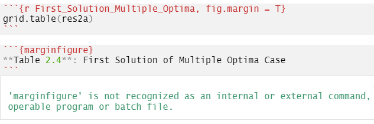

# Troubleshooting

```{r Ch91setup, include=FALSE}
knitr::opts_chunk$set(echo = TRUE)
knitr::opts_chunk$set(tidy = F)
library (tufte)
library (pander)
library (tidyr)
library (ggplot2)
library (ggrepel)
library(ompr)
library(magrittr)
library(ompr.roi)
library(ROI.plugin.glpk)
library(sudokuAlt)
suppressPackageStartupMessages(library(dplyr))
suppressPackageStartupMessages(library (tint, quietly = TRUE))
    # Loading this last masks margin_note, newthought,
    #    quote_footer, sans_serif from the tufte package.
```

## Overview

The goal of this chapter is **not** to cover all errors that might arise in R or RMarkdown. The goal of this Appendix is to demonstrate and discuss some common errors that arise in building OR models using R. The error messages may not always be clear and here we provide a review.  It is good practice to carefully look over the error message when you get one to see if you can find a clue as to where the problem might be.  \vspace{12pt}

I have personally run into these problems and have had readers of this book also run into them. \vspace{12pt}

This appendix uses a mix of both real, working code along with images of non-working code and the errors they generate.  Images are used so that this writeup can itself be properly knitted without errors.  \vspace{12pt}

## Blank Lines in LaTeX

The LaTeX proceossor is different from the Math renderer used for previewing in an RMarkdown document.  The result is that something may be visible in the preview and look correct but not render in the PDF.   \vspace{12pt}

$$
\begin{split}
\begin{aligned}
\text{Max:  }  & 20\cdot A+14\cdot B \\
\text{s.t.: } & \\
  & 6\cdot A +2\cdot B \leq 200 \\
  & A, B \geq 0  
  \end{aligned}
  \end{split}
$$
The formulation on the right has a blank line in between the inequality constraint and the non-negativity constraints in the LaTeX formulation.  \vspace{12pt}

```{r Fig-LaTeX_blank_line1, echo=TRUE, fig.margin=TRUE, out.width='100%' }
knitr::include_graphics("images/ERRORS_LaTeX_blank_line1.PNG")
```

It renders in HTML and in the RMarkdown preview without generating an error by ignoring the blank line but when knitted to PDF, a full LaTeX processor is used which may more strictly enforce LaTeX requirements. The result is that this blank line causes an error when knitted to PDF.  \vspace{12pt}

```{r Fig-LaTeX_blank_line2, echo=FALSE, fig.fullwidth = TRUE, out.width='100%'}
knitr::include_graphics("images/ERRORS_LaTeX_blank_line2.PNG")
```

Again, the error message may not be obvious but googling would often find a hint as to the source of the error.  \vspace{12pt}

If you had really intended to add a blank line before the non-negativity constraints, simply add the LaTeX linebreak code of a double slash.    \vspace{12pt}

$$
\begin{split}
\begin{aligned}
\text{Max:  }  & 20\cdot A+14\cdot B \\
\text{s.t.: } & \\
  & 6\cdot A+2\cdot B \leq 200 \\
\\
  & A, B \geq 0  
  \end{aligned}
  \end{split}
$$
\vspace{12pt}

## Undefined Object in ompr

Of course an object must exist before it can be used in R. It might be confusing or difficult to identify the error though.
\vspace{12pt}

A student told me that they spent hours trying to identify the error in the following code chunk.  Using piped object might mistattribute the line or the source error to the beginning of the piped command. 
\vspace{12pt}

The error message is informative from `ompr` is `Error in check_for_unknown_vars_impl(model, the_ast): The expression contains a variable that is not part of the model.` The message suggests that perhaps the user forgot to create a variable using `add_variable` that was used in the objective function or a constraint. Another possibility is that the user has a problem with a data object used in the `ompr` model.  The result is that users may still have difficulty finding the source of the problem.
\vspace{12pt}

```{r Fig-undefined_object, echo=FALSE, fig.fullwidth = TRUE, out.width='100%'}
#  fig.cap='Initial error message generated by using a variable in ompr that is also defined outside ompr.',
knitr::include_graphics("images/ERRORS_Undefined_object_in_ompr.png")
```
\vspace{12pt}

The console reflects what I did to help in debugging.  These are the steps that I followed:

* Sweep environment variables to ensure that there is nothing that might affect the analysis.  
* `Run All` code chunks from the pull down menu.  
* Identify the code chunk with the error.
* Check to make sure that every linear programming variable used in the model is created using the `add_variable` function.  In this example, there is only one set of variables, `x[i,j]` and it was handled correctly.  
* Enter each R object in the console to see whether it is defined yet.  In this case, `NSupply` was defined but when I tried `Cost` it clearly stated that it was not yet defined.  

\vspace{12pt}
  
In this case, I then scrolled up and confirmed that the student had defined `NSupply`, `NDest`, and all the other data items used in the linear program except for `Cost`.  This will also help capture an inconsistent spelling such as `Cost` vs. `cost` or `Costs`.  
\vspace{12pt}

## Unexpected Symbol in ompr

Another problem for a student occurred with in the following code chunk of an `ompr` linear programming model generated an 'Error: unexpected symbol in:` message.  
\vspace{12pt}

```{r Fig-unexpected_symbol, echo=FALSE, fig.fullwidth = TRUE, out.width='100%'}
#  fig.cap='Initial error message generated by using a variable in ompr that is also defined outside ompr.',
knitr::include_graphics("images/ERRORS_ompr_unexpected_symbol.png")
```

\vspace{12pt}
  
In this case, the error is simply a typo of missing a multiplication symbol between some numbers and linear programming variables.  For example, `20Chairs` should be `20*Chairs`.   

\vspace{12pt}
  
## Name Conflicts with R and ompr

You should avoid using the same name for something as an ompr variable and an R object. This can happen when you want to have a LP variable be used for the same purpose in the rest of our R code or perhaps because the variable name is used elsewhere in your work for other purposes. Simple variable names such as `x` or `y` are particularly likely to find multiple uses and therefore conflicts. Hint: Sometimes it may be helpful to clear your environment to avoid other conflicts. This may help resolve some other inscrutable errors.   \vspace{12pt}

This example illustrates what happens when you have an object in your general R environment with the same name as an ompr model variable.   \vspace{12pt}

Here is a very simple linear program formulated and solved using ompr.    \vspace{12pt}

```{r Working_LP, echo=TRUE}
result1 <- MIPModel() %>%
  add_variable(A, type = "continuous", lb = 0) %>%
  add_variable(B, type = "continuous",lb = 0) %>%
 
  set_objective(20*A + 14*B, "max") %>%
  
  add_constraint(6*A + 2*B <= 200) %>% 
  solve_model(with_ROI(solver = "glpk"))
```

Let's verify that it solved to optimality.    \vspace{12pt}

```{r show_result1}
result1
```

Now, let's redo this with an identical LP, but renaming the variables from `A` and `B` to `C` and `D`.  To trigger this problem, we will define `C` to be a matrix.   \vspace{12pt}

```{r}
C <- matrix(c(1,2,3,4), ncol=2)
```

Now, we create the same LP but renaming `A` and `B` as `C` and `D`.  \vspace{12pt}
    
```{r Nonworking_LP, echo=TRUE, eval=FALSE}
result2 <- MIPModel() %>%
  add_variable(C, type = "continuous", lb = 0) %>%
  add_variable(D, type = "continuous",lb = 0) %>%
  set_objective(20*C + 14*D, "max") %>%
  add_constraint(6*C + 2*D <= 200) %>% 
  solve_model(with_ROI(solver = "glpk"))
```

Since this LP is identical to the previous one other than changing names, it _should_ work.  Alas, we get an error message.  \vspace{12pt}
    
```{r Fig-ompr_var1, echo=FALSE, fig.fullwidth = TRUE, out.width='100%'}
#  fig.cap='Initial error message generated by using a variable in ompr that is also defined outside ompr.',
knitr::include_graphics("images/ERRORS_ompr_name_variable_conflicts1.PNG")
```

Notice that the error message may not actually refer to the variables causing the problem.  In our example, variable `C` is causing the problem but it refers to `x`.  This is because the error is actually occurring deeper in the `ompr` code which has already transformed the actual variables into a more abstract notation.  \vspace{12pt}

```{r Fig-ompr_var2, echo=FALSE, fig.fullwidth = TRUE, out.width='100%'}
# fig.cap='Message in console when all code chunks were run.', 
knitr::include_graphics("images/ERRORS_ompr_name_variable_conflicts2.PNG")
```

If you run all chunks, you may get the following error message.  It doesn't make clear which variable is generating the error but does list the `ompr` variables so that you can perhaps narrow them down.    \vspace{12pt}

```{r Fig-ompr_var3, echo=FALSE, fig.fullwidth = TRUE, out.width='100%'}
knitr::include_graphics("images/ERRORS_ompr_name_variable_conflicts3.PNG")
```

Another way to potentially deal with this problem or others is to periodically clear or sweep your RStudio environment of past objects.  This can be done by using the broom icon in the Environment tab of RStudio.    \vspace{12pt}

```{r Fig-ompr_var4, echo=FALSE, fig.fullwidth = TRUE, out.width='100%' }
# fig.cap='Sweeping the environment clean of past objects.', 
knitr::include_graphics("images/ERRORS_ompr_name_variable_conflicts4.PNG")
```

One way to avoid this might be to prefix all `ompr` variables with a capital `V` to suggest that it is a mathematical programming variable.  Readers can then easily differentiate which items in constraints or the objective function are variables (specific to `ompr`) and which are sources of data from outside of `ompr`.  \vspace{12pt}

## Marginfigure not recognized

Another problem can arise when code chunks are copied from another source.  In this book I use a feature to put items into the right hand margin. This can be done by setting an option in the code chunk or by wrapping material in a chunk.  and calling `{marginfigure}`.  The following screen capture reflects both situations along with the message returned from running the code chunks.
\vspace{12pt}

```{r Fig-marginfigure, echo=FALSE, fig.fullwidth = TRUE, out.width='100%' }
# fig.cap='Warning for marginfigur.', 

```

Notice that it returns a warning that `marginfigure is not recognized...` but this does not prevent running all the other code chunk in the RMarkdown document. The `marginfigure` function is used for building the book and is not supported for simple knitting to HTML or PDF. While it does not prevent the code chunks from running, it might prevent a document from knitting or showing a desired formulation or table. \vspace{12pt}

The solution to this is simply to remove the `marginfigure` wrapping of the material (including the beginning and ending triple tick) whether it is simply text, as is the case in this example or whether it is a LaTeX formulation.  \vspace{12pt}

## General Debugging Tips

This is far from a comprehensive list but these items may be helpful for general purpose debugging.

* Read through the error message to try to decode where the problem is.  For example, it tells you pretty clearly if there are two code chunks with the same name.
* Check for spelling, capitalization, or singular/plural errors in variable names.
* If you are using piping (`%>%`), make sure to not use a pipe at the very end of the series of commands being connected.
* Try stepping through the code one by evaluating one code chunk at a time to narrow down where an error may be occurring.
* Use the console to examine code and variables directly.  
* Do a web search for the error message, leaving out items specific to your code such as variables or code chunk names.
* Narrow down where to look for problems by line numbers or code chunk names.
* Check your parentheses carefully - it is easy to get a parenthesis misplaced.
* If you are getting a LaTeX error, look at the TeX log file.  You can scroll down to the very end to see where things went wrong.  This message may give more clues where the error arose.
* See if you can create a "minimal" example that reproduces the same problem in a new file.  This can be very helpful for others to see where your problem is and not read through many lines of working code. As you trim it down in a second file, you might also have a Eureka moment where you see it yourself.
* If you have a complex statement that does three or four things in one line, try working from inside out by running parts of the command in the console to make sure that they each generate the results that you intend.
* Inspect the data that you are using.  Perhaps the data is not of the right form.  

## Getting Help

After going through the above ideas, you may still be stuck.  We've all been there before in working with computers. Given the large number of people using R, it is likely that many other people have had the same problem before so good searching will probably find a discussion of the problem and resolution. I will often use google to search for the generalized text snippets of error messages, leaving out things unique to my case such as a variable name.  Sometimes add in the words "R", "package" or the specific package name used as appropriate. 
\vspace{12pt}

After going through these efforts, you may still not find a solution.  The R community is a great resource for getting answers to problems but there is a common practice that is important to emphasize.  When you ask for help, you are typically requesting a person that you don't know to review your work for free. \vspace{12pt} 

Try to come up with a simple, short reproducible example.  The goal is to make it as quick and easy for the person to examine this.  
\vspace{12pt}

Make it as short and simple as possible, remember that depending upon where you are asking for help, they may not be familiar with linear programming or the particular packages that you are using.  For example, if you have a problem building an ompr model, try removing as many constraints as possible while still getting the error.  The person trying to help won't care about the other missing constraints.  You can always add them back later. 

```{marginfigure}
I often find that I discover how to fix it myself while creating this simplified version. 
```
\vspace{12pt}

Using simplified variable names may help make it more readable and shorter.  Again, the reader doesn't really care about your specific model.  Of course, this might cause (or fix?) name conflicts or collisions.  
\vspace{12pt}

A detailed discussion of how to create good reproducible examples can be found online.  
https://reprex.tidyverse.org/articles/reprex-dos-and-donts.html

\vspace{12pt}

Including the code in a way that can be easily run is often helpful.  If you are using rstudio.cloud, you may even create a simple project that someone can jump into for debugging purposes.  I've done this with students but it would not work well for posting a link into an open Internet forum.  
\vspace{12pt}

If you have posted the question or emailed someone and there were suggestions given, a response is usually appreciated or in a forum post, may be helpful for a future person that has the same problem.
