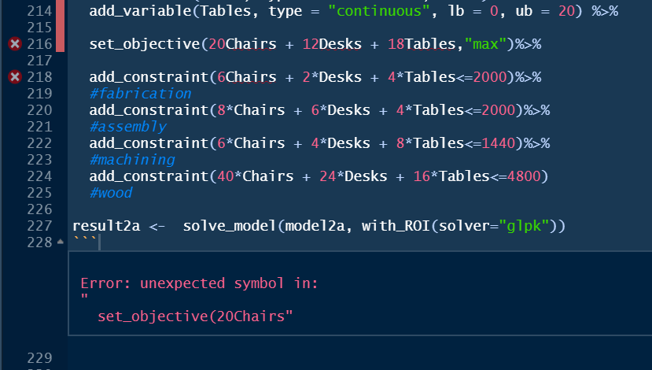
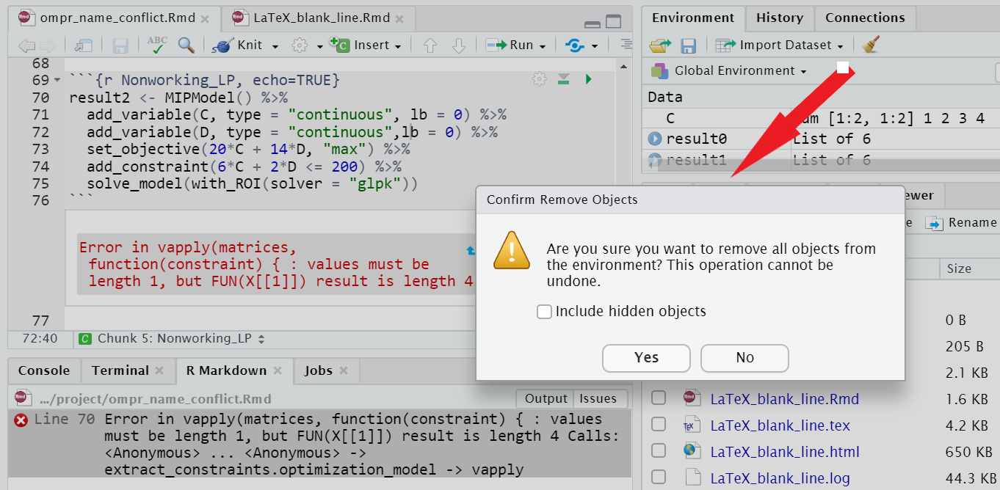

# Troubleshooting

```{r Ch91setup, include=FALSE}
knitr::opts_chunk$set(echo = TRUE)
knitr::opts_chunk$set(tidy = F)
library (tidyr)
suppressPackageStartupMessages(library(dplyr))
library(ompr)
library(ompr.roi)
library(ROI.plugin.glpk)
```

## Overview

The goal of this chapter is **not** to cover all errors that might arise while using R or RMarkdown. The goal of this Appendix is to demonstrate and discuss some common errors that arise in building optimization models using R. The error messages may not always be clear and here we provide a review. It is good practice to carefully look over the error message when you get one to see if you can find a clue as to where the problem might be.

All of these problems have stumped me or my students at some point. Whether the problems arise while doing optimization with `ompr`, creating tables to display these results, expressing the mathematical model using LaTeX, or creating the PDF for disseminating results, all of these errors can occur in other situations as well.

This appendix uses a mix of both real, working code along with images of non-working code and the errors they generate. Images are used so that this writeup can itself be properly knitted without errors.

## Model Building

### Define and Formulate before Implementing

One of the most common errors is to jump straight into coding a model into `ompr` before really understanding the model.  This is the equivalent of trying to build a house without a plan.  There will be a lot of wasted time and effort as well as making things difficult for anyone to assist.  Algebraic linear programming models are generally only a few lines long and will often look similar to related models.  Changes at this point are also very easy to make. If the model is *good* - then it is a matter of just making sure that the implementation matches the plan (formulation.)

Software engineers have a similar perspective that the cost of bug fixes goes up by a factor of 10 at every stage of development from specification development, to prototyping, to coding, to end user testing.

As an example, new modelers often get confused between which items are pieces of data to be fed into the model and which things are decision variables.  Frequently, I will see people that jump too quickly to implementation going back and forth often using the same item as both data and as an optimization variable. Without this being clear, no implementation regardless of how clever, can succeed.

### Failing to Look for Past Optimization Models

When conducting a complex optimization application, it is helpful to look at the literature. Others have likely built related models that can give a starting point for ideas on formulating. Usually some customizing is needed to fit address aspects of the new application but it is much easier than starting with a blank sheet of paper (or screen as the case may be.) In fact, by doing this you may find implementations in algebraic modelings languages that are straightforward to translate to `ompr` as well.

### Misrendering of PDF

Just because a PDF is knitted or rendered does not mean that it is correct. A variety of common errors often creep in such as unrendered section headings from the RMarkdown file.  Consider the following text from an RMarkdown document.  

```
end of sentence.
##Section Heading
Beginning of next sentence.
```

This fragment has three problems, each of which may cause the author's intended 2nd level heading to not be recognized as a heading.

1. There should be a blank line after the "end of sentence." line.
2. The pound symbols should be followed by a space before the "Section Heading."
3. There should be another blank line before the "Beginning of next sentence."

None of these will cause an error message to appear and they can easily occur by accident while editing a document so it is just good  practice to look over the PDF for this or similar issues.  

### Blank Lines in LaTeX

Put simply, blank lines are not allowed in LaTeX equations but this problem can be one of the most puzzling ones that readers have seen.  The problem is that everything looks right and knits to HTML but it doesn't knit to PDF.  Part of the confusion is caused by the LaTeX processor being different from RStudio's Math rendering system which is used for previewing in an RMarkdown document. The result is that something may be visible in the preview and look correct but not render in the PDF because of differing strictness in the implementation of parsing of the math notation. \

The following screen capture shows a LaTeX formulation in an RMarkdown document that has a blank line in between the inequality constraint and the non-negativity constraints. The RStudio math preview ignores the empty line and everything looks fine. \index{LaTeX!Blank line}\ 

```{r Fig-LaTeX-blank-line1, echo=FALSE,  out.width='50%', fig.cap="Preview Ignores Blank LaTeX Line" }
knitr::include_graphics("images/ERRORS_LaTeX_blank_line1.PNG")
```

It renders in HTML and in the RMarkdown preview without generating an error by ignoring the blank line but when knitted to PDF, a full LaTeX processor is used which is generally more strict in enforcing LaTeX requirements. The result is that this blank line causes an error when attempting to knit to PDF and terminates. \

```{r Fig-LaTeX-blank-line2, echo=FALSE, out.width='100%', fig.cap="Rendering Error Caused by Blank LaTeX Line"}
knitr::include_graphics("images/ERRORS_LaTeX_blank_line2.PNG")
```

Again, the error message may not be obvious but googling would often find a hint as to the source of the error.

If you had really intended to add a blank line before the non-negativity constraints, simply add the LaTeX linebreak code of a double slash, `\\`.

$$
\begin{split}
\begin{aligned}
\text{Max:  }  & 20\cdot A+14\cdot B \\
\text{s.t.: } & \\
  & 6\cdot A+2\cdot B \leq 200 \\
\\
  & A, B \geq 0  
  \end{aligned}
  \end{split}
$$ 

Note that LaTeX may return a lot of warnings that do not represent problems but are provided out of an abundance of caution. For example, see the following:

`LaTeX Warning: Command \textellipsis invalid in math mode on input line 1324.`

The line number refers to the intermediate .tex file rather than the original .Rmd file. When LaTeX fails, it is sometimes necessary to look at both the .log and .tex files to see where the error is occurring.

### Problems with PDF Creation

Knitting to PDF uses the LaTeX environment so a variety of other issues may arise.  While sometimes these are spotted late in a project, the source is often at early stage of work so I am including it in the Model Building section.

Typically everything must be correct for an RMarkdown to be knitted. For example, when I want to rebuild this book, I will often use the `Build Book` command in RStudio. This will go through all analyses and generate a fully up to date version of the book. Alas, sometimes I only want a specific chapter, perhaps because there is an error in another chapter that I'm wrestling with. Even a single error can cause this to not build. Knitting to PDF would be another option but the various options and settings that I'm using for this book seem to prevent the Knit to PDF from working. A third option is to use the render command directly. The following command will render the file for the second chapter of the book.

```{r Direct_Rendering, eval=FALSE}
library(rmarkdown)
rmarkdown::render("02-A_First_LP.Rmd", "pdf_document")
    # Renders as a regular PDF document
```

Another possible problem is having the PDF file open from having previously created it. This will typically generate a message about being unable to write the PDF file. The solution is to simply ensure that the PDF is not open in any other program.

A related issue is that there could be a temporary file for debugging purposes that needs to be deleted before it can be done. I often see this with a Markdown file (`.md`), not to be confused with the RMarkdown file (`.Rmd`).

Avoid using an underscore, `_`, in the code chunk label for any code chunk that involves a `kable` or graphical figure.  This can cause strange errors when knitting to PDF. While the underscore is valid for a code chunk name, its importance in LaTeX causes problems - it is best to just use a dash.

Some PDF errors are caused by the strict enforcement of LaTeX requirements.  If the `.tex` file is generated but the `.pdf` is incomplete or missing, you can sometimes overcome these problems by using `latexmk` to rerun the Tex engine on the PDF. This is not meant to be a cure-all and is only meant for late stage errors.  For example, this book sometimes requires running `latexmk OMUR.tex -pdf -f -interaction=nonstopmode` after building the `pdf_book` generates a LaTeX error at the bibliography stage. Of course tracking down the LaTeX error is preferred. \index{LaTeX!latexmk}

If there is a code chunk that is causing fatal errors, you can always use the code chunk option of `eval=FALSE` in order to temporarily turn off the execution while working on other parts of the PDF and model. Another workaround is to use the code chunk option of `error=TRUE` which will allow knitting despite an error in a code chunk. Of course both of these options are just temporary patches.

## Implementation Troubleshooting

This section includes a variety of technical problems. Implementation troubleshooting can be tricky enough without compounding the challenge by not having a clear model. Implementation will take a lot more time and troubleshooting will be a lot harder if the definitions are not precise and the formulation is complete.  

### Errors in a Piped Model

While piping is very convenient for simplifying the implementation it has a couple of major drawbacks. First, piping may be a little slower than non-piped implementations. Second and more important for debugging problems - an error message in one line will point to the entire piped object rather than the specific line. This can make it very hard to see where the problem is.

As an example, running all code chunks for a case returned this error message to the right in my console. (Note that a similar message would also happen if I were knitting an RMarkdown document.)  Also, in this example, I used the original piping operator, `%>%` which required the `magrittr` package rather than the new piping operator `|>` built into R 4.1.0 and higher. The same issue occurs regardless of the piping operator used. \index{Piping!New vs. old operator} \index{Piping!Debugging a piped model}

```{r Fig-piping-error0, echo=FALSE, out.width="60%", fig.cap="Name conflict error between R and `ompr`"}
knitr::include_graphics("images/ERRORS_piping_error0.png")
```

One of the many advantages to a modern integrated development environment, IDE, like RStudio is that it helps in debugging. In this case, looking in the code pane, RStudio has a red vertical line indicating R's best guess as to where the problem is. Unfortunately, we have a long vertical bar covering 11 lines, the entire piped object, as the source of the problem rather than a single line. When piping, it is treated as a single line and R can't narrow down the problem further. I'll leave it as a challenge for the reader to the find the error in the code in the next figure.

```{r Fig-piping-error1, echo=FALSE, out.width="60%", fig.cap="Inability to Focus on Error Source in a Piped Model."}
knitr::include_graphics("images/ERRORS_piping_error1.png")
```

The result is that it may be helpful to focus on building up an unpiped model while you are in active debugging.

While piping is discussed in chapter 2, it is helpful to highlight the same model side by side, implemented without piping and with piping.

```{r Fig-piping, echo=FALSE,  out.width='100%', fig.cap="Piped vs. Unpiped Model."}
#  fig.cap='Initial error message generated by using a variable in ompr that is also defined outside ompr.',
knitr::include_graphics("images/ERRORS_piping.png")
```

Unpiping a piped model is easy. The first step is to remove all of the pipe operators `%>%` or `|>`. Second, every `ompr` command after the model is initialized needs to be modified to name the model that is being enhanced. Lastly, every line needs to say to what the enhanced model is being assigned. The following figure is an unpiped version of the earlier code chunk that has the same error as the earlier screen capture but it is now much easier to find the error as the reader only has to look at one line of code - the line to the right of the red vertical bar. \index{Piping!Unpiping}\

```{r Fig-piping-error2, echo=FALSE, out.width="45%", fig.cap="Finding an Error in an Unpiped Model."}
#  fig.cap='Initial error message generated by using a variable in ompr that is also defined outside ompr.',
knitr::include_graphics("images/ERRORS_piping_error2.png")
```

In general, since the model name or variant may occur twice in every line of an unpiped `ompr` model, keeping a short model name such as `m0` instead of `model0` would help keep the code easier to read.\

### Undefined Object in `ompr`

Let's now review the error that was generated in the previous section. This is a common `ompr` error. Of course an object must exist before it can be used in R. It might be confusing or difficult to identify the error though. \

A student told me that they spent hours trying to identify the error in the following code chunk. Using a piped object might misattribute the line or the source error to the beginning of the piped command. If you see this error, read the previous section on dealing with piped objects.\

The error message from `ompr` is informative.

`Error in check_for_unknown_vars_impl(model, the_ast): The expression contains a variable that is not part of the model.` 

The message suggests that perhaps the user forgot to create a variable using `add_variable` that was used in the objective function or a constraint. Another possibility is that the user has a problem with a data object used in the `ompr` model. The result is that users may still have difficulty finding the source of the problem. \

```{r Fig-undefined-object, echo=FALSE, out.width='80%', fig.cap="Error from an defined variable."}
knitr::include_graphics("images/ERRORS_Undefined_object_in_ompr.png")
```

The console reflects what I did to help in debugging. These are the steps that I followed:

-   Sweep environment variables to ensure that there is nothing that might affect the analysis.
-   `Run All` code chunks from the pull down menu.
-   Identify the code chunk with the error.
-   Check to make sure that every linear programming variable used in the model is created using the `add_variable` function. In this example, there is only one set of variables, `x[i,j]` and it was handled correctly.
-   Enter each R object in the console to see whether it is defined yet. In this case, `NSupply` was defined but when I tried `Cost` it clearly stated that it was not yet defined.

In this case, I then scrolled up and confirmed that the student had defined `NSupply`, `NDest`, and all the other data items used in the linear program except for `Cost`. This will also help capture an inconsistent spelling such as `Cost` vs. `cost` or `Costs`.

### Unexpected Symbol in `ompr`

Another problem for a student occurred with in the following code chunk of an `ompr` linear programming model generated an 'Error: unexpected symbol in:\` message.

```{r Fig-unexpected-symbol, echo=FALSE,  out.width='100%', fig.cap="Unexpected Symbol in ompr"}

```

In this case, the error is simply a typo of missing a multiplication symbol between a number and a linear programming variables. More specifically, `20Chairs` should be `20*Chairs`.

### Name Conflicts between R and `ompr`

It is an important feature of `ompr` that it has access to all of the data objects that you have defined. This enables rich models to be built without specifically passing each piece of data into a function. This has a critical requirement that you should avoid using the same name for something as an `ompr` variable and an R object. This can happen when you want to have a LP variable be used for the same purpose in the rest of our R code or perhaps because the variable name is used elsewhere in your work for other purposes. Simple variable names such as `x` or `y` are particularly likely to find multiple uses and therefore conflicts. **Hint:** Sometimes it may be helpful to clear your environment to avoid other conflicts. This may help resolve some other inscrutable errors.

This example illustrates what happens when you have an object in your general R environment with the same name as an `ompr` model variable.

Here is a very simple linear program formulated and solved using `ompr`. Again, it uses the old piping operator instead of the new `|>` operator. 

```{r Working_LP, echo=TRUE}
result1 <- MIPModel() %>%
  add_variable(A, type = "continuous", lb = 0) %>%
  add_variable(B, type = "continuous",lb = 0) %>%
 
  set_objective(20*A + 14*B, "max") %>%
  
  add_constraint(6*A + 2*B <= 200) %>% 
  solve_model(with_ROI(solver = "glpk"))
```

Let's verify that it solved to optimality.

```{r show_result1}
result1
```

Now, let's redo this with an identical LP, but renaming the variables from `A` and `B` to `C` and `D`. To trigger this problem, we will define `C` to be a matrix.

```{r}
C <- matrix(c(1,2,3,4), ncol=2)
```

Now, we create the same LP but renaming `A` and `B` as `C` and `D`.\}

```{r Nonworking_LP, echo=TRUE, eval=FALSE}
result2 <- MIPModel() %>%
  add_variable(C, type = "continuous", lb = 0) %>%
  add_variable(D, type = "continuous",lb = 0) %>%
  set_objective(20*C + 14*D, "max") %>%
  add_constraint(6*C + 2*D <= 200) %>% 
  solve_model(with_ROI(solver = "glpk"))
```

Since this LP is identical to the previous one other than changing names, it *should* work. Alas, we get an error message. 

```{r Fig-ompr-var1, echo=FALSE, out.width="55%", fig.cap="Error Due to Name Conflict between R and `ompr`"}
knitr::include_graphics("images/ERRORS_ompr_name_variable_conflicts1.PNG")
```

Notice that the error message may not actually refer to the variables causing the problem. In our example, variable `C` is causing the problem but it refers to `x`. This is because the error is actually occurring deeper in the `ompr` code which has already transformed the actual variables into a more abstract notation.

```{r Fig-ompr-var2, echo=FALSE,  out.width='100%', fig.cap="Error as Displayed in Console from Run All Chunks."}
knitr::include_graphics("images/ERRORS_ompr_name_variable_conflicts2.PNG")
```

If you run all chunks, you may get the following error message. It doesn't make clear which variable is generating the error but does list the `ompr` variables so that you can perhaps narrow them down. \

```{r Fig-ompr-var3, echo=FALSE,  out.width='100%'}
knitr::include_graphics("images/ERRORS_ompr_name_variable_conflicts3.PNG")
```

Another way to potentially deal with this problem or others is to periodically clear or sweep your RStudio environment of past objects. This can be done by using the broom icon in the Environment tab of RStudio. 

```{r Fig-ompr-var4, echo=FALSE,  out.width='100%', fig.cap="Sweeping Out the Environment"}

```

Since the problem is having the same name for objects inside and outside of `ompr` an an easy solution is to adopt a convention that differentiates `ompr` variables. I have adopted the convention of prefixing all `ompr` variables with a capital `V` to suggest that it is a mathematical programming variable. Readers can then easily differentiate which items in constraints or the objective function are variables (specific to `ompr`) and which are sources of data from outside of `ompr`. The resulting model is shown below. When expressing the model mathematically for readers, I can then omit the `V` prefix. 

```{r Working_LP_with_V_Prefix, echo=TRUE, eval=FALSE}
# Fixing the Problem by Giving Variables Unique Names

result2 <- MIPModel() %>%
  add_variable(VC, type = "continuous", lb = 0) %>%
  add_variable(VD, type = "continuous", lb = 0) %>%
  set_objective(20*VC + 14*VD, "max") %>%
  add_constraint(6*VC + 2*VD <= 200) %>% 
  solve_model(with_ROI(solver = "glpk"))
```

### Blindly Reusing Code

You will often find examples of code that is helpful.  It is important to try to read what the code is doing before using it.  For example, a reader tried using my `TRA` package for drawing DEA input-output diagrams and used a code example that I had. They did not realize that it was writing to a subdirectory named `images` that existed in my project but not theirs.  

## General Debugging Tips

This is far from a comprehensive list but these items may be helpful for general purpose debugging.

-   Read through the error message to try to decode where the problem is. For example, it tells you pretty clearly if there are two code chunks with the same name.
-   Check for spelling, capitalization, or singular/plural errors in variable names. The human reader's eye tends to be more forgiving of inconsistencies than computers.
-   Try stepping through the code by evaluating one code chunk (or even line) at a time to narrow down where an error may be occurring.
-   Use the console to run code and display variable values directly.
-   Do a web search for the error message, leaving out items specific to your code such as variables or code chunk names.
-   Narrow down where to look for problems by line numbers or code chunk names.
-   Check your parentheses carefully - it is easy to get a parenthesis misplaced.
-   If you are getting a LaTeX error, look at the TeX log file. You can scroll down to the very end to see where things went wrong. This message may give more clues to where the error arose.\index{LaTeX!TeX log file}
-   See if you can create a "minimal" example that reproduces the same problem in a new file. This can be very helpful for others to see where your problem is and not read through many lines of working code. As you trim it down in a second file, you might also have a Eureka moment where you see it yourself.
-   If you have a complex statement that does three or four things in one line, try working from inside out by running parts of the command in the console to make sure that they each generate the results that you intend.
-   Inspect the data that you are using. Perhaps the data is not of the right form.
-   Caching analysis results in RStudio can be helpful for advanced users with computationally demanding models but can result in subtle problems. Avoid it unless you plan to be very careful. \index{RMarkdown!Caching}
-   If you are using piping, either the new `|>` pipe operator built into R, or the older `%>%` pipe, make sure to not use a pipe at the very end of the series of commands being connected.

## Getting Help

After going through the above ideas, you may still be stuck. We've all been there before in working with computers. Given the large number of people using R, it is likely that many other people have had the same problem before so a good search will probably find a discussion of the problem and resolution. I often use google to search for the generalized text snippets of error messages, leaving out things unique to my case such as a variable name. Sometimes add in the words "R", "package" or the specific package name used as appropriate. Using the search qualifiers of `+` or `-` can be very helpful in finding specific items. For example a search of `boxplot +r -python` will find pages that discuss boxplots and R but exclude any page that mentions python.\

After going through these efforts, you may still not find a solution. The R community is a great resource for getting answers to problems but there is a common practice that is important to emphasize. When you ask for help, you are typically requesting a person that you don't know to review your work for free.\

Try to come up with a simple, short reproducible example. The goal is to make it as quick and easy for the person to examine this. Make it as short and simple as possible, remember that depending upon where you are asking for help, they may not be familiar with linear programming or the particular packages that you are using. For example, if you have a problem building an ompr model, try removing as many constraints as possible while still getting the error. The person trying to help won't care about the other missing constraints. You can always add them back later.\

Another tip for making the reproducible example is to use simplified variable names. Again, the reader doesn't really care about your specific model but this makes it shorter and easier to read. Of course, this might cause (or fix?) name conflicts or collisions. \

A detailed discussion of how to create good reproducible examples can be found online.\
<https://reprex.tidyverse.org/articles/reprex-dos-and-donts.html>

Including the code in a way that can be easily run is often helpful. If you are using rstudio.cloud, you may even create a simple project that someone can jump into for debugging purposes. I've done this with students but it would not work well for posting a link into an open Internet forum.\

If you have posted the question or emailed someone and there were suggestions given, a response is usually appreciated or in a forum post, may be helpful for a future person that has the same problem.
